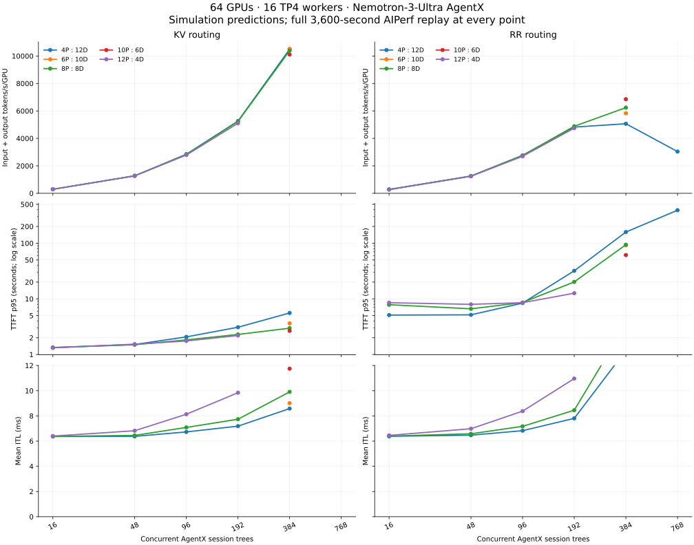

# 64-GPU disagg AgentX topology sweep

2026-09-17. **64 GPUs = 16 TP4 workers**, using the study's GB300/Nemotron-3-Ultra serving-rate model. Both KV and RR run the actual aiperf 0.12.0 AgentX replay. These are topology predictions; there is no matching 64-GPU hardware measurement in this comparison.

## Current results — sweep in progress

As of 2026-09-17 06:19 UTC, **33 of 47 selected points are complete and audited**. The remaining high-load points are still running or queued. No final topology winner or KV saturation knee has been established.

At 384 clients, 6P:10D, 4P:12D, and 8P:8D KV throughput is within about 1.2%; 8P:8D has the lower TTFT tail among these three. RR benefits from more prefill workers at this load. For 4P:12D RR, throughput falls from 5,067 at 384 clients to 3,040 at 768, showing a clear downturn in that modeled curve.

| Clients | P:D workers | KV total tok/s/GPU | RR total tok/s/GPU | KV TTFT p95, s | RR TTFT p95, s |
|---:|---|---:|---:|---:|---:|
| 192 | 4:12 | 5,260 | 4,823 | 3.09 | 31.94 |
| 192 | 8:8 | 5,236 | 4,884 | 2.29 | 20.19 |
| 192 | 12:4 | 5,103 | 4,748 | 2.19 | 12.64 |
| 384 | 4:12 | 10,496 | 5,067 | 5.58 | 158.78 |
| 384 | 6:10 | 10,516 | 5,830 | 3.63 | 92.07 |
| 384 | 8:8 | 10,389 | 6,241 | 2.97 | 93.94 |
| 384 | 10:6 | 10,108 | 6,856 | 2.66 | 61.26 |
| 384 | 12:4 | pending | pending | pending | pending |
| 768 | 4:12 | pending | 3,040 | pending | 391.91 |
| 768 | 6:10 | pending | pending | pending | pending |
| 768 | 8:8 | pending | pending | pending | pending |
| 768 | 10:6 | pending | pending | pending | pending |
| 768 | 12:4 | pending | pending | pending | pending |
| 1536 | 6:10 | pending | — | pending | — |
| 1536 | 8:8 | pending | — | pending | — |
| 1536 | 10:6 | pending | — | pending | — |

The chart includes only completed points. Missing low-concurrency points for the intermediate splits were not part of the initial ladder. The [CSV](../sim-results/agentx_64gpu_20260917/comparison.csv) contains all completed low-load and higher-load metrics; the [audit archive](../sim-results/agentx_64gpu_20260917/README.md) retains validation and provenance.

## Experiment

The initial splits are 4P:12D, 8P:8D, and 12P:4D, corresponding to 16/48, 32/32, and 48/16 GPUs for prefill/decode. The concurrency ladder starts at 16, then 48, 96, 192, 384, and 768 live AgentX session trees. Additional points refine the high-throughput region. TP4 and the per-worker serving constants are fixed; this is a P/D allocation search, not a TP/EP or kernel-configuration search.

Every point gets the full **3,600-second profiling window**, actual one-token trajectory warmup, 60-second grace period, and 1,200-second request timeout. The replay config and benchmark ID come from the real disagg KV192 AgentX artifact, with concurrency and the simulated deployment changed explicitly. The same 393-root Arrow snapshot, chat template, seed 42, sampled 25–75% starting positions, branches/joins, cache-bust identity, and root recycling rules are retained.

RR rotates independently on the P and D tiers. KV uses prefix overlap and queued prefill work for P selection; D selection minimizes the projected unique active prompt-block footprint, following the decode-load term in [Dynamo 1.4.2](https://github.com/ai-dynamo/dynamo/blob/2ecbdfdf192c69c02c6d21e931d20d3b4a0bb64a/lib/kv-router/src/scheduling/selector.rs#L217). The older least-request-count D policy remains available for historical runs. Regression checks cover unequal prompt sizes, shared-block lifetime, and independent RR cycles.

The real disagg frontend metadata advertises **809,406 blocks, or 51,801,984 KV tokens per worker**, and max-running sequences 64. This is decode-facing model metadata, not a per-prefill-worker measurement. The sweep explicitly uses 51.8M tokens as a **prefill-cache capacity proxy**, pending actual P-worker measurements. It is not a measurement of usable Mamba-state cache capacity.

## Reading the curves

Primary throughput is aiperf's **input plus output tokens/s divided by all 64 GPUs**. Cached prompt tokens count toward this metric. Output throughput, request throughput, latency, cache fraction, and errors are retained alongside it. The topology selection has no latency-SLO filter; aiperf's inherited goodput thresholds are reported only as context.

The curve summary identifies the first sampled concurrency reaching 90% of each topology/policy curve's highest observed throughput. This is a transparent sampled throughput-knee proxy, not proof of a physical saturation boundary. A curve still growing by more than 10% at the upper boundary needs another concurrency point. Within-run first/second-half TTFT and queue-wait statistics, plus the fraction of arrivals finding an empty prefill queue, provide separate queue diagnostics. Closed-loop load and changing request mix limit what a one-hour stationarity check can establish.

## Confidence and hardware validation

Replay fidelity is much stronger than serving-model fidelity. All points are audited for the full phase window, dependency graph, actual warmup, prompt-token reconstruction, timeout handling, and valid worker placement. RR dispatch balance is checked on both tiers. At 192 clients, initial lanes, warmup selections/token counts, and matched initial-tree profiling token counts are also compared with the actual disagg KV192 run used as the configuration source. Its hardware performance is not used as a 64-GPU measurement.

The engine still uses serial fixed-rate prefill, a static per-request decode rate, immediate cache insertion at admission, and zero KV-transfer time. It does not implement hybrid/Mamba checkpoint eligibility, finite Mamba-state pools, 16,384-token chunk scheduling, P max-running 8 / D max-running 64 admission limits, or dynamic batching. Admitted requests include those waiting for prefill; that count must not be interpreted as the running decode GPU batch. Large-load predictions are particularly sensitive to these omissions.

Use the selected topology and its nearest competitor as the next hardware calibration candidates, first near the predicted knee and then above it. Compare cache hits, P queue/service time, D active blocks and batch size, transfer/handoff time, TTFT, ITL, and errors. The [agg calibration results](agentx-faithful-replay.md) demonstrate why a successful replay audit alone does not guarantee accurate capacity predictions.

[Run instructions](agentx-replay-howto.md#64-gpu-topology-sweep) · [Saved targets](../sim-results/agentx_64gpu_targets.json)
