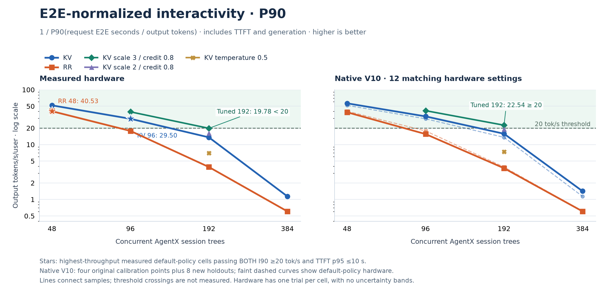
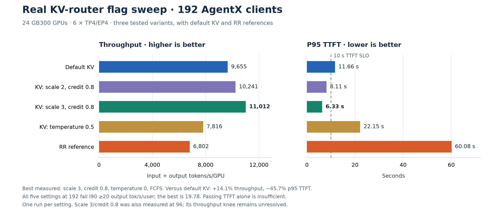

# N3U aggregated serving: KV-aware routing versus round-robin

Hardware collected **2026-09-16** · V10 simulations **2026-09-17–18** · SLO comparison updated **2026-09-18** · **24 GB300 GPUs, 6 × TP4/EP4 workers**

With **TTFT p95 ≤10 s** and **E2E-normalized interactivity at P90 ≥20 output tokens/s/user**, the best measured default-KV point is **96 sessions**, versus **48 for RR**: **2.11× total tokens/s/GPU**. Tuned KV at 192 passes TTFT but narrowly fails interactivity (**19.7795 <20**); its highest-throughput measured point passing both limits is also **96**. These are single-run comparisons. The throughput peak remains 192 for both default policies, while the SLO boundary needs more points and repeats.

[Standalone HTML](agentx-agg-kv-rr-report.html) · [all plotted data (CSV)](agentx-agg-kv-rr-report.csv) · [data and provenance (JSON)](agentx-agg-kv-rr-report.json) · [preserved inputs (ZIP)](agentx-agg-kv-rr-report-inputs.zip)

## 1. Real data sweep and knee

### Setup and metric definitions

These are completed **hardware jobs**, using AIPerf 0.12.0's `inferencex-agentx-mvp` scenario and the public Weka 256K trace. Both default policies were measured at **48, 96, 192 and 384 clients**, with a **3,600-second profiling window**, 60-second grace and 1,200-second request timeout. AgentX concurrency counts live session trees, including their subagents; it does not equal requests simultaneously decoding.

Throughput charts use AIPerf **input + output tokens/s divided by all 24 GPUs**, including cached input tokens. This is served token volume, not GPU compute throughput. TTFT is AIPerf's **p95 over successful profiling requests**, converted from milliseconds to seconds. Output-only throughput is shown separately in the SLO tables. Interactivity charts use per-request E2E latency and output length; that per-user rate is not divided by GPU count.

The configured serving shape is six TP4/EP4 replicas, context 262,144, max running 16 per worker, 16,384-token prefill chunks, and 443,697 attention-KV pages at 64 tokens/page. The recipe installs Dynamo 1.4.2, whose SGLang dependency is 0.5.16. The initial container tag alone does not prove the installed package version; the benchmark's actual worker package inventory was not captured.

KV and RR used separate deployments (`n3u-agg-ns` and `n3u-agg-ns2`) with the same configured serving shape. Each baseline cell has one collected run; these are not repeated-trial estimates, and no confidence intervals are claimed. The busy-stream measurements in [AGG24_RESULTS.md](../AGG24_RESULTS.md) use a different concurrency definition and are excluded here.


[Hardware plot SVG](agentx-agg-kv-rr-report-hardware.svg) · [PDF](agentx-agg-kv-rr-report-hardware.pdf)

Stars mark **192, the highest-throughput sampled default-policy point**. Hollow markers at 384 identify the measured saturation region. The shaded 192–384 interval highlights the unsampled default-KV saturation transition; it is not a confidence band or an assertion that the two policies have identical knees. Green diamonds add the **measured tuned-KV scale-3/credit-0.8 points at 96 and 192**. That two-point curve does not establish a tuned throughput knee.

### What the sweep establishes

- **Default KV:** 192 remains stable in the reported within-run check. At 384 throughput falls **14.5%**, and TTFT p95 rises from **11.66 to 119.44 s**. The original request-record analysis reports TTFT p50 rising from **37.9 to 99.6 s** between the first and last quarters at 384. Thus **192 is the last stable sampled point**, and the saturation transition is bracketed between **192 and 384**.
- **RR:** doubling clients from 96 to 192 buys only **10.8%** more throughput while TTFT p95 rises **12.56 → 60.08 s**. This indicates diminishing returns in **96–192**. At 384 throughput falls another **25.4%** and TTFT p95 reaches **494.98 s**. The highest sampled throughput is at **192**, but even 96 fails the 10-second TTFT limit and the 20-token/s interactivity limit.
- **Resolution:** there are no collected default-policy AgentX points between 192 and 384. The original ladders stopped at 384; 768/1,536 were not measured. A continuous optimum or an exact knee at 192 is not established.
- **Errors:** exported request-error counts are 48 clients: KV 0, RR 0; 96 clients: KV 0, RR 0; 192 clients: KV 3, RR 3; 384 clients: KV 7, RR 14. Latency percentiles exclude failed requests; their counts remain visible rather than being treated as zero.

The quarter-by-quarter queue evidence comes from the existing [hardware report, section iii](../AGENTX_AGG_RESULTS.md#iii-real-runs-performance-curve-and-the-kv-vs-rr-points). The plots and numerical comparisons here are regenerated from the original AIPerf summaries, not rounded plot-point JSON.

### Source jobs

| Clients | KV hardware artifacts | RR hardware artifacts |
| --- | --- | --- |
| 48 | [KV c48](https://console.cloud.google.com/storage/browser/alisachen-models/perf/1789545801_alisachen-n3u-agg-ns-agentx-kv-c48) | [RR c48](https://console.cloud.google.com/storage/browser/alisachen-models/perf/1789550745_alisachen-n3u-agg-ns2-agentx-rr-c48) |
| 96 | [KV c96](https://console.cloud.google.com/storage/browser/alisachen-models/perf/1789550601_alisachen-n3u-agg-ns-agentx-kv-c96) | [RR c96](https://console.cloud.google.com/storage/browser/alisachen-models/perf/1789555623_alisachen-n3u-agg-ns2-agentx-rr-c96) |
| 192 | [KV c192](https://console.cloud.google.com/storage/browser/alisachen-models/perf/1789555981_alisachen-n3u-agg-ns-agentx-kv-c192) | [RR c192](https://console.cloud.google.com/storage/browser/alisachen-models/perf/1789560983_alisachen-n3u-agg-ns2-agentx-rr-c192) |
| 384 | [KV c384](https://console.cloud.google.com/storage/browser/alisachen-models/perf/1789562076_alisachen-n3u-agg-ns-agentx-kv-c384) | [RR c384](https://console.cloud.google.com/storage/browser/alisachen-models/perf/1789567077_alisachen-n3u-agg-ns2-agentx-rr-c384) |

Each GCS directory contains the AIPerf summary (`profile_export_aiperf.json`), per-request metrics (`profile_export.jsonl`), raw request/response exports and server metrics. All 12 known agg AgentX summaries, including tuning runs, were verified accessible and preserved in the [input manifest](agentx-agg-kv-rr-data/manifest.json). The [run index](../RUN_INDEX.md#bench-jobs-chronological) contains the complete job list.

## 2. KV versus RR at equal configuration and equal SLO

### 2.1 Same configuration and client count

GPU count, worker shape, dataset, scenario and profiling duration are fixed. The policies run on separate equivalent fleets; benchmark IDs, cache-bust namespaces and completed closed-loop request cohorts are not identical. Throughput gain is `100 × (KV / RR − 1)`; the final column is `RR TTFT p95 / KV TTFT p95`.

| Clients | KV total tok/s/GPU | RR total tok/s/GPU | KV throughput gain | KV TTFT p95 (s) | RR TTFT p95 (s) | RR/KV TTFT p95 |
| --- | --- | --- | --- | --- | --- | --- |
| 48 | 3,334 | 3,250 | +2.6% | 3.83 | 8.27 | 2.16× |
| 96 | 6,844 | 6,137 | +11.5% | 5.36 | 12.56 | 2.34× |
| 192 | 9,655 | 6,802 | +41.9% | 11.66 | 60.08 | 5.15× |
| 384 | 8,257 | 5,076 | +62.7% | 119.44 | 494.98 | 4.14× |

The main stable comparison is **192 clients**: KV has **1.42× total throughput** and **5.15× shorter p95 TTFT**. The 384 comparison describes overloaded operation and should not be presented as a sustainable capacity advantage.

### 2.2 TTFT-only comparison: p95 ≤10 seconds

For each policy, select the **highest-throughput measured cell that passes the same p95 threshold**. Concurrency is allowed to differ; topology and GPU count remain fixed. This is a run-level TTFT percentile constraint, not AIPerf's separate request-goodput metric and not a combined TTFT/ITL or error-rate SLO.

| Policy | Selected clients | Total tok/s/GPU | Output tok/s/GPU | TTFT p95 (s) | Throughput/RR |
| --- | --- | --- | --- | --- | --- |
| Default KV | 96 | 6,844 | 75.11 | 5.36 | 2.11× |
| RR | 48 | 3,250 | 31.32 | 8.27 | 1.00× |
| Tuned KV: scale 3, credit 0.8 | 192 | 11,012 | 108.87 | 6.33 | 3.39× |

The default-policy selections are **KV96 versus RR48**, giving **2.11× total throughput/GPU**. The measured TTFT transition is bracketed by **48–96 for RR** and **96–192 for default KV**. No interpolation supplies an unmeasured passing point. This replaces the report's former 20-second TTFT comparison with the chosen **10-second** limit.

The tuned-KV row uses prefill-load scale 3, overlap credit 0.8 and temperature 0. Its 192-session run passes this **TTFT-only** criterion, giving **3.39×** RR48's total throughput. It **does not pass the added interactivity criterion**, as shown next.

### 2.3 Added comparison: E2E-normalized interactivity at P90 ≥20 output tokens/s

For each valid successful profiling request, compute `r_i = E2E_i_seconds / output_tokens_i`, then **`I90 = 1 / P90(r_i)`**. The selected threshold is **`I90 ≥20 output tokens/s/user`**, equivalently **`P90(r_i) ≤0.050 s/output token`**. E2E covers one inference request including TTFT and generation; human think time, tools and the rest of the session are outside this latency. This follows the [public InferenceX AgentX metric definition](https://github.com/SemiAnalysisAI/InferenceX/blob/main/MODELS.md#agentx-guidelines). The **20-token/s cutoff is our chosen engineering criterion**, not a Weka-mandated threshold.

The calculation uses individual AIPerf `request_latency` and `output_sequence_length` values, with linear percentile interpolation. It does **not** divide aggregate percentiles or use decode-only `1/TPOT`. AIPerf's P10 of per-request output/E2E rate is close but can differ under interpolation; it is checked against the export for provenance and is not substituted for the formula above. The exported data records the valid and excluded request counts for every run. Warmup, errors and cancelled records are excluded from the percentile, with counts preserved separately.



[Interactivity SVG](agentx-agg-kv-rr-report-interactivity.svg) · [PDF](agentx-agg-kv-rr-report-interactivity.pdf) · [per-request metric provenance](agentx-agg-kv-rr-data/request-metrics/manifest.json)

| Hardware setting | Sessions | TTFT p95 (s) | I90 (output tok/s/user) | I90 ≥20 | Both limits pass | Errors |
| --- | --- | --- | --- | --- | --- | --- |
| Default KV | 48 | 3.83 | 51.8257 | Pass | Pass | 0 |
| Default KV | 96 | 5.36 | 29.5030 | Pass | Pass | 0 |
| Default KV | 192 | 11.66 | 13.5367 | Fail | Fail | 3 |
| Default KV | 384 | 119.44 | 1.1372 | Fail | Fail | 7 |
| KV: scale 2, credit 0.8 | 192 | 8.11 | 16.1477 | Fail | Fail | 3 |
| KV: scale 3, credit 0.8 | 96 | 3.11 | 39.4930 | Pass | Pass | 0 |
| KV: scale 3, credit 0.8 | 192 | 6.33 | 19.7795 | Fail | Fail | 3 |
| KV: temperature 0.5 | 192 | 22.15 | 7.0315 | Fail | Fail | 3 |
| RR reference | 48 | 8.27 | 40.5349 | Pass | Pass | 0 |
| RR reference | 96 | 12.56 | 17.7260 | Fail | Fail | 0 |
| RR reference | 192 | 60.08 | 3.8961 | Fail | Fail | 3 |
| RR reference | 384 | 494.98 | 0.6059 | Fail | Fail | 14 |

**Tuned KV192 is a measured fail:** **19.7795 tok/s**, or **50.5573 ms/output token** against the 50 ms budget. It misses by **1.10%** in interactivity. Rounding to 20 would hide the failure. With one trial, its distance from the threshold cannot be distinguished from run-to-run variation; it is a priority repeat.

Select maximum measured throughput under **both run-level limits**: TTFT p95 ≤10 seconds and I90 ≥20 output tokens/s/user.

| Hardware policy | Selected sessions | Total tok/s/GPU | Output tok/s/GPU | TTFT p95 (s) | I90 (output tok/s/user) | Total throughput/RR |
| --- | --- | --- | --- | --- | --- | --- |
| Default KV | 96 | 6,844 | 75.11 | 5.36 | 29.5030 | 2.11× |
| RR | 48 | 3,250 | 31.32 | 8.27 | 40.5349 | 1.00× |
| Tuned KV: scale 3, credit 0.8 | 96 | 7,045 | 78.35 | 3.11 | 39.4930 | 2.17× |

For the existing hardware samples, the interactivity-only and combined selections coincide. Default KV96 gives **110.6% more total throughput/GPU than RR48**. Tuned KV96 gives **2.17× RR48** and **2.9% more than default KV96**; the latter small difference needs repeats. These are the best **sampled eligible** cells, not proven capacity maxima.

Two run-level percentiles do not establish a joint per-request success fraction. Keep request errors and raw E2E distributions visible. AgentX is closed-loop, and policies can complete different request mixes within the same duration; these are criteria for this replay population. A production arrival-rate guarantee requires a separate load-controlled validation.

### 2.4 Real KV-router flag sweep

**Yes: four additional real AgentX jobs were collected**—three KV variants at **192 clients**, plus the best measured variant at **96 clients**. The default-KV and RR comparisons reuse the baseline jobs above. All use the same 24-GPU serving shape and 3,600-second AgentX profiling configuration. These are measured hardware results; no new hardware jobs were launched to generate this report.

**Complete collected tuned-KV agg sweep:**

| Collected tuned-KV job / artifacts | Sessions | Total tok/s/GPU | Output tok/s/GPU | TTFT p95 (s) | I90 (tok/s/user) | Both limits pass | Errors |
| --- | --- | --- | --- | --- | --- | --- | --- |
| [KV: scale 3, credit 0.8](https://console.cloud.google.com/storage/browser/alisachen-models/perf/1789582550_alisachen-n3u-agg-ns2-agentx-kvs3c08-c96) | 96 | 7,045 | 78.35 | 3.11 | 39.4930 | Pass | 0 |
| [KV: scale 2, credit 0.8](https://console.cloud.google.com/storage/browser/alisachen-models/perf/1789575514_alisachen-n3u-agg-ns-agentx-kvs2c08-c192) | 192 | 10,241 | 102.43 | 8.11 | 16.1477 | Fail | 3 |
| [KV: scale 3, credit 0.8](https://console.cloud.google.com/storage/browser/alisachen-models/perf/1789569414_alisachen-n3u-agg-ns-agentx-kvs3c08-c192) | 192 | 11,012 | 108.87 | 6.33 | 19.7795 | Fail | 3 |
| [KV: temperature 0.5](https://console.cloud.google.com/storage/browser/alisachen-models/perf/1789574468_alisachen-n3u-agg-ns2-agentx-kvt05-c192) | 192 | 7,816 | 79.49 | 22.15 | 7.0315 | Fail | 3 |

Scale 3/credit 0.8 is the only tuned setting measured at two concurrencies. Scale 2/credit 0.8 and temperature 0.5 each have one 192-session sample; no curves or additional points are inferred for them. The upper agg plot overlays the two measured scale-3 throughput/TTFT points, and the interactivity plot shows its I90 curve. The 192-session bar chart below compares every tested setting at the same concurrency.

The settings below come from the preserved [runner recipe](agentx-agg-kv-rr-data/hardware/agentx_runner.sh.txt), which installs Dynamo 1.4.2 and changes the frontend router arguments for each named variant. “Not explicitly set” means the recipe inherits the frontend's defaults; the table does not infer a numeric value from a variant name.

| Recipe variant | Prefill-load scale | Overlap credit | Temperature | Queue policy | Measured clients |
| --- | --- | --- | --- | --- | --- |
| `kv` | not explicitly set | not explicitly set | 0.0 | FCFS | 48, 96, 192, 384 |
| `kvs2c08` | 2.0 | 0.8 | 0.0 | FCFS | 192 |
| `kvs3c08` | 3.0 | 0.8 | 0.0 | FCFS | 96, 192 |
| `kvt05` | not explicitly set | not explicitly set | 0.5 | FCFS | 192 |

The explicit flag names are `--router-prefill-load-scale`, `--router-kv-overlap-score-credit`, `--router-temperature` and `--router-queue-policy`. All four KV recipes use `--router-mode kv`. The RR reference uses `--router-mode round-robin`.



[Flag-sweep SVG](agentx-agg-kv-rr-report-flag-sweep.svg) · [PDF](agentx-agg-kv-rr-report-flag-sweep.pdf) · [settings, metrics and deltas (CSV)](agentx-agg-kv-rr-report-flag-sweep.csv)

| 192-client setting / artifacts | Total tok/s/GPU | Change vs default KV | TTFT p95 (s) | TTFT change vs default KV | Cached input | I90 (tok/s/user) | Both limits pass |
| --- | --- | --- | --- | --- | --- | --- | --- |
| [Default KV](https://console.cloud.google.com/storage/browser/alisachen-models/perf/1789555981_alisachen-n3u-agg-ns-agentx-kv-c192) | 9,655 | +0.0% | 11.66 | +0.0% | 74.4% | 13.5367 | Fail |
| [KV: scale 2, credit 0.8](https://console.cloud.google.com/storage/browser/alisachen-models/perf/1789575514_alisachen-n3u-agg-ns-agentx-kvs2c08-c192) | 10,241 | +6.1% | 8.11 | -30.4% | 77.5% | 16.1477 | Fail |
| [KV: scale 3, credit 0.8](https://console.cloud.google.com/storage/browser/alisachen-models/perf/1789569414_alisachen-n3u-agg-ns-agentx-kvs3c08-c192) | 11,012 | +14.1% | 6.33 | -45.7% | 81.8% | 19.7795 | Fail |
| [KV: temperature 0.5](https://console.cloud.google.com/storage/browser/alisachen-models/perf/1789574468_alisachen-n3u-agg-ns2-agentx-kvt05-c192) | 7,816 | -19.0% | 22.15 | +90.0% | 61.0% | 7.0315 | Fail |
| [RR reference](https://console.cloud.google.com/storage/browser/alisachen-models/perf/1789560983_alisachen-n3u-agg-ns2-agentx-rr-c192) | 6,802 | -29.5% | 60.08 | +415.4% | 56.2% | 3.8961 | Fail |

At **192 clients**, `kvs3c08` is the **best measured setting**: **11,012 total tok/s/GPU** and **6.33 s p95 TTFT**, versus default KV's **9,655** and **11.66 s**. That is **14.1% more throughput** and **45.7% lower p95 TTFT**. Output-only throughput also rises from **96.81 to 108.87 tok/s/GPU**. Relative to RR at the same 192 clients, this setting gives **1.62× total throughput** and **9.49× shorter p95 TTFT**.

The lower scale of 2 with the same 0.8 credit improves throughput by **6.1%** and p95 TTFT by **30.4%** versus default KV. Temperature 0.5 reduces throughput by **19.0%** and increases p95 TTFT by **90.0%**, to **22.15 s**, which misses the 10-second TTFT SLO. **All five 192-client settings fail I90 ≥20**, including the two tuned settings that pass TTFT. All five rows have **three exported request errors**; latency percentiles cover successful requests.

At **96 clients**, [the same scale-3/credit-0.8 variant](https://console.cloud.google.com/storage/browser/alisachen-models/perf/1789582550_alisachen-n3u-agg-ns2-agentx-kvs3c08-c96) delivers **7,045 total tok/s/GPU** versus [6,844 for default KV](https://console.cloud.google.com/storage/browser/alisachen-models/perf/1789550601_alisachen-n3u-agg-ns-agentx-kv-c96), a **2.9%** increase. P95 TTFT falls **5.36 → 3.11 s** (**41.9% lower**). Both jobs have zero exported errors. There are no repeat trials to determine the statistical significance of the small throughput difference.

The exact best measured router arguments are:

```text
--router-mode kv
--router-temperature 0.0
--router-queue-policy fcfs
--router-prefill-load-scale 3.0
--router-kv-overlap-score-credit 0.8
```

**Scope of the conclusion:** this is a small flag sweep, not a full factorial search. Scale and overlap credit change together versus default KV, so their individual contributions cannot be separated; scale 2 versus scale 3 does hold credit at 0.8. A `kvwspt` queue-policy recipe exists, but no completed agg AgentX measurement for it is present in the collected run set. There are no measured scale-4/5 variants, independent overlap-credit sweep, or tuned runs above 192 clients. Each cell has one trial on one of the two equivalent deployments. Thus this selects the best **observed** setting without establishing a global optimum or tuned knee.

The higher cached-input share and lower latency are consistent with a better balance between cache reuse and queued work, but the aggregate summaries do not isolate that mechanism. Section 3 now replays every collected flag variant through Native DynoSim V10 and compares its metrics with hardware. Those new points use the original calibration unchanged, so they test whether the simulator reproduces the measured tuning effect. The [original tuning analysis](../AGENTX_AGG_RESULTS.md#v-kv-router-flag-sweep-at-the-192-client-comparison-point-measured) is retained as background; the tables here are regenerated from the full AIPerf summaries and keep the tuned points separate from the default-KV concurrency curve.

### 2.5 Why temperature 0.5 and overlap credit 0.8; what to sweep next

The preserved recipe and experiment notes show a **small exploratory set**, not a parameter search: temperature **0 versus 0.5** with inherited default scale/credit, and prefill scales **2 versus 3** with credit fixed at **0.8** and temperature **0**. The notes compare the tuned recipe with an earlier simulator prediction, but do **not record an optimization or quantitative rule that selected exactly 0.5 or 0.8**. We cannot claim either value was optimal or that an independent credit sweep was completed.

Temperature here is **router worker-selection randomness**, not model generation temperature. Overlap credit **0.8 is a routing cost multiplier**, not an 80% cache-hit target or cache-size fraction. These meanings follow [NVIDIA's router configuration documentation](https://docs.nvidia.com/dynamo/knowledge-base/modular-components/router/configuration-and-tuning). Record the installed version and resolved flags for every new run; the baseline recipe did not explicitly set scale/credit, so this report does not infer their actual runtime values from the historical label.

The existing temperature-0.5 run lost **19.0% throughput** against default KV at 192 and produced **7.0315 I90**, but it does not rule out smaller temperatures or the same temperature on a tuned scale/credit configuration. Similarly, scale 3 outperformed scale 2 **at fixed credit 0.8**; that does not establish a monotone trend from default KV because scale and credit both change against the baseline.

Use the measured `(scale=3, credit=0.8, temperature=0, queue=fcfs)` setting as the anchor. Sweep one parameter at a time first, then check interactions among the strongest candidates:

| Knob | Proposed values | Hold fixed | Existing evidence / next question |
| --- | --- | --- | --- |
| Prefill-load scale | **1, 2, 3, 4, 5** | Credit 0.8, temperature 0, FCFS | 2 and 3 exist at 192. Add 1, 4 and 5 to isolate scale and find whether the gain continues. |
| Device-local overlap credit | **0.4, 0.6, 0.8, 1.0** | Scale 3, temperature 0, FCFS | Only 0.8 is measured here. Determine how much preference for cached prefixes helps near the SLO boundary. |
| Router temperature | **0, 0.1, 0.25, 0.5** | Scale 3, credit 0.8, FCFS | Only 0 exists on this anchor. The old 0.5 job used inherited defaults, so it is not the 0.5 cell of this new sweep. |
| Queue policy, second priority | **FCFS, WSPT** | Same selected scale, credit, temperature and enabled queue threshold | A WSPT recipe exists but has no completed agg AgentX run. Confirm that requests actually queue; otherwise the policy may not affect dispatch. Compare tails and interactivity as well as throughput. |

**First small batch:** repeat the anchor at 192, then test **scale 4/5**, **credit 0.6/1.0**, and **temperature 0.1/0.25** at 192 with the other anchor values fixed. These are six new settings, each isolated against the same anchor. At this load the current best I90 is only 1.10% below target, so a reproducible improvement could turn 192 into an eligible point. Initial runs screen candidates; repeat finalists and validate them at **128/160** and **96**, then compare the best measured throughput satisfying **both** TTFT p95 ≤10 s and I90 ≥20. Add a small crossed scale/credit grid around any winner; isolated sweeps alone can miss interactions.

The [proposed six-setting sweep (JSON)](agentx-agg-kv-rr-report-next-sweep.json) lists the exact router arguments. Six candidate runs plus two additional anchor repeats cost **eight one-hour profiles, or 192 GPU-hours on a 24-GPU fleet**, before warmup, drain and setup. This is a staged proposal; it does not schedule jobs. Finalist repeats and new concurrency points add to that budget.

After router tuning, engine admission (`max-running-requests`) and prefill chunk size are separate useful sweeps, with memory pressure, errors and queue statistics recorded. They change the serving configuration and should form a separate comparison group. Keep the Weka workload, think time, duration and tokenizer fixed across tuning arms. These proposed jobs have **not been launched**.

### 2.6 Which KV flags also apply to disagg?

Disagg has additional choices, but the agg winner is not a validated disagg recipe. Our [historical disagg sweep](../D72_RESULTS.md#kv-router-flag-configuration-and-sweep-for-the-disagg-selected-points) tested scale 2, credit 0.8 and temperature 0.5 separately on **6 prefill + 12 decode workers, host-staged transport, request concurrency 12**. Relative output-throughput changes were **+1.2%, +2.9% and −16%**; TTFT p95 was **6.3, 6.3 and 12.5 seconds**, versus **6.5 seconds** for default KV. These single-cell results use the earlier busy-stream workload, not this AgentX session-concurrency replay. The small gains do not establish an optimum. The historical report also contains an older simulation grid; it is not Native V10 validation and is excluded from this report's comparisons.

Dynamo routes prefill and decode separately: the documented prefill stage disables active-block tracking, and ordinary disagg decode routing disables overlap scoring and prefill-token tracking. Consequently, cache-credit tuning targets prefill placement; decode needs its own load-balance evidence. See [Dynamo's disagg routing behavior](https://docs.nvidia.com/dynamo/knowledge-base/modular-components/router/disaggregated-serving).

For a new disagg AgentX study, first record the effective configuration and per-worker placement on both stages. Start with temperature **0** and FCFS. Prioritize `--router-kv-overlap-score-credit` at **0.6, 0.8 and 1.0**, then an independent `--router-kv-overlap-score-credit-decay` sweep if hot-cache workers accumulate prefill backlog. Test queue threshold and FCFS/WSPT together with evidence that router queueing is active. Treat `--router-prefill-load-scale` **1/2/3** as conditional: if every candidate's cost is only the same positive scale times adjusted prefill work, the scale cancels from deterministic ranking. That is an inference from the [documented cost equation](https://docs.nvidia.com/dynamo/knowledge-base/modular-components/router/routing-concepts), not a measured improvement; confirm a competing cost term or changed placements before spending a full sweep on it.

Hold the P:D split, total GPUs, transport, cache tiers and workload fixed. Select throughput under **TTFT p95 ≤10 seconds and I90 ≥20 output tokens/s**, using actual AgentX measurements. This disagg plan is separate from the completed agg settings and has not been launched here.

## 3. Simulation method, curves and knee selection

### 3.1 Native DynoSim V10: current completed calibration samples

The workspace contains a newer, separate **native DynoSim experiment**. Its path is:

```text
AIPerf 0.12.0 AgentX client, normal wall clock and streaming HTTP
  → Dynamo 1.4.2 frontend and KV / round-robin router
  → native SGLang Mocker/DynoSim worker scheduler
  → AIConfigurator 0.11.0 forward-pass timing
```

**V10 is a local candidate built on Dynamo 1.4.2 with eleven patches; it is not an unmodified NVIDIA release or a Dynamo release named v10.** The patches cover CPU execution, visible first-token handling, prefix/chunk admission, hybrid-state cache behavior and timing corrections. All **12 plotted native runs** use one native core build and one shared engine configuration. The original **four calibration points** are default KV/RR at 192/384; **eight new holdouts** cover default KV/RR at 48/96 and all four tuned-KV hardware settings. The preserved [calibration matrix](agentx-agg-kv-rr-data/native-v10/matrix.json) and [holdout matrix](agentx-agg-kv-rr-data/native-v10/holdouts.json) record these checks; the [patch reconstruction record](agentx-agg-kv-rr-data/native-v10/v10_patch_reconstruction.json) identifies the modified source.

The actual AgentX loader, branches/joins, seed 42, 393 roots, 25–75% sampled starts, one-token trajectory warmup, whole-system idle cap, recycling and metrics export remain in AIPerf. Original benchmark IDs reproduce each hardware point's initial cache-bust namespace. Both simulator speedup ratios are **1.0**. A separate 900-second hardware prewarm failed and is not invented for simulation. Latency still changes closed-loop completion order and the completed request cohort, so this is not a claim of byte-identical full-run request sequences.

The shared native configuration uses six TP4/EP4 workers, max running 16, 16,384-token chunks and the measured **28,396,608 attention-KV tokens per worker**. Its hybrid-state settings are **769 state slots**, 64-token cache chunks and a 256-token tracking interval. Those hybrid settings remain model assumptions; the actual hardware Mamba-state pool was not captured. AIC uses its SGLang **0.5.14** tables, while the hardware recipe's Dynamo dependency specifies SGLang **0.5.16**.

Prefill calibration was fitted to **93 isolated one-token RR192 hardware warmups**, using shared coefficients for every policy and concurrency:

```text
prefill_ms = 1.7050018888 × AIC_prefill_ms
           + 165.5695513 × batch × new_tokens × (prefix_tokens + new_tokens / 2) / 1e9
decode_ms  = AIC_decode_ms + 0.288 + 0.03145728 × ready_decode_requests
```

The decode additions are a candidate correction for missing recurrent-state work in AIC's analytical fallback, derived from model geometry and bandwidth/kernel-overhead assumptions. They are not directly measured Nemotron kernel times. No per-concurrency throughput multiplier is applied. See the preserved [prefill fit](agentx-agg-kv-rr-data/native-v10/prefill_calibration_v2.json) and [decode derivation](agentx-agg-kv-rr-data/native-v10/decode_mamba_timing_candidate_v10.json).


[Native simulation SVG](agentx-agg-kv-rr-report-native-simulation.svg) · [PDF](agentx-agg-kv-rr-report-native-simulation.pdf)

Solid KV/RR curves now contain **48, 96, 192 and 384** for each default policy. The tuned scale-3/credit-0.8 curve contains **96 and 192**; scale 2/credit 0.8 and temperature 0.5 each have one 192-session point. Faint dashed curves show default-policy hardware. **Every hardware point has a matching Native DynoSim V10 run; all current simulation plots and comparisons use that same V10 build.**

| Policy | Clients | V10 sample role | Real total tok/s/GPU | V10 total tok/s/GPU | Throughput error | TTFT p95 sim / real (s) | TTFT error |
| --- | --- | --- | --- | --- | --- | --- | --- |
| Default KV | 48 | holdout | 3,334 | 3,321 | -0.4% | 3.52 / 3.83 | -8.2% |
| Default KV | 96 | holdout | 6,844 | 6,842 | -0.0% | 4.70 / 5.36 | -12.4% |
| Default KV | 192 | calibration | 9,655 | 10,182 | +5.5% | 8.71 / 11.66 | -25.2% |
| Default KV | 384 | calibration | 8,257 | 9,433 | +14.2% | 94.32 / 119.44 | -21.0% |
| KV: scale 2, credit 0.8 | 192 | holdout | 10,241 | 10,848 | +5.9% | 6.40 / 8.11 | -21.1% |
| KV: scale 3, credit 0.8 | 96 | holdout | 7,045 | 7,021 | -0.3% | 2.95 / 3.11 | -5.1% |
| KV: scale 3, credit 0.8 | 192 | holdout | 11,012 | 11,379 | +3.3% | 5.34 / 6.33 | -15.7% |
| KV: temperature 0.5 | 192 | holdout | 7,816 | 8,018 | +2.6% | 20.48 / 22.15 | -7.5% |
| RR reference | 48 | holdout | 3,250 | 3,232 | -0.6% | 8.47 / 8.27 | +2.5% |
| RR reference | 96 | holdout | 6,137 | 6,121 | -0.3% | 12.26 / 12.56 | -2.4% |
| RR reference | 192 | calibration | 6,802 | 6,830 | +0.4% | 53.96 / 60.08 | -10.2% |
| RR reference | 384 | calibration | 5,076 | 5,324 | +4.9% | 305.06 / 494.98 | -38.4% |

The recorded calibration gate is **±20% total throughput error at each of the four selected points**; all four pass. **TTFT was not an acceptance target**, and three points miss ±20% TTFT. The RR384 tail is underestimated by **38.4%**. These four workloads were used during model development; passing them is calibration evidence, not independent validation of arbitrary loads, policies or latency SLOs. The latest candidate narrows the earlier throughput gap, but does not establish TTFT fidelity.

Among the **eight new holdouts**, **8/8** fall within ±20% total throughput error. This is a check against the frozen model, not a newly fitted calibration gate. Latency and SLO classification are assessed separately below.

The interactivity comparison uses each native run's own request records. Units below are output tokens/s/user; it was **not a calibration acceptance target**.

| Policy | Sessions | Hardware I90 | V10 I90 | I90 error | V10 passes both limits | Hardware / V10 request errors |
| --- | --- | --- | --- | --- | --- | --- |
| Default KV | 48 | 51.8257 | 56.4714 | +9.0% | Pass | 0 / 0 |
| Default KV | 96 | 29.5030 | 32.6301 | +10.6% | Pass | 0 / 0 |
| Default KV | 192 | 13.5367 | 15.7431 | +16.3% | Fail | 3 / 3 |
| Default KV | 384 | 1.1372 | 1.4157 | +24.5% | Fail | 7 / 4 |
| KV: scale 2, credit 0.8 | 192 | 16.1477 | 19.1037 | +18.3% | Fail | 3 / 3 |
| KV: scale 3, credit 0.8 | 96 | 39.4930 | 41.4877 | +5.1% | Pass | 0 / 0 |
| KV: scale 3, credit 0.8 | 192 | 19.7795 | 22.5354 | +13.9% | Pass | 3 / 2 |
| KV: temperature 0.5 | 192 | 7.0315 | 7.4468 | +5.9% | Fail | 3 / 3 |
| RR reference | 48 | 40.5349 | 38.7997 | -4.3% | Pass | 0 / 0 |
| RR reference | 96 | 17.7260 | 15.5342 | -12.4% | Fail | 0 / 0 |
| RR reference | 192 | 3.8961 | 3.7086 | -4.8% | Fail | 3 / 3 |
| RR reference | 384 | 0.6059 | 0.6069 | +0.2% | Fail | 14 / 11 |

Across all 12 paired settings, the combined-SLO pass/fail decision differs at **1** points: **KV: scale 3, credit 0.8 at 192**. Native KV192 passes TTFT alone while hardware KV192 fails it; interactivity rejects both. Matching throughput at the four calibration points does not by itself validate latency or SLO decisions.

| Policy | Hardware selected sessions | V10 selected sessions | Hardware total tok/s/GPU | V10 total tok/s/GPU | Combined-SLO decision |
| --- | --- | --- | --- | --- | --- |
| Default KV | 96 | 96 | 6,844 | 6,842 | Same sampled concurrency |
| RR reference | 48 | 48 | 3,250 | 3,232 | Same sampled concurrency |
| KV: scale 3, credit 0.8 | 96 | 192 | 7,045 | 11,379 | Different selection |

Each model selects its highest-throughput measured cell passing both limits. A matching selected concurrency is evidence about this sampled ladder, not proof of an exact boundary or independent confirmation of the hardware capacity.

### 3.2 Native V10 comparison for the complete tuned-KV agg sweep

All four collected tuned-KV hardware jobs now have a corresponding **Native DynoSim V10 holdout** with the same hardware workload configuration, exact router arguments and unchanged engine calibration. Temperature, scale and credit are applied to the native Dynamo frontend; they are not replaced with fitted throughput multipliers.

| Tuned setting | Sessions | Hardware / V10 total tok/s/GPU | Hardware / V10 output tok/s/GPU | Hardware / V10 TTFT p95 (s) | Hardware / V10 I90 (tok/s/user) | Both limits: hardware / V10 |
| --- | --- | --- | --- | --- | --- | --- |
| KV: scale 3, credit 0.8 | 96 | 7,045 / 7,021 | 78.35 / 77.80 | 3.11 / 2.95 | 39.4930 / 41.4877 | Pass / Pass |
| KV: scale 2, credit 0.8 | 192 | 10,241 / 10,848 | 102.43 / 107.35 | 8.11 / 6.40 | 16.1477 / 19.1037 | Fail / Fail |
| KV: scale 3, credit 0.8 | 192 | 11,012 / 11,379 | 108.87 / 112.95 | 6.33 / 5.34 | 19.7795 / 22.5354 | Fail / Pass |
| KV: temperature 0.5 | 192 | 7,816 / 8,018 | 79.49 / 81.39 | 22.15 / 20.48 | 7.0315 / 7.4468 | Fail / Fail |

For the scale-3/credit-0.8 **192-session** pair, median input lengths are **75,415 / 75,433 tokens** (hardware/V10), and median output lengths are **392 / 393**. The interactivity difference therefore accompanies very similar median sequence lengths. TTFT p95 is **6.33 / 5.34 s**, and ITL p90 is **37.32 / 34.84 ms**. Both latency components remain relevant; these aggregate percentiles cannot apportion the I90 error causally, and the completed request cohorts differ. Use the hardware result for the operating-point decision until repeats and intermediate points resolve the boundary.

These are direct comparisons of the same named setting. The two scale-3 points form the measured concurrency curve; the other settings have one point each. Errors and missed SLO classifications remain in the comparison. The earlier custom Python model is archived in the preserved inputs for historical provenance and is **excluded from every current simulation chart, selection and comparison**.

### 3.3 How a knee is selected

1. **Hold the workload and serving configuration fixed.** For hardware or one simulator build, sweep concurrency from low load upward. Compare the same AIPerf throughput definition and GPU denominator.
2. **Locate diminishing returns and saturation.** Examine throughput gains between adjacent samples, p95 TTFT, request errors, and within-run queue/TTFT progression. The highest-throughput sample is a candidate operating point, not proof of an exact continuous knee.
3. **Bracket the transition.** Hardware default KV is stable at 192 and saturated at 384; RR is already flattening over 96–192 and collapses by 384. Native V10 also declines from 192 to 384 for the default policies; its added 48/96 points complete the same geometric ladder. Intermediate concurrencies and repeats are still needed to localize a knee, and the two-point tuned curve does not establish one.
4. **Refine and validate.** Prioritize the SLO boundaries below. Further throughput-peak refinement at KV240/288/336 or RR120/144/168 can wait: those intervals are already beyond the observed default-policy SLO boundaries. Queue stationarity and failure behavior must accompany throughput before promoting a simulator-selected point to a hardware recommendation.
5. **Apply the SLO separately.** Among measured eligible cells, maximize throughput subject to both thresholds. A throughput knee and the best point under a latency budget are different selections: here RR192 is the sampled throughput peak, while RR48 is the combined-SLO choice. The pass/fail boundary is not itself proof of a sharp knee; tail changes need repeats to establish that they exceed run-to-run variation.

### 3.4 Recommended additional measurements

**Yes—collect targeted boundary points and repeats.** The geometric sweep already shows overload; more points above 384 are low priority for this SLO. The following work is proposed, not collected:

| Priority | Measurement | What it resolves |
| --- | --- | --- |
| 1 | Two additional independent repeats of default KV96, RR48, tuned KV96 and tuned KV192, keeping the same seed and 3,600-second duration | Establish three trials per anchor; tuned KV192 is only 1.10% below the interactivity cutoff. Report each trial and the spread before accepting a borderline point. |
| 2 | Default RR64, then RR80 if needed to narrow the boundary | RR48 passes both limits; RR96 fails both. Start at 64 and refine according to the measured pass/fail bracket. |
| 2 | Default and tuned KV128, then KV160 if needed, keeping the two KV settings paired | Both pass at 96 and fail interactivity at 192. The intermediate points may add throughput while meeting both limits. |
| 3 | Native V10 at any newly collected 64/80/128/160 hardware boundary points, with the build and calibration coefficients frozen | The original 12 hardware settings now have matching native runs. New intermediate hardware points would provide another holdout check of the SLO boundary. |

For direct KV/RR A/B claims at a new concurrency, collect the matching policy at that **same concurrency**; for capacity under the shared SLO, each policy may select a different concurrency. Repeat the final new boundary cells before promoting them. Keep corpus, tokenizer/revision, seed, duration, serving configuration and cache-reset procedure fixed; run close in time or alternate order. Check trace/context/output-length distributions, request failures, cache hit, actual in-flight requests and per-worker queue/KV pressure. After estimating same-seed run noise, use an additional matched seed to check trace-sample sensitivity. Do not fit a new simulator correction to these points and also call them independent validation.

### Reproduce this report

The [manifest](agentx-agg-kv-rr-data/manifest.json) preserves exact source hashes and original locations. The input ZIP contains hardware summaries and the router-flag recipe, native configurations/build identity, the native matrix, calibration evidence, the separate custom-model audit/source, and **numeric per-request metrics for all 24 plotted runs**. The [original native experiment notes](agentx-agg-kv-rr-data/native-v10/original-calibration-report.md) preserve the detailed method and source locations as a readable snapshot; [the original text](agentx-agg-kv-rr-data/native-v10/original-calibration-report.txt) is retained. Full hardware request records remain in the linked GCS artifacts. Temporary source paths are recorded for provenance; regeneration uses the preserved report inputs. The command below rebuilds the report; it does not rerun hardware jobs or native simulations.

From the study directory, with Python 3.12, Matplotlib 3.11.2, NumPy 2.5.3 and markdown-it-py 4.2.0 available:

```bash
python scripts/gen_agg_kv_rr_report.py \
  --data-dir reports/agentx-agg-kv-rr-data \
  --output-dir reports
```

The generator checks input hashes, all expected policy/concurrency pairs, the 3,600-second AgentX phase settings, GPU normalization, agreement between native summaries and the comparison matrix, and the shared native engine/build. It also reconciles per-request success/error counts and TTFT with every summary, and raw E2E p95 and AIPerf's P10 rate with the hardware/native exports. It computes the canonical I90 and all selections from unrounded per-request values and writes the [validation record](agentx-agg-kv-rr-report-validation.json). The [numeric extraction script](../scripts/import_agentx_request_metrics.py) preserves phase, status, E2E, OSL and TTFT without prompt/response content; source hashes and row counts are recorded in its manifest. The [frozen native launch adapters](../scripts/native_v10_agg/README.md) describe how the added runs apply each hardware setting without changing the model.
