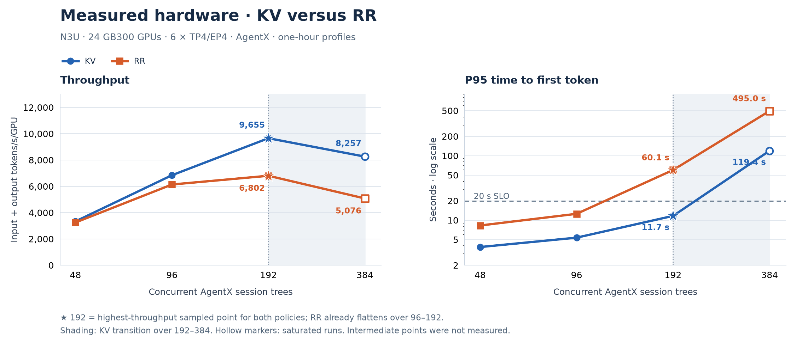
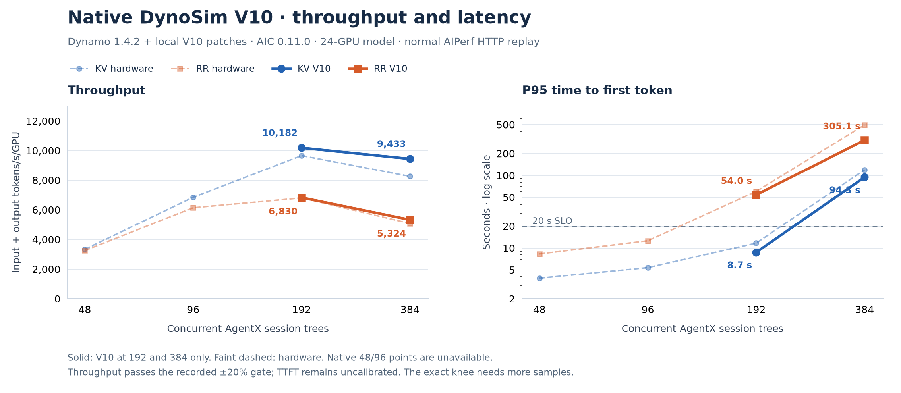
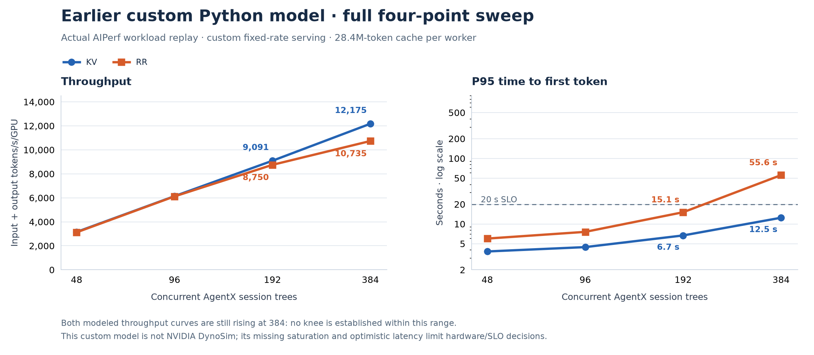

# N3U aggregated serving: KV-aware routing versus round-robin

Hardware collected **2026-09-16** · simulation artifacts **2026-09-17** · **24 GB300 GPUs, 6 × TP4/EP4 workers**

Default KV delivers **41.9% more total tokens/s/GPU than RR at 192 AgentX clients**, with TTFT p95 **11.66 versus 60.08 seconds**. Under the same **TTFT p95 ≤20 s** budget, the best measured default-KV point is **192 clients**, versus **96 clients** for RR: **1.57× throughput**. The highest-throughput sampled hardware point is 192 for both policies; the precise knees need finer sampling.

[Standalone HTML](agentx-agg-kv-rr-report.html) · [all plotted data (CSV)](agentx-agg-kv-rr-report.csv) · [data and provenance (JSON)](agentx-agg-kv-rr-report.json) · [preserved inputs (ZIP)](agentx-agg-kv-rr-report-inputs.zip)

## 1. Real data sweep and knee

### Setup and metric definitions

These are completed **hardware jobs**, using AIPerf 0.12.0's `inferencex-agentx-mvp` scenario and the public Weka 256K trace. Both default policies were measured at **48, 96, 192 and 384 clients**, with a **3,600-second profiling window**, 60-second grace and 1,200-second request timeout. AgentX concurrency counts live session trees, including their subagents; it does not equal requests simultaneously decoding.

All charts use AIPerf **input + output tokens/s divided by all 24 GPUs**, including cached input tokens. This is served token volume, not GPU compute throughput. TTFT is AIPerf's **p95 over successful profiling requests**, converted from milliseconds to seconds. Output-only throughput is shown separately in the SLO table.

The configured serving shape is six TP4/EP4 replicas, context 262,144, max running 16 per worker, 16,384-token prefill chunks, and 443,697 attention-KV pages at 64 tokens/page. The recipe installs Dynamo 1.4.2, whose SGLang dependency is 0.5.16. The initial container tag alone does not prove the installed package version; the benchmark's actual worker package inventory was not captured.

KV and RR used separate deployments (`n3u-agg-ns` and `n3u-agg-ns2`) with the same configured serving shape. Each baseline cell has one collected run; these are not repeated-trial estimates, and no confidence intervals are claimed. The busy-stream measurements in [AGG24_RESULTS.md](../AGG24_RESULTS.md) use a different concurrency definition and are excluded here.



[Hardware plot SVG](agentx-agg-kv-rr-report-hardware.svg) · [PDF](agentx-agg-kv-rr-report-hardware.pdf)

Stars mark **192, the highest-throughput sampled point**. Hollow markers at 384 identify the measured saturation region. The shaded 192–384 interval highlights the unsampled KV saturation transition; it is not a confidence band or an assertion that the two policies have identical knees.

### What the sweep establishes

- **Default KV:** 192 remains stable in the reported within-run check. At 384 throughput falls **14.5%**, and TTFT p95 rises from **11.66 to 119.44 s**. The original request-record analysis reports TTFT p50 rising from **37.9 to 99.6 s** between the first and last quarters at 384. Thus **192 is the last stable sampled point**, and the saturation transition is bracketed between **192 and 384**.
- **RR:** doubling clients from 96 to 192 buys only **10.8%** more throughput while TTFT p95 rises **12.56 → 60.08 s**. This indicates diminishing returns in **96–192**. At 384 throughput falls another **25.4%** and TTFT p95 reaches **494.98 s**. The highest sampled throughput is at **192**, but this already fails the 20-second latency budget.
- **Resolution:** there are no collected default-policy AgentX points between 192 and 384. The original ladders stopped at 384; 768/1,536 were not measured. A continuous optimum or an exact knee at 192 is not established.
- **Errors:** exported request-error counts are 48 clients: KV 0, RR 0; 96 clients: KV 0, RR 0; 192 clients: KV 3, RR 3; 384 clients: KV 7, RR 14. Latency percentiles exclude failed requests; their counts remain visible rather than being treated as zero.

The quarter-by-quarter queue evidence comes from the existing [hardware report, section iii](../AGENTX_AGG_RESULTS.md#iii-real-runs-performance-curve-and-the-kv-vs-rr-points). The plots and numerical comparisons here are regenerated from the original AIPerf summaries, not rounded plot-point JSON.

### Source jobs

| Clients | KV hardware artifacts | RR hardware artifacts |
| --- | --- | --- |
| 48 | [KV c48](https://console.cloud.google.com/storage/browser/alisachen-models/perf/1789545801_alisachen-n3u-agg-ns-agentx-kv-c48) | [RR c48](https://console.cloud.google.com/storage/browser/alisachen-models/perf/1789550745_alisachen-n3u-agg-ns2-agentx-rr-c48) |
| 96 | [KV c96](https://console.cloud.google.com/storage/browser/alisachen-models/perf/1789550601_alisachen-n3u-agg-ns-agentx-kv-c96) | [RR c96](https://console.cloud.google.com/storage/browser/alisachen-models/perf/1789555623_alisachen-n3u-agg-ns2-agentx-rr-c96) |
| 192 | [KV c192](https://console.cloud.google.com/storage/browser/alisachen-models/perf/1789555981_alisachen-n3u-agg-ns-agentx-kv-c192) | [RR c192](https://console.cloud.google.com/storage/browser/alisachen-models/perf/1789560983_alisachen-n3u-agg-ns2-agentx-rr-c192) |
| 384 | [KV c384](https://console.cloud.google.com/storage/browser/alisachen-models/perf/1789562076_alisachen-n3u-agg-ns-agentx-kv-c384) | [RR c384](https://console.cloud.google.com/storage/browser/alisachen-models/perf/1789567077_alisachen-n3u-agg-ns2-agentx-rr-c384) |

Each GCS directory contains the AIPerf summary (`profile_export_aiperf.json`), per-request metrics (`profile_export.jsonl`), raw request/response exports and server metrics. All 12 known agg AgentX summaries, including tuning runs, were verified accessible and preserved in the [input manifest](agentx-agg-kv-rr-data/manifest.json). The [run index](../RUN_INDEX.md#bench-jobs-chronological) contains the complete job list.

## 2. KV versus RR at equal configuration and equal SLO

### 2.1 Same configuration and client count

GPU count, worker shape, dataset, scenario and profiling duration are fixed. The policies run on separate equivalent fleets; benchmark IDs, cache-bust namespaces and completed closed-loop request cohorts are not identical. Throughput gain is `100 × (KV / RR − 1)`; the final column is `RR TTFT p95 / KV TTFT p95`.

| Clients | KV total tok/s/GPU | RR total tok/s/GPU | KV throughput gain | KV TTFT p95 (s) | RR TTFT p95 (s) | RR/KV TTFT p95 |
| --- | --- | --- | --- | --- | --- | --- |
| 48 | 3,334 | 3,250 | +2.6% | 3.83 | 8.27 | 2.16× |
| 96 | 6,844 | 6,137 | +11.5% | 5.36 | 12.56 | 2.34× |
| 192 | 9,655 | 6,802 | +41.9% | 11.66 | 60.08 | 5.15× |
| 384 | 8,257 | 5,076 | +62.7% | 119.44 | 494.98 | 4.14× |

The main stable comparison is **192 clients**: KV has **1.42× total throughput** and **5.15× shorter p95 TTFT**. The 384 comparison describes overloaded operation and should not be presented as a sustainable capacity advantage.

### 2.2 Same SLO: TTFT p95 ≤20 seconds

For each policy, select the **highest-throughput measured cell that passes the same p95 threshold**. Concurrency is allowed to differ; topology and GPU count remain fixed. This is a run-level TTFT percentile constraint, not AIPerf's separate request-goodput metric and not a combined TTFT/ITL or error-rate SLO.

| Policy | Selected clients | Total tok/s/GPU | Output tok/s/GPU | TTFT p95 (s) | Throughput/RR |
| --- | --- | --- | --- | --- | --- |
| Default KV | 192 | 9,655 | 96.81 | 11.66 | 1.57× |
| RR | 96 | 6,137 | 67.11 | 12.56 | 1.00× |
| Tuned KV: scale 3, credit 0.8 | 192 | 11,012 | 108.87 | 6.33 | 1.79× |

Default KV 384 fails the threshold; RR 192 and 384 fail it. Therefore **default KV192 versus RR96 gives 1.57×**, or **57.3% more total throughput/GPU**, under this SLO. No interpolation supplies an unmeasured passing point. The RR latency-budget crossing lies somewhere between 96 and 192; the KV crossing lies between 192 and 384.

The tuned-KV row is a separate measured variant, using prefill-load scale 3, overlap credit 0.8 and temperature 0. It gives **1.79× RR throughput** under the same SLO, but has only been measured at 96 and 192 clients; its knee is unestablished. Other collected tuning points are:

| KV variant | Clients | Total tok/s/GPU | TTFT p95 (s) |
| --- | --- | --- | --- |
| kvs3c08 | 96 | 7,045 | 3.11 |
| kvs2c08 | 192 | 10,241 | 8.11 |
| kvs3c08 | 192 | 11,012 | 6.33 |
| kvt05 | 192 | 7,816 | 22.15 |

Tuning details and artifact links are in [hardware report section v](../AGENTX_AGG_RESULTS.md#v-kv-router-flag-sweep-at-the-192-client-comparison-point-measured). These variants are not silently substituted into the default-KV curve.

## 3. Simulation method, curves and knee selection

### 3.1 Native DynoSim V10: current completed calibration samples

The workspace contains a newer, separate **native DynoSim experiment**. Its path is:

```text
AIPerf 0.12.0 AgentX client, normal wall clock and streaming HTTP
  → Dynamo 1.4.2 frontend and KV / round-robin router
  → native SGLang Mocker/DynoSim worker scheduler
  → AIConfigurator 0.11.0 forward-pass timing
```

**V10 is a local candidate built on Dynamo 1.4.2 with eleven patches; it is not an unmodified NVIDIA release or a Dynamo release named v10.** The patches cover CPU execution, visible first-token handling, prefix/chunk admission, hybrid-state cache behavior and timing corrections. All four plotted native runs use one native core build and one shared engine configuration. The preserved [matrix](agentx-agg-kv-rr-data/native-v10/matrix.json) records these checks; the [patch reconstruction record](agentx-agg-kv-rr-data/native-v10/v10_patch_reconstruction.json) identifies the modified source.

The actual AgentX loader, branches/joins, seed 42, 393 roots, 25–75% sampled starts, one-token trajectory warmup, whole-system idle cap, recycling and metrics export remain in AIPerf. Original benchmark IDs reproduce each hardware point's initial cache-bust namespace. Both simulator speedup ratios are **1.0**. A separate 900-second hardware prewarm failed and is not invented for simulation. Latency still changes closed-loop completion order and the completed request cohort, so this is not a claim of byte-identical full-run request sequences.

The shared native configuration uses six TP4/EP4 workers, max running 16, 16,384-token chunks and the measured **28,396,608 attention-KV tokens per worker**. Its hybrid-state settings are **769 state slots**, 64-token cache chunks and a 256-token tracking interval. Those hybrid settings remain model assumptions; the actual hardware Mamba-state pool was not captured. AIC uses its SGLang **0.5.14** tables, while the hardware recipe's Dynamo dependency specifies SGLang **0.5.16**.

Prefill calibration was fitted to **93 isolated one-token RR192 hardware warmups**, using shared coefficients for every policy and concurrency:

```text
prefill_ms = 1.7050018888 × AIC_prefill_ms
           + 165.5695513 × batch × new_tokens × (prefix_tokens + new_tokens / 2) / 1e9
decode_ms  = AIC_decode_ms + 0.288 + 0.03145728 × ready_decode_requests
```

The decode additions are a candidate correction for missing recurrent-state work in AIC's analytical fallback, derived from model geometry and bandwidth/kernel-overhead assumptions. They are not directly measured Nemotron kernel times. No per-concurrency throughput multiplier is applied. See the preserved [prefill fit](agentx-agg-kv-rr-data/native-v10/prefill_calibration_v2.json) and [decode derivation](agentx-agg-kv-rr-data/native-v10/decode_mamba_timing_candidate_v10.json).



[Native simulation SVG](agentx-agg-kv-rr-report-native-simulation.svg) · [PDF](agentx-agg-kv-rr-report-native-simulation.pdf)

Solid curves contain **only the completed native points at 192 and 384**. Faint dashed curves show hardware context. There are no native 48/96 points in this calibration set; the plot does not fill those positions with another model.

| Policy | Clients | Real total tok/s/GPU | V10 total tok/s/GPU | Throughput error | TTFT p95 sim / real (s) | TTFT error |
| --- | --- | --- | --- | --- | --- | --- |
| KV | 192 | 9,655 | 10,182 | +5.5% | 8.71 / 11.66 | -25.2% |
| KV | 384 | 8,257 | 9,433 | +14.2% | 94.32 / 119.44 | -21.0% |
| RR | 192 | 6,802 | 6,830 | +0.4% | 53.96 / 60.08 | -10.2% |
| RR | 384 | 5,076 | 5,324 | +4.9% | 305.06 / 494.98 | -38.4% |

The recorded calibration gate is **±20% total throughput error at each of the four selected points**; all four pass. **TTFT was not an acceptance target**, and three points miss ±20% TTFT. The RR384 tail is underestimated by **38.4%**. These four workloads were used during model development; passing them is calibration evidence, not independent validation of arbitrary loads, policies or latency SLOs. The latest candidate narrows the earlier throughput gap, but does not establish TTFT fidelity.

### 3.2 Earlier custom Python model: complete four-point diagnostic sweep

The earlier eight-point comparison also uses actual AIPerf AgentX workload replay, but routes it through an accelerated in-process transport into the study's **custom Python serving model**, historically named `dynosim_agentx.py`. It does **not** invoke NVIDIA DynoSim. Its plotted cells all use a 28.4M-token attention-cache capacity; KV additionally includes projected active-prompt-block routing cost. Within each concurrency, the KV/RR pair shares the RR hardware client's configuration and benchmark ID.

That serving model uses fixed-rate serial prefill (**19,700 uncached tokens/s per worker**), immediate cache insertion and a static decode interval (**8.9 + 1.73 × outstanding requests ms**). Outstanding requests include those waiting for prefill. It omits faithful shared-GPU scheduling, running-limit admission and hybrid-state cache eligibility. It therefore cannot be used to select a hardware knee merely because its replay audit passes. Its [source snapshot and audit](agentx-agg-kv-rr-data/custom-python/audit.json) are preserved separately from V10.



[Custom-model SVG](agentx-agg-kv-rr-report-custom-simulation.svg) · [PDF](agentx-agg-kv-rr-report-custom-simulation.pdf)

| Clients | Custom KV total tok/s/GPU | Custom RR total tok/s/GPU | Custom KV / RR TTFT p95 (s) |
| --- | --- | --- | --- |
| 48 | 3,155 | 3,123 | 3.81 / 5.99 |
| 96 | 6,140 | 6,120 | 4.44 / 7.58 |
| 192 | 9,091 | 8,750 | 6.69 / 15.11 |
| 384 | 12,175 | 10,735 | 12.45 / 55.61 |

Both custom-model throughput curves still rise at 384: **the knee is not reached in that sampled range**. Labeling 384 as its knee would confuse the largest tested concurrency with a saturation point. At 384 the custom model overpredicts KV throughput by **47.4%** and RR by **111.5%**, and even incorrectly puts KV inside the 20-second SLO. These diagnostic results explain why the hardware and native-calibration sections must remain separate.

### 3.3 How a knee is selected

1. **Hold the workload and serving configuration fixed.** For hardware or one simulator build, sweep concurrency from low load upward. Compare the same AIPerf throughput definition and GPU denominator.
2. **Locate diminishing returns and saturation.** Examine throughput gains between adjacent samples, p95 TTFT, request errors, and within-run queue/TTFT progression. The highest-throughput sample is a candidate operating point, not proof of an exact continuous knee.
3. **Bracket the transition.** Hardware default KV is stable at 192 and saturated at 384; RR is already flattening over 96–192 and collapses by 384. Native V10 also declines from 192 to 384, but with no lower-concurrency native samples its exact knee is unresolved. The earlier custom model has no observed downturn through 384.
4. **Refine and validate.** Candidate follow-up concurrencies are **240/288/336 for default KV** and **120/144/168 for RR**, plus repeats of adjacent points. These are proposed refinement points, not completed jobs. Queue stationarity and failure behavior must accompany throughput before promoting a simulator-selected point to a hardware recommendation.
5. **Apply the SLO separately.** Among measured eligible cells, maximize throughput subject to the chosen threshold. A throughput knee and the best point under a latency budget are different selections: here RR192 is the sampled throughput peak, while RR96 is the 20-second-SLO choice.

### Reproduce this report

The [manifest](agentx-agg-kv-rr-data/manifest.json) preserves exact source hashes and original locations. The input ZIP contains summaries, native configurations/build identity, the native matrix, calibration evidence, and the separate custom-model audit/source. The [original native experiment notes](agentx-agg-kv-rr-data/native-v10/original-calibration-report.txt) preserve the detailed method and source locations as a text snapshot. Full hardware request records remain in the linked GCS artifacts. Temporary source paths are recorded for provenance; regeneration uses the preserved report inputs. The command below rebuilds the report; it does not rerun hardware jobs or native simulations.

From the study directory, with Python 3.12, Matplotlib 3.11.2 and markdown-it-py 4.2.0 available:

```bash
python scripts/gen_agg_kv_rr_report.py \
  --data-dir reports/agentx-agg-kv-rr-data \
  --output-dir reports
```

The generator checks input hashes, all expected policy/concurrency pairs, the 3,600-second AgentX phase settings, GPU normalization, agreement between native summaries and the comparison matrix, and the shared native engine/build. It computes tables and plots from unrounded metrics and writes the [validation record](agentx-agg-kv-rr-report-validation.json).
