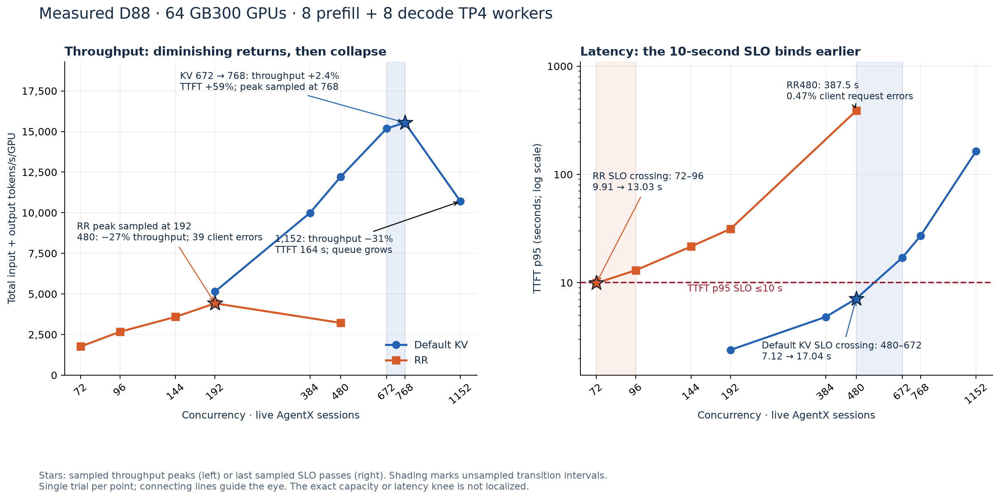
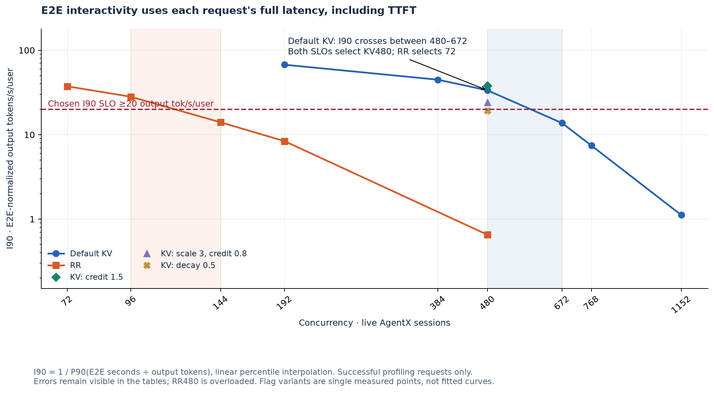
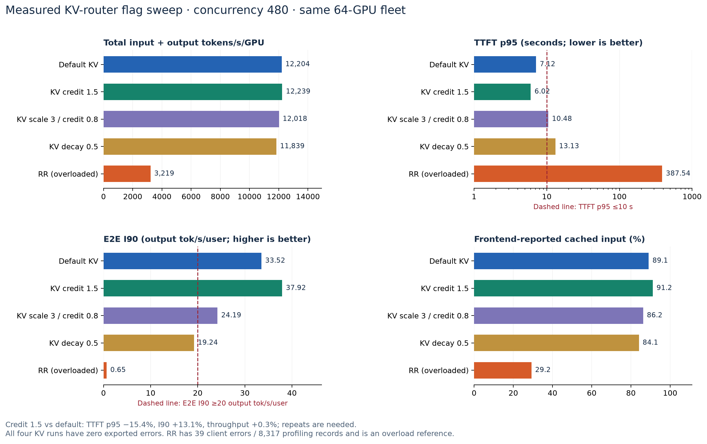
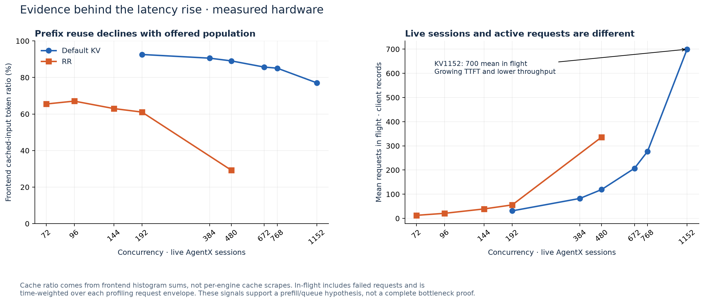

# N3U disaggregated serving: KV-aware routing versus round-robin

Hardware collected **2026-09-17–19** · **64 GB300 GPUs, 8 prefill + 8 decode TP4 workers** · **14 measured runs: 6 default KV, 5 RR, 3 tuned KV**

With **TTFT p95 ≤10 seconds** and **E2E-normalized interactivity at P90 ≥20 output tokens/s/user**, the best measured default-KV point is **480 sessions**, versus **72 for RR**: **6.92× total tokens/s/GPU**. Overlap credit **1.5 at 480** also passes both limits, reducing TTFT p95 **7.12 → 6.02 s (−15.4%)** and increasing E2E interactivity **33.52 → 37.92 tok/s**. Its **+0.3% throughput change needs repeat testing**. These are best sampled points, not established capacity limits.

[Standalone HTML](agentx-disagg-kv-rr-report.html) · [all plotted data (CSV)](agentx-disagg-kv-rr-report.csv) · [data and provenance (JSON)](agentx-disagg-kv-rr-report.json) · [preserved inputs (ZIP)](agentx-disagg-kv-rr-report-inputs.zip) · [agg companion report](agentx-agg-kv-rr-report.md)

This report follows the agg report's sweep, knee, SLO and flag-comparison structure. Its hardware inventory is pinned to [AGENTX_D88_RESULTS.md at `5726009`](https://github.com/alisachen-google/gcp-dynamo-cuj/blob/57260092dc15e5fd5de5343501c61836c60dc312/kv-cache-aware-bench/nemotron-3-ultra-550b-nvfp4/AGENTX_D88_RESULTS.md); the original AIPerf summaries and request exports provide full-precision metrics. Later measurements are outside this snapshot. No new hardware jobs were launched to prepare it.

## 1. Real data sweep and knee

### Setup and metric definitions

The fleet has **8 prefill and 8 decode TP4 workers** across 16 × a4x-maxgpu-4g nodes, with one MNNVL ComputeDomain and Mooncake/MNNVL KV transfer. The source reports SGLang 0.5.16, Dynamo 1.4.2 and FlashInfer 0.6.18. The exported client configuration verifies AIPerf's `inferencex-agentx-mvp` scenario, Weka 256K corpus (**393 sessions**), seed **42**, **3,600 s** profiling, **60 s** grace, **200 client workers**, streaming, server token counts, `ignore_eos`, end-to-start agentic replay and per-play `first_turn_prefix` cache busting. Trajectory starts are sampled in **25–75%** of the trace before warmup; do not compare to a different start range without labeling that workload change.

| Metric | Definition used here |
| --- | --- |
| Concurrency | Live AgentX session trees, including spawned subagents and recorded think time; not requests on the wire. |
| Total throughput/GPU | AIPerf input + output token throughput divided by **all 64 GPUs**. Cached inputs count; this is not newly computed token throughput. |
| Output throughput/GPU | Output-only throughput divided by all 64 GPUs, reported beside the total. |
| TTFT p95 | Successful profiling requests' time to first token; chosen limit **≤10 s**. |
| E2E I90 | **`1 / P90(E2E_seconds / output_tokens)`**, calculated per successful profiling request with linear percentile interpolation; chosen limit **≥20 output tok/s/user**. |
| Cached input | `dynamo_frontend_cached_tokens` histogram sum / `dynamo_frontend_input_sequence_tokens` histogram sum from the exported frontend scrape. **Not per-engine cache hit telemetry.** |
| In-flight | Time-weighted number of open client requests, including errors, over the first-start to last-end envelope of profiling-tagged records. Not an engine running-batch gauge. |
| Error / health | Errors are counted separately; latency percentiles exclude them. The selected SLO points all have zero errors and pass the source's queue check. |

The source's column named “P90 interactivity” is **`1000 / ITL_p90_ms`**, which describes decode speed. This report replaces that comparison with the same **E2E I90** used in the agg report. Both values remain in the downloadable data to make the distinction explicit. The chosen 20 tok/s threshold is our engineering criterion, not a dataset requirement. AIPerf's embedded request-goodput settings (TTFT 5 s / ITL 10 ms) are separate and are not used to select these points.



[SVG](agentx-disagg-kv-rr-report-hardware.svg) · [PDF](agentx-disagg-kv-rr-report-hardware.pdf)


### Measured hardware points

| Policy | Sessions | Total tok/s/GPU | Output tok/s/GPU | Req/s | TTFT p95 (s) | E2E I90 (tok/s) | Cached input | Errors | Queue check |
| --- | --- | --- | --- | --- | --- | --- | --- | --- | --- |
| Default KV | 192 | 5,142 | 50.75 | 3.47 | 2.40 | 67.3601 | 92.6% | 0 | AT/PRE-KNEE |
| Default KV | 384 | 9,993 | 100.04 | 6.74 | 4.83 | 44.7508 | 90.6% | 0 | AT/PRE-KNEE |
| Default KV | 480 | 12,204 | 123.36 | 8.23 | 7.12 | 33.5225 | 89.1% | 0 | AT/PRE-KNEE |
| Default KV | 672 | 15,184 | 149.17 | 10.22 | 17.04 | 13.7406 | 85.7% | 0 | AT/PRE-KNEE |
| Default KV | 768 | 15,543 | 152.20 | 10.41 | 27.14 | 7.4108 | 85.1% | 0 | AT/PRE-KNEE |
| Default KV | 1152 | 10,697 | 107.71 | 7.40 | 164.32 | 1.1161 | 77.1% | 0 | POST-KNEE |
| RR | 72 | 1,763 | 20.47 | 1.36 | 9.91 | 37.3998 | 65.5% | 0 | AT/PRE-KNEE |
| RR | 96 | 2,671 | 29.62 | 1.98 | 13.03 | 28.0935 | 67.1% | 0 | AT/PRE-KNEE |
| RR | 144 | 3,588 | 40.78 | 2.67 | 21.63 | 13.9890 | 63.0% | 0 | AT/PRE-KNEE |
| RR | 192 | 4,419 | 44.48 | 3.06 | 31.45 | 8.3783 | 61.1% | 0 | AT/PRE-KNEE |
| RR | 480 | 3,219 | 34.32 | 2.26 | 387.54 | 0.6525 | 29.2% | 39 | POST-KNEE |
| KV: credit 1.5 | 480 | 12,239 | 123.83 | 8.25 | 6.02 | 37.9246 | 91.2% | 0 | AT/PRE-KNEE |
| KV: scale 3, credit 0.8 | 480 | 12,018 | 121.56 | 8.11 | 10.48 | 24.1932 | 86.2% | 0 | AT/PRE-KNEE |
| KV: decay 0.5 | 480 | 11,839 | 119.49 | 8.00 | 13.13 | 19.2392 | 84.1% | 0 | AT/PRE-KNEE |

### What is a knee in these plots?

**Throughput and SLO limits answer different questions.** Default KV has its highest sampled throughput at **768**, but **480** is the highest sampled point satisfying both latency limits. RR's highest sampled throughput is **192**, while its last sampled TTFT pass is **72**. The source queue check labels a run AT/PRE-KNEE or POST-KNEE using within-run queue behavior; that label alone does not locate a cross-concurrency optimum.

| Evidence | Measured change | Interpretation |
| --- | --- | --- |
| KV 672 → 768 | Total throughput +2.4%; TTFT p95 17.04 → 27.14 s (+59%) | Diminishing returns; both points already fail the 10 s SLO. |
| KV 768 → 1,152 | Throughput −31.2%; TTFT p95 27.14 → 164.32 s; TTFT p50 first/last quarter 40.40 → 137.82 s at 1,152 | Measured collapse and a growing queue. Refine 672–1,152 to localize the throughput transition. |
| RR 192 → 480 | Throughput −27.2%; TTFT p95 31.45 → 387.54 s; 39 client errors | A coarse overload bracket. 192 is a sampled peak, not proof that the exact knee is 192. |
| Default KV 480 → 672 | TTFT p95 7.12 → 17.04 s; E2E I90 crosses below 20 | Both chosen latency boundaries lie within this unsampled interval. |
| RR 72 → 96 | TTFT p95 9.91 → 13.03 s | TTFT boundary lies in 72–96. RR72 has only **0.089 s (0.89%)** headroom; repeat it. |

There is one trial per cell, so no repeat-derived confidence interval or noise floor supports an exact knee. Connecting lines do not add measured points. The flag variants have one concurrency each; their knees cannot be inferred from that single point.

### Source jobs

| Run / original artifacts | Sessions | Completed UTC | Summary and per-request provenance |
| --- | --- | --- | --- |
| [Default KV C192](https://console.cloud.google.com/storage/browser/alisachen-models/perf/1789672351_alisachen-n3u-mnnvl-88-agentx-kv-c192) | 192 | 2026-09-17 20:53 | [summary](agentx-disagg-kv-rr-data/hardware/n3u-mnnvl-88-agentx-kv-c192.json) · [request manifest](agentx-disagg-kv-rr-data/request-metrics/manifest.json) |
| [Default KV C384](https://console.cloud.google.com/storage/browser/alisachen-models/perf/1789678827_alisachen-n3u-mnnvl-88-agentx-kv-c384) | 384 | 2026-09-17 22:59 | [summary](agentx-disagg-kv-rr-data/hardware/n3u-mnnvl-88-agentx-kv-c384.json) · [request manifest](agentx-disagg-kv-rr-data/request-metrics/manifest.json) |
| [Default KV C480](https://console.cloud.google.com/storage/browser/alisachen-models/perf/1789740024_alisachen-n3u-mnnvl-88-agentx-kv-c480) | 480 | 2026-09-18 16:18 | [summary](agentx-disagg-kv-rr-data/hardware/n3u-mnnvl-88-agentx-kv-c480.json) · [request manifest](agentx-disagg-kv-rr-data/request-metrics/manifest.json) |
| [Default KV C672](https://console.cloud.google.com/storage/browser/alisachen-models/perf/1789686412_alisachen-n3u-mnnvl-88-agentx-kv-c672) | 672 | 2026-09-18 01:38 | [summary](agentx-disagg-kv-rr-data/hardware/n3u-mnnvl-88-agentx-kv-c672.json) · [request manifest](agentx-disagg-kv-rr-data/request-metrics/manifest.json) |
| [Default KV C768](https://console.cloud.google.com/storage/browser/alisachen-models/perf/1789695978_alisachen-n3u-mnnvl-88-agentx-kv-c768) | 768 | 2026-09-18 04:26 | [summary](agentx-disagg-kv-rr-data/hardware/n3u-mnnvl-88-agentx-kv-c768.json) · [request manifest](agentx-disagg-kv-rr-data/request-metrics/manifest.json) |
| [Default KV C1152](https://console.cloud.google.com/storage/browser/alisachen-models/perf/1789706033_alisachen-n3u-mnnvl-88-agentx-kv-c1152) | 1152 | 2026-09-18 07:38 | [summary](agentx-disagg-kv-rr-data/hardware/n3u-mnnvl-88-agentx-kv-c1152.json) · [request manifest](agentx-disagg-kv-rr-data/request-metrics/manifest.json) |
| [RR C72](https://console.cloud.google.com/storage/browser/alisachen-models/perf/1789773750_alisachen-n3u-mnnvl-88-agentx-rr-c72) | 72 | 2026-09-19 00:42 | [summary](agentx-disagg-kv-rr-data/hardware/n3u-mnnvl-88-agentx-rr-c72.json) · [request manifest](agentx-disagg-kv-rr-data/request-metrics/manifest.json) |
| [RR C96](https://console.cloud.google.com/storage/browser/alisachen-models/perf/1789734386_alisachen-n3u-mnnvl-88-agentx-rr-c96) | 96 | 2026-09-18 13:50 | [summary](agentx-disagg-kv-rr-data/hardware/n3u-mnnvl-88-agentx-rr-c96.json) · [request manifest](agentx-disagg-kv-rr-data/request-metrics/manifest.json) |
| [RR C144](https://console.cloud.google.com/storage/browser/alisachen-models/perf/1789728380_alisachen-n3u-mnnvl-88-agentx-rr-c144) | 144 | 2026-09-18 12:16 | [summary](agentx-disagg-kv-rr-data/hardware/n3u-mnnvl-88-agentx-rr-c144.json) · [request manifest](agentx-disagg-kv-rr-data/request-metrics/manifest.json) |
| [RR C192](https://console.cloud.google.com/storage/browser/alisachen-models/perf/1789721971_alisachen-n3u-mnnvl-88-agentx-rr-c192) | 192 | 2026-09-18 10:36 | [summary](agentx-disagg-kv-rr-data/hardware/n3u-mnnvl-88-agentx-rr-c192.json) · [request manifest](agentx-disagg-kv-rr-data/request-metrics/manifest.json) |
| [RR C480](https://console.cloud.google.com/storage/browser/alisachen-models/perf/1789757358_alisachen-n3u-mnnvl-88-agentx-rr-c480) | 480 | 2026-09-18 20:53 | [summary](agentx-disagg-kv-rr-data/hardware/n3u-mnnvl-88-agentx-rr-c480.json) · [request manifest](agentx-disagg-kv-rr-data/request-metrics/manifest.json) |
| [KV: credit 1.5 C480](https://console.cloud.google.com/storage/browser/alisachen-models/perf/1789778938_alisachen-n3u-mnnvl-88-agentx-kvc15-c480) | 480 | 2026-09-19 03:01 | [summary](agentx-disagg-kv-rr-data/hardware/n3u-mnnvl-88-agentx-kvc15-c480.json) · [request manifest](agentx-disagg-kv-rr-data/request-metrics/manifest.json) |
| [KV: scale 3, credit 0.8 C480](https://console.cloud.google.com/storage/browser/alisachen-models/perf/1789748912_alisachen-n3u-mnnvl-88-agentx-kvs3c08-c480) | 480 | 2026-09-18 18:42 | [summary](agentx-disagg-kv-rr-data/hardware/n3u-mnnvl-88-agentx-kvs3c08-c480.json) · [request manifest](agentx-disagg-kv-rr-data/request-metrics/manifest.json) |
| [KV: decay 0.5 C480](https://console.cloud.google.com/storage/browser/alisachen-models/perf/1789765406_alisachen-n3u-mnnvl-88-agentx-kvd05-c480) | 480 | 2026-09-18 23:15 | [summary](agentx-disagg-kv-rr-data/hardware/n3u-mnnvl-88-agentx-kvd05-c480.json) · [request manifest](agentx-disagg-kv-rr-data/request-metrics/manifest.json) |

## 2. KV versus RR at equal configuration and equal SLO

### 2.1 Same configuration and client count

Both policies use the same 64-GPU 8:8 fleet shape, corpus, seed and profiling settings. Runs are sequential; the frontend is restarted with different router flags. Per-run cache-bust IDs and the turns completed in a time-bounded closed loop differ. Only **192 and 480** were measured for both default policies.

| Sessions | KV total/GPU | RR total/GPU | KV/RR throughput | KV TTFT p95 | RR TTFT p95 | RR/KV TTFT | Qualification |
| --- | --- | --- | --- | --- | --- | --- | --- |
| 192 | 5,142 | 4,419 | 1.16× | 2.40 s | 31.45 s | 13.12× | Both zero errors; RR misses SLO |
| 480 | 12,204 | 3,219 | 3.79× | 7.12 s | 387.54 s | 54.42× | RR overloaded; 39 client errors |

The **192-session** comparison is the cleaner equal-population result: **16.4% more total throughput** for KV and **13.12× shorter p95 TTFT**. At 480, the **3.79× throughput ratio** describes operation against an overloaded RR reference and must not be presented as sustainable capacity at equal load.

### 2.2 TTFT-only comparison: p95 ≤10 seconds

Select the highest-throughput measured point passing the same TTFT threshold, with a passing queue check and zero exported errors. Concurrency may differ; GPU count and topology remain fixed.

| Policy | Selected sessions | Total tok/s/GPU | Output tok/s/GPU | TTFT p95 (s) | Total throughput/RR |
| --- | --- | --- | --- | --- | --- |
| Default KV | 480 | 12,204 | 123.36 | 7.12 | 6.92× |
| RR | 72 | 1,763 | 20.47 | 9.91 | 1.00× |
| KV: credit 1.5 | 480 | 12,239 | 123.83 | 6.02 | 6.94× |

Default **KV480 versus RR72 gives 6.92× total throughput/GPU**, **6.03× output-only throughput/GPU**, and **6.05× requests/s**. These ratios differ because the completed request mix differs. Credit 1.5 at 480 gives **6.94×** RR72's total throughput. Neither scale 3 / credit 0.8 nor decay 0.5 passes TTFT at its only measured point, 480; their lower-concurrency capacity is unmeasured.

### 2.3 E2E-normalized interactivity at P90 ≥20 output tokens/s

E2E covers one inference request's TTFT and generation, excluding human think time, tools and later turns. For each successful profiling request, divide its `request_latency` by its server-counted `output_sequence_length`, take P90, then invert. Warmup and failed/cancelled requests are excluded and counted separately. All successful exported requests in this snapshot have valid positive E2E and output length. Full-precision TTFT, E2E p95 and AIPerf's P10 E2E output rate are independently reconciled to each summary; P10 output/E2E is not substituted for the canonical inverse-P90 calculation.



[SVG](agentx-disagg-kv-rr-report-interactivity.svg) · [PDF](agentx-disagg-kv-rr-report-interactivity.pdf)


| Hardware setting | Sessions | TTFT p95 (s) | E2E p95 (s) | I90 (tok/s/user) | TTFT ≤10 | I90 ≥20 | Both pass | Errors |
| --- | --- | --- | --- | --- | --- | --- | --- | --- |
| Default KV | 192 | 2.40 | 31.75 | 67.3601 | Pass | Pass | Pass | 0 |
| Default KV | 384 | 4.83 | 43.19 | 44.7508 | Pass | Pass | Pass | 0 |
| Default KV | 480 | 7.12 | 49.93 | 33.5225 | Pass | Pass | Pass | 0 |
| Default KV | 672 | 17.04 | 62.08 | 13.7406 | Fail | Fail | Fail | 0 |
| Default KV | 768 | 27.14 | 70.54 | 7.4108 | Fail | Fail | Fail | 0 |
| Default KV | 1152 | 164.32 | 182.22 | 1.1161 | Fail | Fail | Fail | 0 |
| RR | 72 | 9.91 | 30.98 | 37.3998 | Pass | Pass | Pass | 0 |
| RR | 96 | 13.03 | 34.20 | 28.0935 | Fail | Pass | Fail | 0 |
| RR | 144 | 21.63 | 44.15 | 13.9890 | Fail | Fail | Fail | 0 |
| RR | 192 | 31.45 | 50.69 | 8.3783 | Fail | Fail | Fail | 0 |
| RR | 480 | 387.54 | 394.52 | 0.6525 | Fail | Fail | Fail | 39 |
| KV: credit 1.5 | 480 | 6.02 | 50.27 | 37.9246 | Pass | Pass | Pass | 0 |
| KV: scale 3, credit 0.8 | 480 | 10.48 | 51.17 | 24.1932 | Fail | Pass | Fail | 0 |
| KV: decay 0.5 | 480 | 13.13 | 51.71 | 19.2392 | Fail | Fail | Fail | 0 |

**Highest-throughput eligible samples under both run-level limits:**

| Policy | Sessions | Total tok/s/GPU | Output tok/s/GPU | TTFT p95 (s) | E2E I90 (tok/s) | Total/RR |
| --- | --- | --- | --- | --- | --- | --- |
| Default KV | 480 | 12,204 | 123.36 | 7.12 | 33.5225 | 6.92× |
| RR | 72 | 1,763 | 20.47 | 9.91 | 37.3998 | 1.00× |
| KV: credit 1.5 | 480 | 12,239 | 123.83 | 6.02 | 37.9246 | 6.94× |

The combined selections match the TTFT-only selections in this snapshot. The two limits still reject different flag variants: **scale 3 / credit 0.8 passes I90 but fails TTFT**, while **decay 0.5 fails both**. For the interactivity-only criterion, RR can reach 96 sessions, while default KV remains at 480. Two separate run-level percentile limits do not establish the fraction of requests meeting both individual limits. These are closed-loop replay operating points; a production arrival-rate guarantee needs separate validation.

### 2.4 Real KV-router flag sweep at 480 sessions

Temperature **0** and **FCFS** are held fixed for all measured KV rows. Numeric defaults below follow the source recipe's stated defaults; unset flags inherit Dynamo defaults. The exact arguments are preserved with the runner. There are **four KV configurations including baseline**, plus an overloaded RR reference.

| Setting | Prefill-load scale | Overlap credit | Credit decay | Changed arguments |
| --- | --- | --- | --- | --- |
| Default KV | 1 | 1 | 0 | None; KV defaults |
| KV: credit 1.5 | 1 | 1.5 | 0 | `--router-kv-overlap-score-credit 1.5` |
| KV: scale 3, credit 0.8 | 3 | 0.8 | 0 | `--router-prefill-load-scale 3 --router-kv-overlap-score-credit 0.8` |
| KV: decay 0.5 | 1 | 1 | 0.5 | `--router-kv-overlap-score-credit-decay 0.5` |


[SVG](agentx-disagg-kv-rr-report-flag-sweep.svg) · [PDF](agentx-disagg-kv-rr-report-flag-sweep.pdf)

| 480-session setting | Total tok/s/GPU | Δ throughput | TTFT p95 (s) | Δ TTFT | E2E I90 | Cached input | Both pass |
| --- | --- | --- | --- | --- | --- | --- | --- |
| Default KV | 12,204 | +0.00% | 7.12 | +0.0% | 33.5225 | 89.08% | Pass |
| KV: credit 1.5 | 12,239 | +0.29% | 6.02 | -15.4% | 37.9246 | 91.15% | Pass |
| KV: scale 3, credit 0.8 | 12,018 | -1.52% | 10.48 | +47.1% | 24.1932 | 86.24% | Fail |
| KV: decay 0.5 | 11,839 | -2.99% | 13.13 | +84.3% | 19.2392 | 84.08% | Fail |
| RR | 3,219 | -73.63% | 387.54 | +5342.5% | 0.6525 | 29.24% | Fail |

**Credit 1.5 is the strongest measured candidate at 480.** Compared with default KV, TTFT p95 decreases **15.4%**, E2E I90 increases **13.1%**, and the frontend cached-input ratio increases **2.08 percentage points**. Throughput changes only **+0.29%**. The tail improvement is observed in one trial; repeat both baseline and candidate before calling it reproducible.

**Scale 3 / credit 0.8** reduces total throughput **1.5%** and raises TTFT p95 to **10.48 s**. **Decay 0.5** reduces throughput **3.0%**, raises TTFT p95 to **13.13 s**, and drops I90 below 20. The first variant changes two flags together, so this experiment cannot attribute its regression separately to load scale and credit. Decay 0.5 and credit 1.5 each change one flag from default.

The observed direction differs from the [agg flag sweep](agentx-agg-kv-rr-report.md#24-real-kv-router-flag-sweep), where scale 3 / credit 0.8 helped at 192 sessions. An agg setting should not be copied into disagg without measuring it: the prefill and decode queues, GPU allocation and active request mix differ. The present data support testing stronger prefix preference on D88; they do not prove that any one router formula or bottleneck explains the entire difference.

The source prose still describes a **>2% throughput** winner gate. Its pinned `pick_agentx_flag_winner.py` also accepts **>10% TTFT reduction** with throughput no more than **1% below default** and a passing queue check. Credit 1.5 meets that updated operational rule. Neither rule replaces repeat-based uncertainty analysis.

Candidate router arguments, for a controlled repeat:

```text
--router-mode kv
--router-temperature 0.0
--router-queue-policy fcfs
--router-kv-overlap-score-credit 1.5
```

Load scale 1 and decay 0 remain the source's defaults. Credit 2.0 and a 576-session follow-up are listed in the source orchestration but have no completed row in this 14-run snapshot. They are not plotted as results.

### 2.5 Why KV helps, and what the measurements establish



[SVG](agentx-disagg-kv-rr-report-cache-load.svg) · [PDF](agentx-disagg-kv-rr-report-cache-load.pdf)


At 192 sessions, KV reports **92.6% cached input** versus **61.1% for RR**, alongside TTFT p95 **2.40 versus 31.45 s**. At 480, RR falls to **29.2% cached input**, carries about **336 mean requests in flight**, and has **39 exported client request failures**; KV reports **89.1% cached input** with about **119 in flight** and no request errors. This is consistent with extra prefill work and queue pressure when prefix reuse is lost.

ITL remains relatively low even as TTFT explodes; decode-only speed therefore hides the request-level slowdown. This supports investigating the prefill/admission path first. It does **not** isolate prefill compute, scheduler wait and KV handoff latency: the export scrapes the frontend, not every prefill/decode engine, and this report has no phase-aligned per-engine GPU, KV occupancy or transfer-latency series. Those measurements are needed for a complete bottleneck attribution.

### 2.6 Replay health and comparability

All 14 summaries report `submission_valid: true`; none of the preserved request records is a context-overflow skip or cancellation. **RR480 has 39 client request errors / 8,317 profiling records (0.469%)**, leaving **8,278 successes** for latency percentiles. The summary identifies all 39 as responses without actual content. Separately, the source report cites **353 server-side 300-second disaggregation queue-wait timeouts** and a MNNVL guard verdict of **overload with healthy transport**. Those 353 events have not been reconciled to the client records and must not be used as the AIPerf request-error count. Matching server events to request IDs is an outstanding audit item. A valid replay stamp is not a serving-health certificate; no per-engine transport logs were newly audited here.

The source queue checker marks a run POST-KNEE if TTFT p50 grows by both >1.5× and >2 s from first to last time-quarter, overall TTFT p50 exceeds 20 s, or bad-request fraction exceeds 5%. Recalculation from the preserved records reproduces its verdicts. **RR480 is post-knee because of its standing queue**, despite a lower last-quarter median; **KV1152 has both a standing and growing queue**. AT/PRE-KNEE does not mean that the run passes our TTFT or E2E SLO.

| Run | Warmup requests | Warmup wall (s) | Client in-flight mean / peak | TTFT p50 Q1 → Q4 (s) | Queue check |
| --- | --- | --- | --- | --- | --- |
| Default KV C192 | 185 | 1,699.2 | 31.1 / 60 | 0.36 → 0.39 | AT/PRE-KNEE |
| Default KV C384 | 349 | 2,694.8 | 82.4 / 123 | 0.64 → 0.55 | AT/PRE-KNEE |
| Default KV C480 | 445 | 3,334.4 | 119.3 / 182 | 0.93 → 0.74 | AT/PRE-KNEE |
| Default KV C672 | 618 | 4,258.7 | 207.1 / 273 | 4.93 → 4.17 | AT/PRE-KNEE |
| Default KV C768 | 702 | 4,718.1 | 276.8 / 392 | 7.16 → 9.64 | AT/PRE-KNEE |
| Default KV C1152 | 1059 | 6,389.1 | 699.6 / 886 | 40.40 → 137.82 | POST-KNEE |
| RR C72 | 68 | 814.8 | 12.6 / 32 | 1.20 → 0.45 | AT/PRE-KNEE |
| RR C96 | 91 | 971.8 | 20.9 / 44 | 1.44 → 0.99 | AT/PRE-KNEE |
| RR C144 | 141 | 1,304.1 | 39.1 / 84 | 5.92 → 1.00 | AT/PRE-KNEE |
| RR C192 | 185 | 1,705.9 | 55.7 / 99 | 11.19 → 4.12 | AT/PRE-KNEE |
| RR C480 | 445 | 3,350.2 | 336.2 / 444 | 96.54 → 47.82 | POST-KNEE |
| KV: credit 1.5 C480 | 445 | 3,328.5 | 117.6 / 177 | 0.75 → 0.66 | AT/PRE-KNEE |
| KV: scale 3, credit 0.8 C480 | 445 | 3,331.8 | 125.1 / 191 | 2.21 → 0.89 | AT/PRE-KNEE |
| KV: decay 0.5 C480 | 445 | 3,321.6 | 130.2 / 200 | 4.01 → 1.77 | AT/PRE-KNEE |

All five C480 runs have **445 successful warmup requests**. Their warmup wall times span **3,321.6–3,350.2 s**, a **0.86%** range relative to default KV. This corrects the source prose's “within 0.5%” statement for the full C480 group. Similar warmup duration is a useful check, but does not establish an undegraded fleet or identical physical cache state. Caches were not flushed between runs; per-play cache busting prevents recycled trace content from simply reusing a previous play's marked prefix, while old blocks can still occupy cache capacity.

The separate plain-replay warmup in the job template exits on a duplicate flag according to the source report; the successful AgentX trajectory warmup is the one used here. Tokenizer name is recorded, but an immutable tokenizer revision and server image digest are not attested by these summaries; this limits future byte-for-byte reproduction. GPU utilization is unmeasured here, not zero.

Closed-loop progression changes the request cohort even at fixed concurrency. The following descriptors make that visible; no assumption of identical completed turns is made.

| Run | Successful requests | ISL p50 | OSL p90 / p99 | Turn index p50 | Distinct source traces | Profiled sessions/lane |
| --- | --- | --- | --- | --- | --- | --- |
| Default KV C192 | 12,744 | 80,114 | 2,037 / 8,858 | 12 | 268 | 1.40 |
| Default KV C384 | 24,736 | 81,187 | 2,154 / 8,157 | 12 | 357 | 1.41 |
| Default KV C480 | 30,205 | 82,104 | 2,112 / 9,001 | 12 | 377 | 1.35 |
| Default KV C672 | 37,508 | 82,347 | 2,077 / 8,392 | 12 | 393 | 1.31 |
| Default KV C768 | 38,194 | 83,354 | 2,130 / 8,245 | 12 | 393 | 1.27 |
| Default KV C1152 | 27,146 | 77,572 | 2,093 / 7,820 | 10 | 393 | 1.01 |
| RR C72 | 4,982 | 63,460 | 2,152 / 7,888 | 9 | 109 | 1.51 |
| RR C96 | 7,267 | 70,482 | 2,102 / 7,564 | 10 | 145 | 1.51 |
| RR C144 | 9,810 | 69,262 | 2,069 / 9,371 | 9 | 198 | 1.38 |
| RR C192 | 11,184 | 76,944 | 2,048 / 8,656 | 12 | 252 | 1.31 |
| RR C480 | 8,278 | 76,630 | 2,093 / 8,221 | 8 | 316 | 0.94 |
| KV: credit 1.5 C480 | 30,293 | 82,103 | 2,112 / 9,051 | 12 | 377 | 1.36 |
| KV: scale 3, credit 0.8 C480 | 29,757 | 82,156 | 2,116 / 8,953 | 12 | 377 | 1.35 |
| KV: decay 0.5 C480 | 29,369 | 82,009 | 2,108 / 8,812 | 12 | 375 | 1.34 |

## 3. Simulation method, calibration gaps and next measurements

### 3.1 Native simulation status

**All 14 hardware samples above are measured, not simulation.** There is no completed, matched Native DynoSim result set for this entire D88 concurrency/flag grid in the pinned source. The [C480 native flag simulation report](agentx-disagg-c480-kv-flags.md) tracks that work separately. As checked at **2026-09-19 03:25 UTC**, it has **0 completed runs; baseline and credit 0.8 failed before exporting results**, and two scale-control runs are active. It uses a **V11 disaggregation extension with frozen V10 AIC timing coefficients**, and should not be labeled the unchanged Native V10 build. Consult that live report for later completion status. Failed or active jobs do not supply a comparison point.

This report does not substitute the source's older custom Python **v5** model for Native V10, or fill missing points with a fitted curve. Matching native-vs-hardware comparisons require the same 8:8 topology, concurrency, router settings and replay configuration, with a recorded native binary hash. Completed agg V10 calibration does not by itself validate disaggregated scheduling or KV handoff.

### 3.2 Historical simulation gap in the source report

The source used the older v5 stream-level model to choose its initial ladder. The table below is a **historical error audit only**; those forecasts are not part of the current Native V10/V11 comparison. Measured latency is much higher than forecast, especially at large populations. This makes the model unsuitable for choosing the D88 SLO boundary without further calibration.

| Policy | Sessions | Old v5 total/GPU | Measured total/GPU | Old v5 TTFT p95 (s) | Measured TTFT p95 (s) | Measured/old TTFT |
| --- | --- | --- | --- | --- | --- | --- |
| Default KV | 192 | 3,329 | 5,142 | 1.07 | 2.40 | 2.2× |
| Default KV | 1152 | 24,663 | 10,697 | 12.78 | 164.32 | 12.9× |
| RR | 96 | 2,322 | 2,671 | 5.38 | 13.03 | 2.4× |
| RR | 192 | 4,083 | 4,419 | 8.64 | 31.45 | 3.6× |
| Default KV | 384 | 8,379 | 9,993 | 2.93 | 4.83 | 1.6× |
| Default KV | 768 | 19,034 | 15,543 | 4.39 | 27.14 | 6.2× |
| RR | 144 | 2,915 | 3,588 | 7.12 | 21.63 | 3.0× |
| Default KV | 480 | 9,697 | 12,204 | 2.41 | 7.12 | 3.0× |
| RR | 480 | 8,435 | 3,219 | 131.22 | 387.54 | 3.0× |
| Default KV | 672 | 15,183 | 15,184 | 3.86 | 17.04 | 4.4× |

The measurements establish a prediction gap, not its complete cause. A calibration investigation should separate **prefix residency and frontend overlap estimates**, **prefill admission/queueing**, **prefill–decode handoff and timeout behavior**, and **decode timing under actual batches**. Router tuning is an implementation experiment; changing AIC timing coefficients to fit a queueing error would mix mechanisms. Fit on declared calibration points, then retain a concurrency and flag variant as held-out validation before trusting a simulated knee.

### 3.3 Recommended additional measurements

| Priority | Additional points | Purpose |
| --- | --- | --- |
| 1 | Repeat default KV480 and credit-1.5 KV480; repeat RR72 | Establish noise at the candidate improvement and at RR's very narrow TTFT margin. Alternate run order with identical cache protocol. |
| 2 | KV default and credit 1.5 at 576; refine toward 528 or 624 based on the result | Bisect the measured 480–672 latency boundary under **both** limits. No presumed pass at an unmeasured point. |
| 3 | RR84, then 78 or 90 as appropriate | Refine the 72–96 TTFT boundary after confirming RR72. |
| 4 | Credit 1.25 / 1.5 / 2.0 at C480, with load scale 1 and decay 0 | Isolate credit response; credit 1.5 is currently one trial. Credit 2.0 is planned in the source, not measured in this snapshot. |
| 5 | Scale 1 / 2 / 3 at fixed credit; decay 0 / 0.25 / 0.5 at fixed scale and credit | Separate the two changes in the scale-3/credit-0.8 regression and identify whether mild decay helps before expanding the grid. |
| 6 | Matched native C480 default, credit 1.5, scale 3 / credit 0.8, and decay 0.5 | Test simulation ranking against these measured flags. The initial native sweep needs a credit-1.5 case to cover the new hardware candidate. |

For every added cell, record per-engine cache and KV occupancy, queue/running/prefill counts, phase-aligned GPU telemetry and transfer/wait time, alongside request-level E2E, output length, errors and source-trace IDs. Preserve corpus, tokenizer revision, scenario settings, duration and native/server build identities. Geometric expansion serves capacity exploration; bisection and repeats serve the chosen latency boundary.

## 4. Reproduction and audit trail


The [input manifest](agentx-disagg-kv-rr-data/manifest.json) pins the original source commit, every GCS summary, frontend metrics export and SHA-256. The [request-metrics manifest](agentx-disagg-kv-rr-data/request-metrics/manifest.json) records hashes of the original full JSONL exports and of compact CSV projections; all phases and statuses are retained without prompt/response text. The input ZIP includes these files and the two report scripts. Summary/token/latency checks, source rounding agreement, queue verdicts, warmup and in-flight reconciliation run every time the report is generated.

The source fleet manifest, benchmark template, router runner and queue-check logic are preserved under [`agentx-disagg-kv-rr-data/source/`](agentx-disagg-kv-rr-data/manifest.json). [Validation results](agentx-disagg-kv-rr-report-validation.json) list the checked inventory and exclusions.

Regenerate offline from the repository root (Python with NumPy, Matplotlib and markdown-it-py):

```bash
python kv-cache-aware-bench/nemotron-3-ultra-550b-nvfp4/scripts/gen_disagg_kv_rr_report.py
```

The initial read-only GCS import used:

```bash
python kv-cache-aware-bench/nemotron-3-ultra-550b-nvfp4/scripts/import_agentx_d88.py \
  --scratch /tmp/agentx-d88-import
```

Re-importing follows the current source inventory; it intentionally requires network access. Offline regeneration uses the pinned preserved snapshot instead. No simulation or GPU benchmark is launched by either report-generation command.
