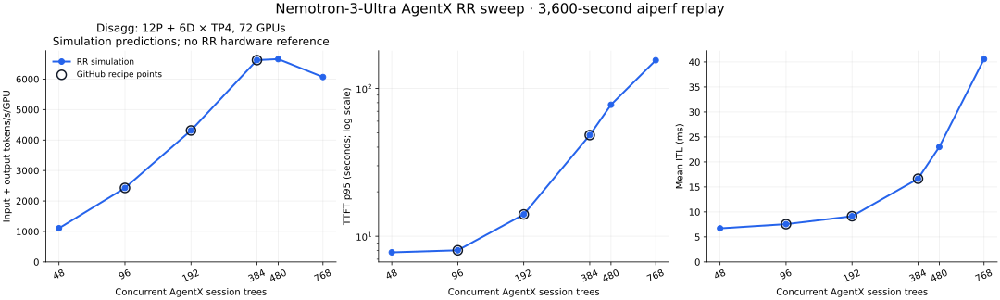

# Disagg 12P:6D RR AgentX recipe simulation

Completed 2026-09-17. These are **72-GPU simulation predictions**, using 18 TP4 workers. The searched GCS artifact namespace contains no corresponding disagg RR hardware results. Real KV performance is not used as an RR measurement.

The [GitHub resume recipe](https://github.com/alisachen-google/gcp-dynamo-cuj/blob/96a019d8922002de91f4f9acc68005c7aac4ea21/kv-cache-aware-bench/nemotron-3-ultra-550b-nvfp4/scripts/resume_126_after_capacity.sh#L18) specifies RR at 192, 96, and 384 clients. The complete simulation extends those points to 48, 480, and 768. Each replays aiperf 0.12.0 itself for 3,600 seconds after its actual trajectory warmup, retaining the full Weka AgentX dependency graph, tokenizer, seed 42, cache-bust rules, 60-second grace, and 1,200-second timeout.

| Clients | Recipe point | Input+output tok/s/GPU | Output tok/s/GPU | TTFT p95, s | Mean ITL, ms | Cached input | Request errors |
|---:|---|---:|---:|---:|---:|---:|---:|
| 48 | extension | 1,106 | 10.7 | 7.79 | 6.72 | 60.63% | 0 |
| 96 | yes | 2,429 | 27.0 | 8.04 | 7.56 | 61.13% | 0 |
| 192 | yes | 4,314 | 43.0 | 14.05 | 9.14 | 59.26% | 0 |
| 384 | yes | 6,624 | 66.7 | 48.30 | 16.65 | 56.62% | 3 |
| 480 | extension | 6,656 | 67.3 | 77.47 | 23.01 | 53.96% | 4 |
| 768 | extension | 6,068 | 57.7 | 154.87 | 40.57 | 47.38% | 8 |

Throughput is nearly flat between 384 and 480 clients, then falls at 768. The 384-client point is a candidate for checking the upper part of this particular model's curve: adding clients beyond it buys little throughput and raises latency. This is not a hardware capacity claim or an SLO gate.

The engine uses independent RR counters on P and D. Every run passes full-window, source-graph, trajectory-warmup, tokenizer, timeout, and both-tier RR-balance checks. At 192 clients, the initial lane snapshots, warmup source/turn/token counts, and matched initial-tree profiling token counts also agree with the **KV hardware run used only as the replay-config source**.

Serving remains approximate: fixed-rate FCFS prefill, static request-admission TPOT, zero transfer time, unlimited admission, and an idealized 100M-token prefix cache per P worker. Hybrid/Mamba cache eligibility and actual chunked scheduling are absent. Subsequent hardware metadata showed smaller advertised cache pools; this historical sweep preserves its original constants for traceability. The [64-GPU sweep](agentx-64gpu-topology.md) records a separate capacity assumption and improved disagg KV decode scoring.

See the [disagg correctness checklist](agentx-replay-howto.md#what-disagg-correctness-requires), [reproduction commands](agentx-replay-howto.md#rr-sweep-agg-and-disagg), and [audited artifacts](../sim-results/agentx_rr_sweep_20260917/README.md).
