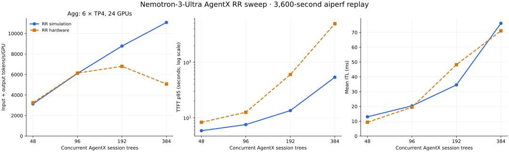

# AgentX replay fidelity, RR sweeps, and KV calibration

Completed 2026-09-17. Study base commit:
`96a019d8922002de91f4f9acc68005c7aac4ea21`.

**The previous simulation did not replay the real AgentX workload faithfully.**
The initial two selected agg cells ran through aiperf 0.12.0 itself, with simulated
serving and an accelerated clock. Both completed a full 3,600-second profiling
window after the actual trajectory warmup. The custom Python serving-model constants
were held fixed; no engine parameters were fitted to these results.

**Engine identity correction:** these results use our local `dynosim_agentx.py::Engine`,
not NVIDIA's upstream DynoSim. AIPerf 0.12.0 supplies the real workload replay;
our code supplies approximate serving latency and cache behavior. The scheduling
limitation below is a local modeling issue, not an established upstream bug.
See the [source-version audit and executable example](agentx-serving-model-audit.md).

The replay checks pass. This establishes agreement on the audited replay
inputs and rules, not identical hardware timing or a calibrated GPU model.
The subsequent RR sweep uses the same replay implementation for agg6 and
disagg12:6. The disagg recipe and the remaining serving-model limitations are
documented in the [run instructions and correctness table](agentx-replay-howto.md#what-disagg-correctness-requires).

AgentX is closed loop: response latency and failures change when dependent
requests become eligible, which trees recycle, and what completes in an hour.

## What was wrong in the previous replay

The latest saved v5 results are disaggregated 12:6 KV, not an agg v5 sweep.
The published agg reference is the v3 CSV; later engine-substitution results
are separate calibration experiments. See the [historical comparison](agentx-replay-calibration.md).

| Replay component | Previous approximation | Actual aiperf behavior retained in the new run |
|---|---|---|
| Dataset construction | v3 uses a 4k-request slice; v5 reconstructs stream trees separately | Public Weka loader, including flattened chains, subagents, seams, and context synthesis |
| Initial root selection | Random draws with replacement in v5 | Sequential root sampler, seed 42; sampled timestamps between 25% and 75% |
| Dependencies and initial dispatch | Simplified parent/child joins and stream delays | Full interval barriers, future child spawning, joins, and sampled-boundary offsets |
| Warmup | Instantaneous cache priming plus 900 seconds of replay in v5 | Spread one-token trajectory priming, followed by a barrier before profiling |
| Recycling | v5b resamples a position; v5d starts at turn 0 but draws roots randomly | A drained whole tree releases its lane; the shared sampler supplies the next root at turn 0 |
| Prompt identity and sizes | Trace block IDs and approximate input sizes | Actual synthesized messages, tokenizer/chat template, cache-bust markers, and output caps |
| Metrics | Custom windows; some old reports compare mean TPOT with median ITL | aiperf's own summary/export pipeline on both simulation and hardware |

The new adapter uses the installed aiperf 0.12.0 implementation. Seven core
loader/replay files were checked byte-for-byte against upstream tag
`be53bf2953d30e46c500e6a80fc1f8b6f84bc718`. Its dataset comes from the actual
processed Arrow cache, snapshot `8fecd2fc56694469f758f0afbbb6335ad3043740`.
Provenance retains the dataset, tokenizer, replay-source, and engine-source
SHA-256 hashes. Hardware benchmark IDs are reused to reproduce cache-bust text.

## Parity results

| Check | RR96 | KV192 |
|---|---:|---:|
| Logged initial lane snapshots matching hardware | 96 / 96 | 192 / 192 |
| Warmup conversation and turn selections matching | 91 / 91 | 185 / 185 |
| Warmup input/output token counts matching | 91 / 91 | 185 / 185 |
| Common successful requests from initially warmed trees with matching input/output counts | 1,798 / 1,798 | 3,956 / 3,956 |
| Actual profiling send window | 3,600.000 s | 3,600.000 s |
| Full token-array checks of cached vs full prompt encoding | 163 passed | 174 passed |

Both loaded **393 roots → 9,602 conversations → 68,266 turns**. Both reproduced
the same **34,015 gated turns**, including the complete join-width histogram
from the hardware logs. They preserve tree-wide cache-bust identity, seed 42,
the 10-second whole-system idle cap, 60-second grace period, and 1,200-second
request timeout. The audit asserts those checks and rejects unexpected errors.

The 5,754 common profiling requests above are an explicitly matched subset,
identified through their initially warmed trees. They are not a claim that
every request or dispatch timestamp in two latency-dependent runs must match.
Full prompt token arrays from hardware were not exported in the downloaded
per-request metric records; the direct hardware comparison is of source/turn
identity and token counts, supported by the pinned reconstruction code.

**Prewarm correction:** the separate 900-second prewarm in the hardware job
template did not complete for either cell. Both GCS prewarm directories contain
only empty directory markers. The main profiling directory timestamps are
16 seconds (RR96) and 17 seconds (KV192) after the job epoch. The
[runner](../scripts/agentx_runner.sh) uses
[`sgl-d72-agentx.yaml`](../../manifests/perf/sgl-d72-agentx.yaml), whose prewarm
repeats `--no-fixed-schedule`. Reproducing it with aiperf 0.12.0 fails immediately
with `Parameter --no-fixed-schedule specified multiple times.` The successful
one-token trajectory warmup is reproduced; no fictitious 900-second prewarm is
added. Persistent GPU cache left by earlier jobs remains outside this model.

## Performance: 6 × TP4, 24 GB300 GPUs

Throughput is **input plus output tokens/s/GPU**. Error is
`100 × (simulation / hardware − 1)`. Values use the same aiperf summary metrics,
including its measurement/grace accounting; these are not active-throughput
or independently normalized record estimates.

| Cell | Published v3 sim | New faithful replay | Hardware | New throughput error |
|---|---:|---:|---:|---:|
| RR, 96 clients | 2,924 | **6,106** | 6,137 | **−0.5%** |
| Default KV, 192 clients | 3,715 | **6,983** | 9,655 | **−27.7%** |

| Metric | RR96 sim / real | Error | KV192 sim / real | Error |
|---|---:|---:|---:|---:|
| TTFT p95, seconds | 7.53 / 12.56 | −40.0% | 1.79 / 11.66 | −84.7% |
| ITL mean, ms | 20.41 / 19.47 | +4.8% | 51.42 / 30.61 | +68.0% |
| ITL p50, ms | 19.28 / 12.12 | +59.1% | 33.12 / 23.85 | +38.8% |
| Requests/s | 1.743 / 1.747 | −0.2% | 1.982 / 2.594 | −23.6% |
| Mean input tokens | 83,143 / 83,372 | −0.3% | 83,706 / 88,441 | −5.4% |
| Mean output tokens | 913 / 922 | −1.0% | 844 / 896 | −5.8% |
| Cached input fraction | 73.94% / 69.73% | +4.21 pp | 93.15% / 74.38% | +18.77 pp |

RR now closely reproduces aggregate throughput and request composition, while
still missing latency distribution. KV remains substantially wrong despite
the replay checks passing. It predicts excessive cache reuse, very cheap
prefill, and slow decoding. This is a useful separation: changing the dataset
replay again to force throughput agreement would conceal the serving-model
problem.

Successful profiling request composition was:

| Cell | Main sim / real | Subagent sim / real | Flat sim / real |
|---|---:|---:|---:|
| RR96 | 2,262 / 2,294 | 3,609 / 3,588 | 527 / 531 |
| KV192 | 2,596 / 3,699 | 4,041 / 5,013 | 638 / 807 |

The new KV simulation reported six request timeouts versus three hardware
timeout records. RR had no request errors. End-of-window cancellations are
handled separately by aiperf's grace-period logic.

## RR sweep and the real saturation curve

All four hardware references below are actual aiperf AgentX runs; no busy-stream results are used.

| RR clients | Sim total tok/s/GPU | Real total tok/s/GPU | Error | TTFT p95 sim / real, s | Mean ITL sim / real, ms | Cache sim / real |
|---:|---:|---:|---:|---:|---:|---:|
| 48 | 3,135 | 3,250 | -3.5% | 5.85 / 8.27 | 13.01 / 9.31 | 75.42% / 74.11% |
| 96 | 6,111 | 6,137 | -0.4% | 7.53 / 12.56 | 20.38 / 19.47 | 73.93% / 69.73% |
| 192 | 8,775 | 6,802 | +29.0% | 13.47 / 60.08 | 34.55 / 48.20 | 70.53% / 56.17% |
| 384 | 11,078 | 5,076 | +118.2% | 53.74 / 494.98 | 76.16 / 71.07 | 67.01% / 30.12% |

The model matches low-load total throughput but misses the real downturn at 384 clients. At that point, derived uncached-input throughput is **3,623 sim vs 3,512 real tokens/s/GPU (+3.1%)**, while total throughput is wrong by +118.2%. This quantity is `input_token_throughput / 24 × (1 − cached_input_fraction)`, using each run’s own summary and request cohort. It is an accounting comparison, not a measurement of GPU FLOPs. The much larger assumed cache fraction is a strong explanation for the inflated total-token throughput; cache and scheduler behavior should be calibrated before changing a single prefill-rate constant.

The new RR96 repeat produced 6,111 versus the initial 6,106 (+0.09%). Both pass replay parity checks. This small difference reflects execution/tie ordering in the accelerated harness; bitwise identical closed-loop dispatch or performance is not claimed.

[Sweep audit and CSV](../sim-results/agentx_rr_sweep_20260917/README.md) retain the hardware sources and request-level validation. [Disagg RR recipe simulations](agentx-disagg-rr-predictions.md) are separate predictions: no disagg RR hardware comparison is claimed.

### Controlled RR cache-capacity check

The real RR192 and RR384 server exports both advertise **443,697 KV blocks per worker**, or **28,396,608 tokens at 64 tokens/block**. The legacy simulation used 100 million tokens per worker, about 3.52 times as much. The same metadata reports max-running sequences 16 and a 16,384-token batch budget. The gauge's per-worker meaning is defined in [Dynamo's metric registration](https://github.com/ai-dynamo/dynamo/blob/2ecbdfdf192c69c02c6d21e931d20d3b4a0bb64a/lib/llm/src/http/service/metrics.rs#L633).

Two additional full-window RR replays change only `--cache-capacity-tokens 28396608`:

| Clients | Baseline sim total tok/s/GPU | Capacity-corrected sim | Real | Corrected error | Corrected cache / real | Corrected TTFT p95 / real, s |
|---:|---:|---:|---:|---:|---:|---:|
| 192 | 8,775 | 8,750 | 6,802 | +28.6% | 70.16% / 56.17% | 15.11 / 60.08 |
| 384 | 11,078 | 10,735 | 5,076 | +111.5% | 62.71% / 30.12% | 55.61 / 494.98 |

All six workers reach the configured block limit, and both runs pass the hardware replay audit. **Correcting full-KV capacity alone does not resolve the gap.** It reduces the C384 cache fraction by only 4.30 percentage points; the corrected simulation still overstates reuse by 32.59 points. This refutes the idea that shrinking the plain LRU pool is sufficient.

SGLang 0.5.16's [hybrid cache matcher](https://github.com/sgl-project/sglang/blob/fdebc938f7f4d16fe6b9f55dcd9a767cf0899ea1/python/sglang/srt/mem_cache/mamba_radix_cache.py) requires a usable Mamba-state checkpoint as well as an attention-KV prefix. This is the version pinned by `ai-dynamo[sglang]==1.4.2`; the recipe's initial image tag says 0.5.19, so the installed worker version must still be verified. The current simulator counts every matching 64-token prefix as reusable and inserts it at admission. It has no separate Mamba-state capacity, checkpoint eligibility, pinned state, or eviction timing. These are concrete missing mechanisms; their quantitative contribution still needs worker-level measurements. The existing frontend exports do not reveal the actual Mamba-state pool size.

To resolve the remaining mismatch, retain the verified replay and model the actual hybrid-cache eligibility/eviction events, max-running admission queues, 16,384-token chunk scheduling, and evolving decode batches. For disagg, also measure and model Mooncake transfer and handoff. Use per-worker cache-hit, active-state, queue, and service telemetry to constrain those changes, then validate a held-out AgentX point. A global throughput multiplier would not reproduce the policy or latency behavior.

[Capacity ablation audit and hardware metric extracts](../sim-results/agentx_rr_capacity_20260917/README.md).

## Why KV simulation differs from real performance

The existing Python engine's routing score adds **queued prefill blocks** to
the overlap-adjusted request cost. It does not charge active decode load.
Dynamo 1.4.2's selector includes decode-load cost in its worker score, as shown
in the [pinned upstream implementation](https://github.com/ai-dynamo/dynamo/blob/v1.4.2/lib/kv-router/src/scheduling/selector.rs#L217).
The hardware runner installs `ai-dynamo==1.4.2`; the old simulator's comment
claiming an exact router formula is therefore insufficient evidence of parity.

This decode term is the **projected unique active KV-block footprint**, including
the incoming request's additional active blocks. It is not simply a request
counter. The separate `decode_active_request_weight` defaults to zero in
[Dynamo's configuration](https://github.com/ai-dynamo/dynamo/blob/2ecbdfdf192c69c02c6d21e931d20d3b4a0bb64a/lib/kv-router/src/scheduling/config.rs#L54);
we do not attribute the gap to a nonzero setting that the recipe never enabled.

The simulation's worker placement demonstrates the resulting calibration concern:

| KV worker | Warmup requests | Successful profile requests | Mean simulated ITL, ms |
|---:|---:|---:|---:|
| 0 | 110 | 2,101 | 109.2 |
| 1 | 23 | 1,844 | 39.0 |
| 2 | 16 | 1,436 | 26.4 |
| 3 | 16 | 744 | 18.9 |
| 4 | 12 | 490 | 15.2 |
| 5 | 8 | 660 | 20.4 |

Worker 0 gets 59.5% of warmup requests and becomes a strong cache-affinity
destination. The resulting imbalance is consistent with excessive locality
and inadequate decode-load accounting. It is not a measurement of hardware
worker placement, and does not prove how much of the whole gap each mechanism
causes. The cache model also makes prefixes available at admission, assumes
64-token reuse with a large LRU pool, and does not reproduce hybrid/Mamba cache
checkpoint behavior. Decode speed is fixed for each request at admission;
actual batch changes and prefill/decode interference are not modeled.

The new RR192 result is 8,775 total tokens/s/GPU versus 6,802 on hardware
(+29.0%). At **the same 192 clients**, the baseline simulation predicts KV is
20.4% slower than RR, while hardware shows KV is 41.9% faster. A scalar
throughput correction would move one policy in the wrong direction.

There are two calibration problems. The RR serving model becomes optimistic
about cache reuse, queueing, and latency as load increases; the default KV
placement model additionally concentrates work and assigns slow static decode
times. The missing decode-block score is a confirmed implementation mismatch.
How much of the total error it causes requires a controlled change rather than
inference from the final throughput number alone.

### Controlled KV192 decode-load correction

A second full 3,600-second run enables `--kv-decode-block-cost`. It adds
`|active prompt blocks ∪ incoming prompt blocks|` to each worker’s routing
score, maintaining reference counts until request completion/cancellation.
The coefficient is one, following the missing term in Dynamo’s score; no
parameter was fitted to this measurement. The baseline cache, service rates,
per-request TPOT formula, dataset, seed, warmup, and measurement rules remain
fixed. This is an isolated correction, not a full Dynamo scheduler port.

| Metric | Baseline KV sim | With active-block cost | Real KV192 |
|---|---:|---:|---:|
| Total tokens/s/GPU | 6,983 | 9,089 | 9,655 |
| TTFT p95, seconds | 1.79 | 6.60 | 11.66 |
| Mean ITL, ms | 51.42 | 33.63 | 30.61 |
| Cached input, % | 93.15 | 80.70 | 74.38 |
| Requests/s | 1.982 | 2.486 | 2.594 |

Throughput error falls from **−27.7% to −5.9%**; the correction closes about
**79% of the baseline absolute throughput deficit at this one point**. Worker
mean ITLs now span 31.8–36.7 ms, versus 15.2–109.2 ms previously. Warmup
placement is unchanged, so the improvement comes from the profiling-stage
load-aware placement rather than rebalancing the initial warmup.

The new run passes all 192 initial lane and 185 warmup comparisons, and all
4,434 matched initial-tree profiling requests have identical input/output token counts.
This is evidence that the missing load term causes a substantial part of the
KV192 gap under this model. It does not calibrate the remaining cache or
scheduler behavior: cache is still 6.32 percentage points too high and TTFT
p95 is 43.4% too low. The correction remains an explicit option until a
held-out KV point validates it.

[Ablation audit, placement, and archived request records](../sim-results/agentx_kv_decode_cost_20260917/README.md).

Preserve the audited replay rules while calibrating the serving model. Constrain
the baseline engine with the RR curve and cache/latency measurements; constrain
KV placement with active block load and per-worker measurements. Validate a
held-out KV96 point before interpreting the predicted KV-vs-RR gain as reliable.

## Artifacts and reproduction

- [Complete audit and comparison](../sim-results/agentx_aiperf_replay_20260917/audit.json)
- [CSV metrics](../sim-results/agentx_aiperf_replay_20260917/comparison.csv)
- [Archived summaries, logs, dispatch records, and provenance](../sim-results/agentx_aiperf_replay_20260917/README.md)
- [Hardware targets and source artifact URIs](../sim-results/agentx_calibration_targets.json)
- [Runnable setup, simulation, and audit commands](agentx-replay-howto.md)
- [Replay adapter](../../scripts/dynosim_aiperf_replay.py) and [audit script](../../scripts/audit_aiperf_replay.py)

The verified runs took approximately 338 seconds (RR96) and 553 seconds (KV192)
of local wall time. Full live artifacts remain under
`/tmp/n3u-faithful-runs/agg6-{rr-c96,kv-c192}-verified/`; compressed request
records and summaries are retained in the study directory. Ruff, compilation,
110 standalone token-array comparisons, 337 in-run token-array checks, and the
cross-hardware replay audit passed. No live serving workload was launched.
