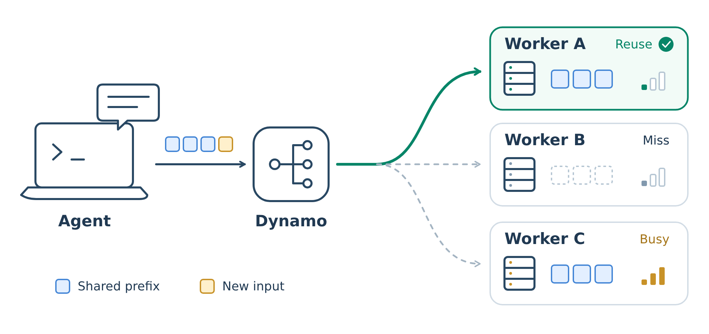
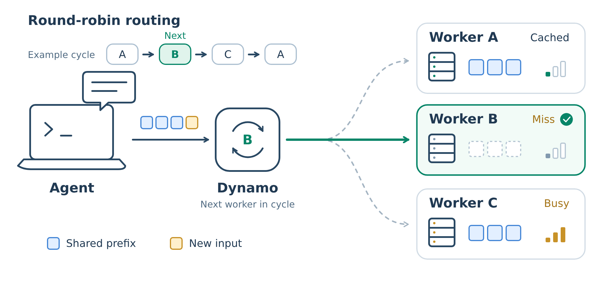
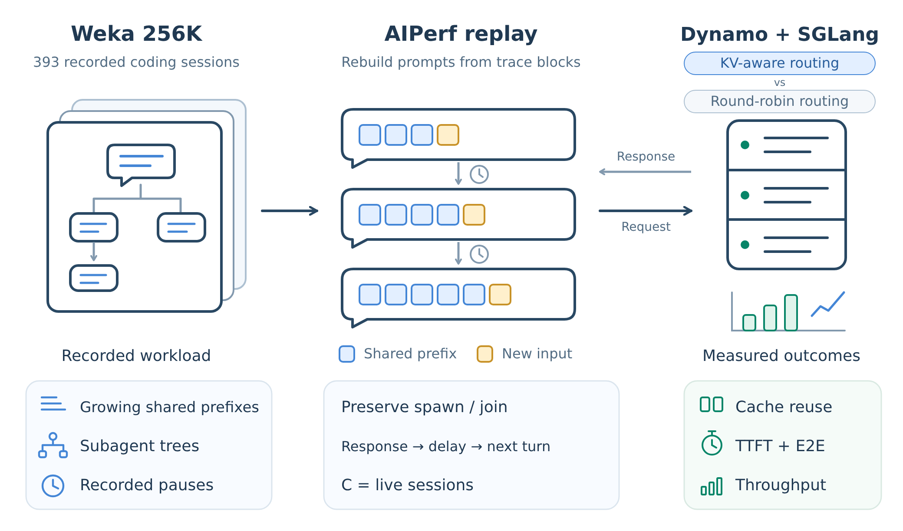
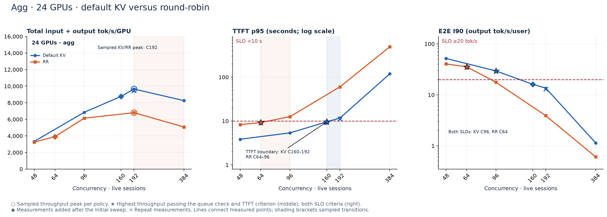
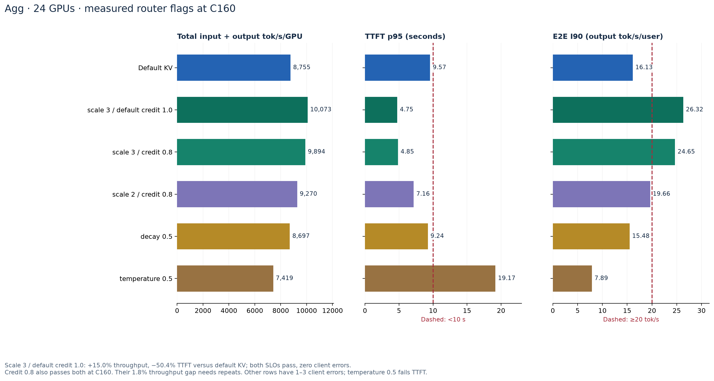
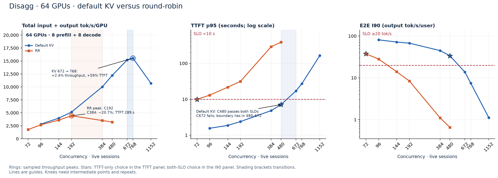
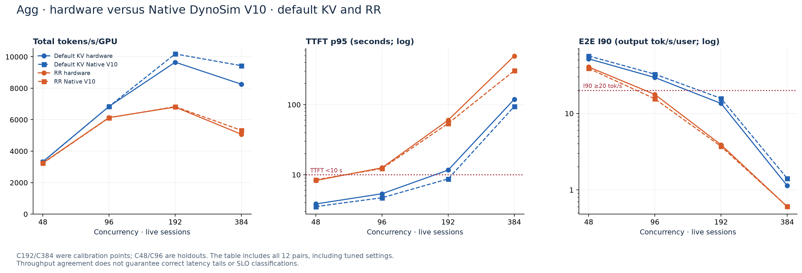
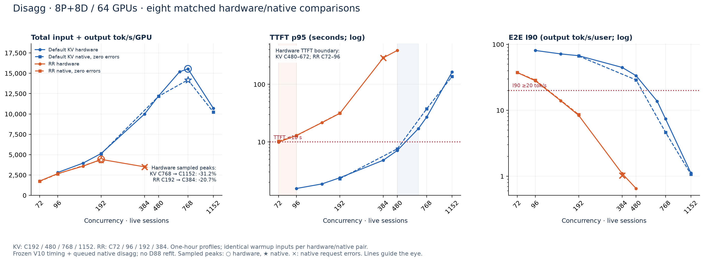
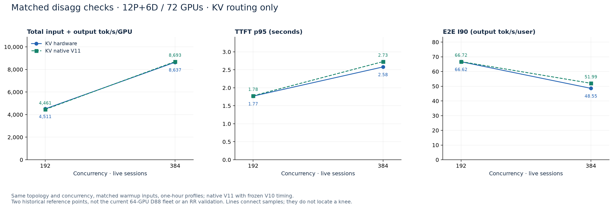

# NVIDIA Dynamo on Google Cloud: KV-Aware vs. Round-Robin Routing

*Technical evaluation of prefix-cache locality, throughput, TTFT and end-to-end latency under AgentX replay on GKE.*

## TL;DR

**Google Cloud and NVIDIA are partnering to enable distributed inference with NVIDIA Dynamo on Google Kubernetes Engine (GKE).** Building on the [Google Cloud–NVIDIA collaboration](https://cloud.google.com/blog/products/compute/google-cloud-ai-infrastructure-at-nvidia-gtc-2026), this CUJ contributes deployment configurations, AgentX replay benchmarks and measured KV-aware versus round-robin routing comparisons for agentic workloads.

- **Scope:** Nemotron-3-Ultra with Dynamo/SGLang on GKE and GB300; AgentX/Weka replay on **24 GPUs for agg** and **64 GPUs for disagg**. Both routing policies retain engine prefix caching.
- **Latency criteria:** **TTFT p95 <10 s** and **I90 ≥20 output tokens/s**, where `I90 = 1 / P90(E2E_seconds / output_tokens)`.
- **Default KV versus RR under both criteria:** **1.75× total served throughput/GPU for agg** at C96/C64, and **6.92× for disagg** at C480/C72 (KV/RR session concurrency).
- **Highest-throughput sampled tuned points under both criteria:** agg **KV scale 3 / default credit 1.0** at C160 achieves **2.58× RR throughput/GPU**; disagg **KV credit 1.5** at C576 achieves **7.95×**. The RR references are C64 and C72, respectively.
- **Interpretation:** throughput includes cached input plus output tokens. These are policy-specific operating points from closed-loop replay; most configurations have one trial. Ratios apply to the measured workloads and fleets, with output throughput and errors reported separately.

## Overview

[NVIDIA Dynamo](https://github.com/ai-dynamo/dynamo) is an open-source distributed inference framework that coordinates request placement and execution across GPU workers. It integrates with inference engines including SGLang, vLLM and TensorRT-LLM. This Google Cloud **customer use journey (CUJ)** evaluates Dynamo's **KV-cache-aware routing** for agentic inference, using SGLang as the execution backend.

The CUJ covers deployment, workload replay, routing-policy comparison and parameter tuning on **[Google Kubernetes Engine (GKE)](https://cloud.google.com/kubernetes-engine)**. The serving workload is **[Nemotron-3-Ultra](https://huggingface.co/nvidia/NVIDIA-Nemotron-3-Ultra-550B-A55B-NVFP4)** on **[NVIDIA GB300 GPUs](https://docs.cloud.google.com/compute/docs/gpus)**, deployed as **[24-GPU aggregated serving](agentx-serving-perf-data/source/n3u-agg-newstack-np2.yaml.txt)** and **[64-GPU disaggregated serving](agentx-serving-perf-data/source/n3u-mnnvl-88.yaml.txt)**. Aggregated workers execute prefill and decode; the disaggregated deployment uses separate prefill and decode pools with a [state-transfer stage](https://docs.nvidia.com/dynamo/dev/knowledge-base/concepts/system-architecture/disaggregated-serving). Each KV/RR comparison uses the same topology and GPU count within its architecture.

The engineering question is whether routing requests to reusable state improves throughput within latency constraints, and how that tradeoff changes between the two serving architectures. The following sections connect the cache mechanism to the workload, then define the experiment and present the measured operating points.

**Evidence snapshot: 2026-09-20 20:42 UTC · 45 completed hardware jobs (25 agg / 20 disagg)**

Each architecture has its own measured curves, full data table, comparison at a sampled knee, and SLO table. The baseline curves show **default KV and RR only**; tuned settings remain in the data and tuning tables.

The snapshot includes **eight additional agg jobs** from [AGENTX_AGG_RESULTS.md, section vi](../AGENTX_AGG_RESULTS.md): RR64, default KV160, five KV variants at C160, and scale-3/credit-0.8 at C256. The D88 measurement cohort is retained from **2026-09-20 02:53 UTC**; later D88 follow-ups are outside this snapshot.

[Standalone HTML](agentx-serving-perf-report.html) · [hardware CSV](agentx-serving-perf-report.csv) · [comparison JSON](agentx-serving-perf-report.json) · [configuration provenance](agentx-serving-perf-report-methodology.json) · [validation](agentx-serving-perf-report-validation.json)

## How Dynamo KV-cache-aware routing works

During **prefill**, the serving engine processes a prompt and stores **key-value (KV) tensors** for attention. When a later prompt begins with the same token sequence, the engine can reuse compatible, resident prefix state and compute the uncached suffix. This reduces repeated prefill work; output tokens still require decoding. **SGLang owns the cached model state, while Dynamo uses cache-location metadata to make placement decisions.** Reuse requires both a matching prefix and the state required by the backend. [NVIDIA's KV-aware routing overview](https://docs.nvidia.com/dynamo/dev/knowledge-base/concepts/system-architecture/kv-aware-routing) describes this relationship.

The routing decision has three steps:

1. **Locate reusable prefixes.** Worker events describe cache-block insertion and eviction. Dynamo's index maps prefix-block hashes to workers, allowing a request to be compared with each worker's advertised cached prefix.
2. **Estimate the placement cost.** The router combines overlap credit with projected active prefill and decode load. Our default KV recipe sets temperature to zero, selecting a lowest-cost eligible worker. A worker with more reusable state can lose to a less busy worker if the load penalty outweighs the reuse benefit.
3. **Execute on the selected worker.** The engine reuses the valid state it can actually access and prefills the remaining tokens. The index carries metadata; the cached tensors remain with the serving backend. Cache eviction and delayed metadata updates can reduce realized reuse.

These are the conceptual inputs to [Dynamo's routing cost model](https://docs.nvidia.com/dynamo/dev/knowledge-base/modular-components/router/routing-concepts). The exact flags used in this experiment are listed with the results.



[SVG](agentx-serving-perf-report-kv-routing-outline.svg) · [PDF](agentx-serving-perf-report-kv-routing-outline.pdf)

*Blue blocks show shared prefixes; gold shows new input. Dynamo selects the cached, lightly loaded worker in this example. Dashed paths are alternatives; meters indicate illustrative load. [Editable SVG](agentx-serving-perf-report-kv-routing-outline.svg).*

In **aggregated serving**, the selected worker performs both prefill and decode. In **disaggregated serving**, prefix locality matters at the prefill pool; the resulting state is transferred to a decode worker. Transfer and decode capacity therefore remain part of the end-to-end latency even when prefill reuse improves. [Dynamo's disaggregated-serving architecture](https://docs.nvidia.com/dynamo/dev/knowledge-base/concepts/system-architecture/disaggregated-serving) explains that execution path.

**Round-robin rotates requests across workers without scoring prefix overlap.** It can still obtain cache hits when matching state is present on the chosen worker. Both arms enable engine prefix caching, so this benchmark measures the effect of placement on cache reuse, load distribution and request latency.



[SVG](agentx-serving-perf-report-round-robin-routing-outline.svg) · [PDF](agentx-serving-perf-report-round-robin-routing-outline.pdf)

*All three workers are eligible in this illustrative A → B → C → A rotation. Worker B is next, so it receives the request and must process the missing prefix. The solid green path shows this request; dashed paths show other workers. Prefix caching remains enabled, and other placements can hit cached state. [Editable SVG](agentx-serving-perf-report-round-robin-routing-outline.svg).*

## KV routing algorithm and tuned policies

**Default KV and tuned KV use the same worker-selection algorithm.** Tuning changes the weights assigned to reusable prefixes and active work, or the randomness of worker selection. The explanation below follows the [Dynamo v1.4.2 source](https://github.com/ai-dynamo/dynamo/tree/2ecbdfdf192c69c02c6d21e931d20d3b4a0bb64a/lib/kv-router/src/scheduling), matching the version specified by the saved serving recipes. It describes the standard device-prefix path; optional host/disk/shared-cache credits and conditional disaggregation extend that path.

### Worker scoring and selection

The router filters eligible workers, calculates a score for each, selects a target and updates its active-work accounting. For an incoming prompt of `L` tokens and block size `B` (**64 tokens** in these recipes), define:

| Symbol | Meaning at this routing decision |
| --- | --- |
| `P = L / B`; `N = ceil(L / B)` | Prompt length in block units; rounded-up request block count |
| `A_i` | Active prefill tokens already assigned to worker `i`, divided by `B` |
| `A_min` | Minimum `A_i` across eligible workers |
| `H_i` | Matching device-resident prefix blocks advertised for worker `i` |
| `D_i` | Request-specific projected active KV-block load from the tracker, called decode cost in the selector |
| `s`, `c`, `d`, `T` | Prefill load scale, overlap credit, credit decay and router temperature |

The [request representation](https://github.com/ai-dynamo/dynamo/blob/2ecbdfdf192c69c02c6d21e931d20d3b4a0bb64a/lib/kv-router/src/scheduling/types.rs) supplies the overlap and worker-load inputs. With prefill tracking enabled, device-only overlap credit and the default zero active-request surcharge, the score is:

```text
excess_i = max(0, A_i - A_min) / N
credit_i = c / (1 + d * excess_i)
prefill_i = max(0, A_i + P - credit_i * H_i)
score_i = s * prefill_i + D_i
```

At **`T = 0`**, the router selects a minimum-score worker; equal minima can be broken randomly. For **`T > 0`**, it samples using `probability_i ∝ exp(-(score_i - score_min) / ((score_max - score_min) * T))`; equal scores give a uniform distribution. The normalization matters when interpreting a temperature value. Both rules and the load-dependent decay are implemented in the [v1.4.2 selector](https://github.com/ai-dynamo/dynamo/blob/2ecbdfdf192c69c02c6d21e931d20d3b4a0bb64a/lib/kv-router/src/scheduling/selector.rs).

Scores are block-based placement heuristics. Cache residence, engine batching, transfer time and decode execution determine the resulting latency. The zero clamp also means that sufficiently large overlap credits can give multiple workers the same prefill contribution.

### What each benchmark routing flag controls

This table covers every routing flag used in the measured default and tuned recipes. Baseline values follow the saved commands and [v1.4.2 configuration defaults](https://github.com/ai-dynamo/dynamo/blob/2ecbdfdf192c69c02c6d21e931d20d3b4a0bb64a/lib/kv-router/src/scheduling/config.rs).

| Flag | Baseline | Effect on routing and tuning tradeoff | Values in this report's hardware cohort |
| --- | --- | --- | --- |
| `--router-mode` | `kv` in KV arms | `kv` scores cache overlap and active load. `round-robin` rotates worker selection. Engine prefix caching is enabled in both arms. | `kv`, `round-robin` |
| `--router-prefill-load-scale` | `1.0` | `s` multiplies the entire adjusted prefill term. Increasing it strengthens both the prefill-backlog penalty and the overlap discount relative to `D_i`; this can favor a worker with less remaining prefill work even if its active-block load is higher. | Agg: 1, 2, 3; D88: 1, 3 |
| `--router-kv-overlap-score-credit` | `1.0` | `c` weights each matching device-prefix block. Lower values reduce locality preference; values above 1 give reuse extra weight and can concentrate work on cache-rich workers. Credit is a scoring multiplier; the cache-hit fraction is measured separately. | Agg: 0.8, 1.0; D88: 0.8, 1.0, 1.5, 2.0 |
| `--router-kv-overlap-score-credit-decay` | `0.0` | `d` reduces overlap credit for workers with more active prefill work than the least-loaded eligible worker. Higher values favor prefill balance. At the load minimum, full credit remains. Decay is load-dependent; cache expiration is a separate mechanism. | Agg: 0, 0.5, 1.0; D88: 0, 0.5 |
| `--router-temperature` | `0.0` | `T` controls sampling among worker scores. Raising it broadens selection and can distribute load at the cost of choosing less favorable cache/load combinations. It controls routing; model-generation temperature is independent. | Agg: 0, 0.5; retained D88 cohort: 0 |
| `--router-queue-policy` | `fcfs` | Orders pending router requests. FCFS uses arrival order within the same priority treatment; it is separate from worker scoring and SGLang batch scheduling. | Fixed at `fcfs` in KV arms; no queue-policy sweep |

For FCFS priority handling, see the [queue policy implementation](https://github.com/ai-dynamo/dynamo/blob/2ecbdfdf192c69c02c6d21e931d20d3b4a0bb64a/lib/kv-router/src/scheduling/policy.rs). The broader [configuration reference](https://docs.nvidia.com/dynamo/dev/knowledge-base/modular-components/router/configuration-and-tuning) also covers admission thresholds, tracking controls, session affinity and cache tiers; these are separate controls from the four numeric parameters swept here.

For example, with `d = 0.5`, a worker whose excess prefill backlog equals one request's rounded block count receives `c / 1.5` effective credit. A larger backlog reduces its locality advantage further, while the least-loaded worker retains `c`.

### How the tuned policies change the score

The principal recipes retain **`T = 0`, `d = 0` and FCFS**. Their device-prefix scores reduce to:

| Recipe | `s` | `c` | Score for an eligible agg/prefill worker | Role in the measured comparison |
| --- | --- | --- | --- | --- |
| Default KV | 1 | 1.0 | `max(0, A_i + P - H_i) + D_i` | Baseline KV curves for both architectures |
| Agg: scale 3 / default credit | 3 | 1.0 | `3 * max(0, A_i + P - H_i) + D_i` | Selected agg point at C160 under both latency criteria |
| Agg: scale 3 / credit 0.8 | 3 | 0.8 | `3 * max(0, A_i + P - 0.8 * H_i) + D_i` | Earlier agg TTFT-only selection at C192; its I90 is below 20 |
| D88: credit 1.5 | 1 | 1.5 | `max(0, A_i + P - 1.5 * H_i) + D_i` | Selected D88 point at C576 under both latency criteria |

**Agg emphasizes adjusted prefill work.** Scale 3 increases the contribution of both pending prefill and cache-adjusted incoming work relative to active-block load. In the C160 sweep, this recipe has **15.0% higher total throughput and 50.4% lower TTFT p95** than default KV, with I90 **26.3229**. These are measured differences; identifying which individual scheduling decisions caused them requires router and engine telemetry.

**D88 increases prefill locality credit.** At C480, credit 1.5 has **15.4% lower TTFT p95** than default KV with a **0.29% throughput difference**; the selected C576 point also passes both criteria. Standard disaggregated routing applies a separate decode-hop override with overlap credit zero and prefill tracking disabled, so decode placement follows its active-load score. This behavior is explicit in [the v1.4.2 prefill router](https://github.com/ai-dynamo/dynamo/blob/2ecbdfdf192c69c02c6d21e931d20d3b4a0bb64a/lib/llm/src/kv_router/prefill_router/mod.rs). Increasing prefill overlap credit therefore targets reuse in the prefill pool.

The retained sweeps favor different weights on the two topologies. Temperature 0.5 and the tested decay settings did not improve the selected agg operating point; D88 scale 3/credit 0.8 misses the TTFT criterion, and decay 0.5 misses both criteria at C480. Sections 2 and 3 retain every measured configuration, including errors and repeatability limits. These selections remain specific to the measured fleet and workload.

## Why we use agentic workloads

Agentic inference is a current infrastructure priority in the [Google Cloud–NVIDIA collaboration](https://cloud.google.com/blog/products/compute/google-cloud-ai-infrastructure-at-nvidia-gtc-2026). Coding agents are a useful workload for this CUJ because their request sequences expose the interaction between **prefix locality, cache lifetime and worker load**. A task can require repeated model calls around tool execution, user input and parallel subagents.

Three properties make those sequences relevant to KV-aware routing:

- **Long, repeated prefixes:** successive turns retain instructions, repository context and earlier conversation content. Routing to reusable state can avoid processing much of that input again and reduce prefill's contribution to TTFT.
- **Branching execution:** subagents can inherit a parent prefix while adding different context. Shared state creates reuse opportunities, while simultaneous branches increase load and can make concentrating requests on one worker expensive.
- **Pauses and competing sessions:** tool execution and user think time separate related requests. Other sessions consume cache capacity during those gaps, so a shared prefix only becomes a cache hit if compatible state is still available when the request arrives.

These properties motivate **trace replay as part of the benchmark**. We use AIPerf to reconstruct requests from the Weka corpus's block identifiers and recorded lengths, retaining shared-prefix structure and parent/subagent dependencies. The [Weka loader documentation](https://github.com/ai-dynamo/aiperf/blob/main/docs/tutorials/weka-trace.md) describes how traces become a dependency graph.



[SVG](agentx-serving-perf-report-agentx-dataset-outline.svg) · [PDF](agentx-serving-perf-report-agentx-dataset-outline.pdf)

*Blue blocks show shared history; gold shows new input. The clocks mark pauses between turns. Arrows show requests to Dynamo + SGLang and responses back to AIPerf. [Editable SVG](agentx-serving-perf-report-agentx-dataset-outline.svg).*

Our **AgentX replay is closed-loop**: response completion and the recorded end-to-start delay control subsequent turns, subject to the scenario's whole-system idle-gap cap. Concurrency **C** counts live session trees, so active requests vary with think time and fan-out. Replay reconstructs the recorded workload; it does not execute the original coding tools or grade task completion. **Cache-hit rate is a measured outcome of replay, placement and residency.** The [AgentX scenario documentation](https://github.com/ai-dynamo/aiperf/blob/main/docs/tutorials/agentx-mvp.md) defines the replay framework; section 1 records our specific controls.

The resulting hypothesis is that KV-aware placement reduces redundant prefill enough to improve throughput within the latency budget, while its load term limits concentration on busy workers. We test that hypothesis at **fixed session concurrency** and under **TTFT p95 <10 seconds**, with **E2E-normalized I90 ≥20 output tokens/s** as an additional criterion. The measured gains in the TL;DR apply to these fleets and replay settings; their magnitude depends on prefix reuse, cache capacity, scheduling and serving topology.

## 1. Setup, agentic workload and benchmarking methodology

### 1.1 Hardware and serving recipes

Both fleets serve **NVIDIA Nemotron-3-Ultra-550B-A55B-NVFP4** on **GB300**, with modelopt FP4 quantization and TP4/EP4 per worker. The recipes install Dynamo **1.4.2** with its SGLang dependency **0.5.16**, and FlashInfer **0.6.18**. The container base tag alone is not the final installed-version record; immutable image/tokenizer revisions and complete live package inventories were not captured.

| Setting | Aggregated serving | Disaggregated serving (D88) |
| --- | --- | --- |
| Fleet | 6 workers × 4 GPUs = **24 GPUs** | 8 prefill + 8 decode workers × 4 GPUs = **64 GPUs** |
| Work placement | Each worker does both prefill and decode | Separate prefill and decode pools |
| Parallelism per worker | TP4, EP4 | TP4, EP4 on both stages |
| Context / page size | 262,144 tokens / 64 tokens | 262,144 tokens / 64 tokens |
| Explicit admission limit | 16 running requests per worker | Prefill 8; decode 64 per worker |
| Prefill chunk / static memory fraction | 16,384 tokens / 0.85 | Prefill 16,384 tokens / 0.85 on both stages |
| Request and transfer path | NATS request plane; no P→D handoff | NATS request plane; Mooncake handoff, MNNVL/IMEX domain |
| Speculative decoding | Not enabled in the saved recipe | Not enabled in the saved recipe |
| Sources | [agg manifest](agentx-serving-perf-data/source/n3u-agg-newstack-np2.yaml.txt) | [disagg manifest](agentx-serving-perf-data/source/n3u-mnnvl-88.yaml.txt) |

The original agg concurrency sweep was collected on September 16. The subsequent np-2 campaign contains two reference repeats and three decay variants. The September 20 SLO campaign adds RR64, default KV160, five C160 flag variants and tuned KV256. The agg recipes use two separate fleets (`n3u-agg-ns` / `n3u-agg-ns2`). The fixed-concurrency C192 comparison uses the original matched campaign; subsequent references and C160 tuning runs are reported separately. Comparisons between agg and disagg normalize by GPU count but retain differences in fleet size and request mix, which limit architectural scaling inferences.

### 1.2 Agentic workload and replay

AIPerf **0.12.0** runs `inferencex-agentx-mvp` on **`semianalysisai/cc-traces-weka-062126-256k`**, a corpus of 393 recorded coding-session roots with their subagents. The loader reconstructs prompt content from block identifiers and trace lengths using the model tokenizer. Replay preserves prefix-sharing structure and subagent spawn/join dependencies. Within each stream, the next turn follows response completion and the recorded end-to-start delay. Each run samples from the corpus; completion of all 393 roots is not required by the duration limit. The [AgentX replay documentation](https://github.com/ai-dynamo/aiperf/blob/main/docs/tutorials/agentx-mvp.md) describes the scenario; the controls below specify this experiment.

| Replay control | Value used in the measured jobs |
| --- | --- |
| Concurrency C | Live root sessions including their descendants; active request count and decode batch size vary |
| Seed / dataset | 42 / 393 roots from the named Weka 256K corpus |
| Initial trajectory | Initial trace time sampled within 0.25–0.75 of recorded duration; trajectory warmup precedes profiling |
| Timing | Recorded end-to-start delays; whole-system idle-gap cap 10 seconds |
| Measurement | 3,600-second profiling window; 60-second grace; 1,200-second request timeout |
| Prompt/output handling | Model tokenizer; server token counts; streaming; `ignore_eos` preserves recorded output lengths |
| Recycled traces | A fresh first-turn-prefix cache-bust marker per play |
| Validation | Included runs pass the scenario stamp; success and error counts are retained separately |

The [benchmark template](agentx-serving-perf-data/source/sgl-d72-agentx.yaml.txt), [runner](agentx-serving-perf-data/source/agentx_runner_flags.sh.txt) and [agg SLO sweep](agentx-serving-perf-data/source/run_agentx_agg_slo10_np2_v2.sh.txt) preserve the replay configuration and router arguments. Completed exports determine the reported run inventory. A fixed seed controls sampling, while closed-loop execution allows a lower-latency configuration to complete more turns within the same profiling window. Input sequence length (ISL), output sequence length (OSL), conversation depth and source-trace distributions therefore remain comparison variables. Runs with think time disabled are excluded from this workload.

### 1.3 Fair KV/RR comparison and metric definitions

**Routing is the configured treatment variable.** Within each architecture, the comparison fixes the serving recipe and replay controls. RR uses `--router-mode round-robin`; default KV uses `--router-mode kv --router-temperature 0 --router-queue-policy fcfs`. Both retain prefix caching in the agg/prefill engines. Tuned KV adds the arguments listed in each architecture's configuration table. Deployment and sampling limitations are reported below.

| Metric or comparison | Definition |
| --- | --- |
| Total throughput/GPU | AIPerf input + output tokens/s divided by the total fleet GPU count, including both disagg stages. Cached input counts toward served token volume; this metric does not measure newly computed tokens alone. |
| Output throughput/GPU | Output tokens/s divided by the same GPU count. Reported separately to expose workload-mix differences. |
| TTFT | p95 time to first token over successful profiling requests, in seconds. The selection criterion is **strict TTFT p95 <10 s**. No sampled point is exactly 10 s. |
| E2E interactivity I90 | For each successful profiling request with valid latency and positive output length, compute `r_i = E2E_seconds / output_tokens`; then `I90 = 1 / P90(r_i)` using linear interpolation. The additional criterion is **I90 ≥20 tok/s/user**, equivalent to `P90(r_i) ≤0.05 s/token`. |
| Same configuration | Same topology, GPU count, workload and session concurrency; only router settings differ. |
| Same SLO | For each policy, select the highest-throughput sampled point passing TTFT <10 s and the queue check. Selected concurrency may differ between policies. Repeats remain separate; the selected value is a sample maximum rather than a mean or confidence bound. |
| Combined SLO | Apply TTFT <10 s **and** I90 ≥20. This is shown separately from the TTFT-only table. |
| Errors | Failed profiling requests are excluded from latency percentiles and reported separately. Operating-point selection does not apply an additional availability SLO. |

**Knee identification:** the report examines throughput slope or decline, TTFT tails, errors and within-run latency progression. Throughput knees are reported at the resolution of the sampled concurrency sweep; an SLO crossing defines a separate boundary. The queue check uses sustained median TTFT, first-to-last-quarter growth in median TTFT, or an error rate above 5% as overload indicators. These are client-observed indicators rather than direct measurements of queue occupancy. GPU utilization alone does not identify either boundary.

Most configuration/concurrency combinations have one trial. The agg C192 reference repeats provide limited repeatability evidence; confidence intervals are not estimated. Caches were not explicitly flushed between every hardware run, so cache busting and successful warmup do not establish identical initial cache state. `overall_usage_prompt_cache_read_pct` measures the client-reported cached-input fraction; per-engine KV occupancy is a separate quantity. Scenario validity checks replay rules. The latency results characterize this closed-loop session population and do not establish latency at an independently controlled production arrival rate.

**E2E accounting:** the source results log's “P90 interactivity” uses inverse P90 inter-token latency. It excludes TTFT and is not the E2E-normalized I90 above. This report recomputes I90 from each successful profiling request's full latency and output length; consequently, default KV160 and scale-2/credit-0.8 C160 pass TTFT but fail I90 ≥20.


## 2. Aggregated serving: measured KV and RR

### 2.1 Default KV versus RR: curves and knee evidence



[SVG](agentx-serving-perf-report-agg-curves.svg) · [PDF](agentx-serving-perf-report-agg-curves.pdf)


| Policy | Sampled throughput / knee evidence | TTFT <10 s boundary | Additional E2E boundary |
| --- | --- | --- | --- |
| Default KV | Peak at **C192**; C384 loses **14.5%** throughput and TTFT p95 rises **11.66→119.44 s**. Saturation transition lies in 192–384. | **C160 passes at 9.57 s**; both C192 references fail. Refine **160–192**. | C96 passes; **C160 fails at I90 16.1267**. Refine **96–160**. |
| RR | C96→192 adds only **10.8%** throughput; C384 loses **25.4%** versus C192. C192 is the sampled peak; diminishing returns begin over 96–192. | **C64 passes at 9.21 s**; C96 fails. Refine **64–96**. | **C64 passes at I90 35.3472**; C96 fails. Refine **64–96**. |

The throughput-knee comparison below uses **C192 for both arms**. It does not claim that C192 meets the latency SLO.

○ marks each policy's sampled throughput peak. ★ marks the point with the highest throughput that passes the queue check and TTFT criterion in the middle panel, or both SLO criteria in the E2E panel. ◆ marks measurements added after the initial sweep; × marks repeat measurements, which remain separate from the connected curves. Lines connect measurements from the original and follow-up campaigns in concurrency order; shaded bands bracket sampled transitions. These SLO brackets need matched repeats before claiming an exact crossing.

### 2.2 All collected data points, including tuned KV

Every completed agg run in the scoped inventory is shown, including repeated references. The flags identify the recipe; each linked name opens its hardware artifacts.

| Setting / artifacts | C | Campaign | Total tok/s/GPU | Output tok/s/GPU | TTFT p95 (s) | E2E I90 | TTFT <10 | Both SLOs | Errors |
| --- | --- | --- | --- | --- | --- | --- | --- | --- | --- |
| [Default KV](https://console.cloud.google.com/storage/browser/alisachen-models/perf/1789545801_alisachen-n3u-agg-ns-agentx-kv-c48) | 48 | Sep 16 | 3,334 | 32.27 | 3.83 | 51.8257 | Pass | Pass | 0 |
| [Default KV](https://console.cloud.google.com/storage/browser/alisachen-models/perf/1789550601_alisachen-n3u-agg-ns-agentx-kv-c96) | 96 | Sep 16 | 6,844 | 75.11 | 5.36 | 29.5030 | Pass | Pass | 0 |
| [Default KV](https://console.cloud.google.com/storage/browser/alisachen-models/perf/1789895318_alisachen-n3u-agg-ns-agentx-kv-c160) | 160 | Sep 20 SLO | 8,755 | 94.00 | 9.57 | 16.1267 | Pass | Fail | 3 |
| [Default KV](https://console.cloud.google.com/storage/browser/alisachen-models/perf/1789555981_alisachen-n3u-agg-ns-agentx-kv-c192) | 192 | Sep 16 | 9,655 | 96.81 | 11.66 | 13.5367 | Fail | Fail | 3 |
| [Default KV](https://console.cloud.google.com/storage/browser/alisachen-models/perf/1789856222_alisachen-n3u-agg-ns-agentx-kv-c192) | 192 | np-2 | 9,468 | 95.42 | 11.18 | 12.9310 | Fail | Fail | 3 |
| [Default KV](https://console.cloud.google.com/storage/browser/alisachen-models/perf/1789562076_alisachen-n3u-agg-ns-agentx-kv-c384) | 384 | Sep 16 | 8,257 | 77.74 | 119.44 | 1.1372 | Fail | Fail | 7 |
| [RR](https://console.cloud.google.com/storage/browser/alisachen-models/perf/1789550745_alisachen-n3u-agg-ns2-agentx-rr-c48) | 48 | Sep 16 | 3,250 | 31.32 | 8.27 | 40.5349 | Pass | Pass | 0 |
| [RR](https://console.cloud.google.com/storage/browser/alisachen-models/perf/1789895323_alisachen-n3u-agg-ns2-agentx-rr-c64) | 64 | Sep 20 SLO | 3,910 | 42.88 | 9.21 | 35.3472 | Pass | Pass | 0 |
| [RR](https://console.cloud.google.com/storage/browser/alisachen-models/perf/1789555623_alisachen-n3u-agg-ns2-agentx-rr-c96) | 96 | Sep 16 | 6,137 | 67.11 | 12.56 | 17.7260 | Fail | Fail | 0 |
| [RR](https://console.cloud.google.com/storage/browser/alisachen-models/perf/1789560983_alisachen-n3u-agg-ns2-agentx-rr-c192) | 192 | Sep 16 | 6,802 | 71.38 | 60.08 | 3.8961 | Fail | Fail | 3 |
| [RR](https://console.cloud.google.com/storage/browser/alisachen-models/perf/1789567077_alisachen-n3u-agg-ns2-agentx-rr-c384) | 384 | Sep 16 | 5,076 | 49.65 | 494.98 | 0.6059 | Fail | Fail | 14 |
| [KV scale 3 / default credit 1.0](https://console.cloud.google.com/storage/browser/alisachen-models/perf/1789912551_alisachen-n3u-agg-ns2-agentx-kvs3c10-c160) | 160 | Sep 20 SLO | 10,073 | 108.52 | 4.75 | 26.3229 | Pass | Pass | 0 |
| [KV scale 3 / credit 0.8](https://console.cloud.google.com/storage/browser/alisachen-models/perf/1789582550_alisachen-n3u-agg-ns2-agentx-kvs3c08-c96) | 96 | Sep 16 | 7,045 | 78.35 | 3.11 | 39.4930 | Pass | Pass | 0 |
| [KV scale 3 / credit 0.8](https://console.cloud.google.com/storage/browser/alisachen-models/perf/1789901101_alisachen-n3u-agg-ns-agentx-kvs3c08-c160) | 160 | Sep 20 SLO | 9,894 | 105.19 | 4.85 | 24.6528 | Pass | Pass | 1 |
| [KV scale 3 / credit 0.8](https://console.cloud.google.com/storage/browser/alisachen-models/perf/1789569414_alisachen-n3u-agg-ns-agentx-kvs3c08-c192) | 192 | Sep 16 | 11,012 | 108.87 | 6.33 | 19.7795 | Pass | Fail | 3 |
| [KV scale 3 / credit 0.8](https://console.cloud.google.com/storage/browser/alisachen-models/perf/1789856381_alisachen-n3u-agg-ns2-agentx-kvs3c08-c192) | 192 | np-2 | 10,992 | 110.04 | 6.20 | 19.7385 | Pass | Fail | 2 |
| [KV scale 3 / credit 0.8](https://console.cloud.google.com/storage/browser/alisachen-models/perf/1789900377_alisachen-n3u-agg-ns2-agentx-kvs3c08-c256) | 256 | Sep 20 SLO | 12,328 | 114.70 | 18.87 | 9.1777 | Fail | Fail | 3 |
| [KV scale 2 / credit 0.8](https://console.cloud.google.com/storage/browser/alisachen-models/perf/1789906804_alisachen-n3u-agg-ns2-agentx-kvs2c08-c160) | 160 | Sep 20 SLO | 9,270 | 99.54 | 7.16 | 19.6589 | Pass | Fail | 2 |
| [KV scale 2 / credit 0.8](https://console.cloud.google.com/storage/browser/alisachen-models/perf/1789575514_alisachen-n3u-agg-ns-agentx-kvs2c08-c192) | 192 | Sep 16 | 10,241 | 102.43 | 8.11 | 16.1477 | Pass | Fail | 3 |
| [KV temperature 0.5](https://console.cloud.google.com/storage/browser/alisachen-models/perf/1789912551_alisachen-n3u-agg-ns-agentx-kvt05-c160) | 160 | Sep 20 SLO | 7,419 | 80.04 | 19.17 | 7.8906 | Fail | Fail | 3 |
| [KV temperature 0.5](https://console.cloud.google.com/storage/browser/alisachen-models/perf/1789574468_alisachen-n3u-agg-ns2-agentx-kvt05-c192) | 192 | Sep 16 | 7,816 | 79.49 | 22.15 | 7.0315 | Fail | Fail | 3 |
| [KV decay 0.5](https://console.cloud.google.com/storage/browser/alisachen-models/perf/1789906836_alisachen-n3u-agg-ns-agentx-kvd05-c160) | 160 | Sep 20 SLO | 8,697 | 93.57 | 9.24 | 15.4845 | Pass | Fail | 3 |
| [KV decay 0.5](https://console.cloud.google.com/storage/browser/alisachen-models/perf/1789831067_alisachen-n3u-agg-ns-agentx-kvd05-c192) | 192 | np-2 | 9,362 | 94.58 | 12.70 | 12.0259 | Fail | Fail | 3 |
| [KV decay 1.0](https://console.cloud.google.com/storage/browser/alisachen-models/perf/1789831039_alisachen-n3u-agg-ns2-agentx-kvd10-c192) | 192 | np-2 | 9,233 | 93.40 | 13.85 | 11.4805 | Fail | Fail | 3 |
| [KV scale 3 / credit 0.8 / decay 0.5](https://console.cloud.google.com/storage/browser/alisachen-models/perf/1789862417_alisachen-n3u-agg-ns-agentx-kvs3c08d05-c192) | 192 | np-2 | 10,713 | 106.29 | 6.97 | 18.2395 | Pass | Fail | 3 |

| Recipe | Collected concurrency | Exact router arguments |
| --- | --- | --- |
| Default KV | 48, 96, 160, 192 (2 runs), 384 | `--router-mode kv --router-temperature 0.0 --router-queue-policy fcfs` |
| RR | 48, 64, 96, 192, 384 | `--router-mode round-robin` |
| KV scale 3 / default credit 1.0 | 160 | `--router-mode kv --router-temperature 0.0 --router-queue-policy fcfs --router-prefill-load-scale 3.0` |
| KV scale 3 / credit 0.8 | 96, 160, 192 (2 runs), 256 | `--router-mode kv --router-temperature 0.0 --router-queue-policy fcfs --router-prefill-load-scale 3.0 --router-kv-overlap-score-credit 0.8` |
| KV scale 2 / credit 0.8 | 160, 192 | `--router-mode kv --router-temperature 0.0 --router-queue-policy fcfs --router-prefill-load-scale 2.0 --router-kv-overlap-score-credit 0.8` |
| KV temperature 0.5 | 160, 192 | `--router-mode kv --router-temperature 0.5 --router-queue-policy fcfs` |
| KV decay 0.5 | 160, 192 | `--router-mode kv --router-temperature 0.0 --router-queue-policy fcfs --router-kv-overlap-score-credit-decay 0.5` |
| KV decay 1.0 | 192 | `--router-mode kv --router-temperature 0.0 --router-queue-policy fcfs --router-kv-overlap-score-credit-decay 1.0` |
| KV scale 3 / credit 0.8 / decay 0.5 | 192 | `--router-mode kv --router-temperature 0.0 --router-queue-policy fcfs --router-prefill-load-scale 3.0 --router-kv-overlap-score-credit 0.8 --router-kv-overlap-score-credit-decay 0.5` |

### 2.3 Tuned KV versus RR at the same configuration, near the sampled knee

| C192 setting | Total tok/s/GPU | Throughput / RR | TTFT p95 (s) | TTFT ratio (RR / policy) | E2E I90 | Errors |
| --- | --- | --- | --- | --- | --- | --- |
| [RR](https://console.cloud.google.com/storage/browser/alisachen-models/perf/1789560983_alisachen-n3u-agg-ns2-agentx-rr-c192) | 6,802 | 1.00× | 60.08 | 1.00× | 3.8961 | 3 |
| [Default KV](https://console.cloud.google.com/storage/browser/alisachen-models/perf/1789555981_alisachen-n3u-agg-ns-agentx-kv-c192) | 9,655 | 1.42× | 11.66 | 5.15× | 13.5367 | 3 |
| [KV scale 3 / credit 0.8](https://console.cloud.google.com/storage/browser/alisachen-models/perf/1789569414_alisachen-n3u-agg-ns-agentx-kvs3c08-c192) | 11,012 | 1.62× | 6.33 | 9.49× | 19.7795 | 3 |

At C192, tuned KV has **1.62× RR total served throughput/GPU**. TTFT p95 is **6.33 s for tuned KV** and **60.08 s for RR**, giving a **9.49× RR/KV latency ratio**. These measurements come from the September 16 campaign. The subsequent tuned repeat is reported separately; that campaign did not include a matched RR192 repeat.

### 2.4 Tuned KV versus RR under the same SLO: TTFT p95 <10 seconds

For each policy, select the highest measured total served throughput passing the **TTFT-only** criterion and queue check. I90 ≥20 is evaluated separately in the last column.

| Policy / selected run | C | Total tok/s/GPU | Output tok/s/GPU | TTFT p95 (s) | E2E I90 | Throughput / RR | I90 ≥20 |
| --- | --- | --- | --- | --- | --- | --- | --- |
| [RR](https://console.cloud.google.com/storage/browser/alisachen-models/perf/1789895323_alisachen-n3u-agg-ns2-agentx-rr-c64) | 64 | 3,910 | 42.88 | 9.21 | 35.3472 | 1.00× | Pass |
| [Default KV](https://console.cloud.google.com/storage/browser/alisachen-models/perf/1789895318_alisachen-n3u-agg-ns-agentx-kv-c160) | 160 | 8,755 | 94.00 | 9.57 | 16.1267 | 2.24× | Fail |
| [KV scale 3 / credit 0.8](https://console.cloud.google.com/storage/browser/alisachen-models/perf/1789569414_alisachen-n3u-agg-ns-agentx-kvs3c08-c192) | 192 | 11,012 | 108.87 | 6.33 | 19.7795 | 2.82× | Fail |

**TTFT-only selection:** default KV160/RR64 has a **2.24× total served throughput/GPU ratio**. Tuned KV192/RR64 has a **2.82×** ratio using the highest-throughput original sample. The np-2 C192 repeat measures **10,992 total tok/s/GPU, 6.20 s TTFT p95 and 2.81× RR64 throughput**, corresponding to the comparison in the source log. The original and repeated C192 trials have three and two client errors, respectively. Default KV160 has three errors; RR64 has zero.

Tuned C256 measures **12,328 total tok/s/GPU** with **18.87 s TTFT p95** and fails the TTFT criterion. For scale 3/credit 0.8, the sampled TTFT crossing is bounded by **C192–256**. Both tuned C192 trials and default KV160 fail the additional E2E criterion.

**Combined TTFT and E2E selection:** apply both latency criteria:

| Policy | Selected C | Total tok/s/GPU | TTFT p95 (s) | E2E I90 | Throughput / RR |
| --- | --- | --- | --- | --- | --- |
| RR | 64 | 3,910 | 9.21 | 35.3472 | 1.00× |
| Default KV | 96 | 6,844 | 5.36 | 29.5030 | 1.75× |
| KV scale 3 / default credit 1.0 | 160 | 10,073 | 4.75 | 26.3229 | 2.58× |

The default-KV/RR throughput ratio under the combined SLO is **1.75×**, compared with 2.11× in the previous snapshot. This change results from selecting RR64 in place of RR48; the default-KV96 measurement is unchanged.

### 2.5 What the flag sweep establishes

**C160 parameter sweep:** load scale 3 with default overlap credit 1.0 has the highest measured agg throughput among the sampled configurations satisfying both SLOs.



[SVG](agentx-serving-perf-report-agg-flags-c160.svg) · [PDF](agentx-serving-perf-report-agg-flags-c160.pdf)


| C160 KV setting | Total tok/s/GPU | Δ throughput | TTFT p95 (s) | E2E I90 | Cached input | Both SLOs | Errors |
| --- | --- | --- | --- | --- | --- | --- | --- |
| [Default KV](https://console.cloud.google.com/storage/browser/alisachen-models/perf/1789895318_alisachen-n3u-agg-ns-agentx-kv-c160) | 8,755 | +0.00% | 9.57 | 16.1267 | 74.8% | Fail | 3 |
| [KV scale 3 / default credit 1.0](https://console.cloud.google.com/storage/browser/alisachen-models/perf/1789912551_alisachen-n3u-agg-ns2-agentx-kvs3c10-c160) | 10,073 | +15.05% | 4.75 | 26.3229 | 85.0% | Pass | 0 |
| [KV scale 3 / credit 0.8](https://console.cloud.google.com/storage/browser/alisachen-models/perf/1789901101_alisachen-n3u-agg-ns-agentx-kvs3c08-c160) | 9,894 | +13.01% | 4.85 | 24.6528 | 83.5% | Pass | 1 |
| [KV scale 2 / credit 0.8](https://console.cloud.google.com/storage/browser/alisachen-models/perf/1789906804_alisachen-n3u-agg-ns2-agentx-kvs2c08-c160) | 9,270 | +5.88% | 7.16 | 19.6589 | 79.1% | Fail | 2 |
| [KV decay 0.5](https://console.cloud.google.com/storage/browser/alisachen-models/perf/1789906836_alisachen-n3u-agg-ns-agentx-kvd05-c160) | 8,697 | -0.67% | 9.24 | 15.4845 | 74.2% | Fail | 3 |
| [KV temperature 0.5](https://console.cloud.google.com/storage/browser/alisachen-models/perf/1789912551_alisachen-n3u-agg-ns-agentx-kvt05-c160) | 7,419 | -15.26% | 19.17 | 7.8906 | 62.4% | Fail | 3 |

**Selected agg candidate:** prefill load scale 3, temperature 0, default overlap credit 1.0 and default decay 0. The additional argument is `--router-prefill-load-scale 3.0`. Relative to default KV at C160, the measured differences are **+15.0% total throughput** and **-50.4% TTFT p95**. The candidate has **I90 26.3229** and zero exported client errors. The cached-input fraction is **74.8% for default KV and 85.0% for this candidate**.

Scale 3 with credit 0.8 also satisfies both criteria at C160, with one client error. Default credit has **+1.8%** observed throughput relative to credit 0.8. Repeats are required to distinguish this difference from run-to-run variation. The default-credit configuration changes only load scale relative to default KV; the use of separate fleets limits causal attribution from these individual runs.

Scale 2/credit 0.8 satisfies TTFT but fails I90 at **19.6589**. Decay 0.5 has **−0.7%** throughput relative to default KV at C160 and fails I90. Temperature 0.5 has **15.3% lower throughput** and fails TTFT at **19.17 s**. C160 tuning-run warmups span approximately **1,389–1,397 s**, compared with **1,492 s** for default KV. Warmup duration is a diagnostic; repeatability requires repeated profiling measurements.

**C192 parameter sweep:** the retained sweep evaluates a higher session concurrency. No sampled C192 configuration satisfies both SLOs.


[SVG](agentx-serving-perf-report-agg-flags.svg) · [PDF](agentx-serving-perf-report-agg-flags.pdf)


| C192 np-2 treatment | C192 np-2 reference | Δ total throughput | Δ TTFT p95 | Δ E2E I90 | Δ cached input |
| --- | --- | --- | --- | --- | --- |
| KV scale 3 / credit 0.8 | Default KV | +16.09% | -44.6% | +52.6% | +9.06 pp |
| KV decay 0.5 | Default KV | -1.13% | +13.6% | -7.0% | -0.71 pp |
| KV decay 1.0 | Default KV | -2.48% | +23.9% | -11.2% | -1.49 pp |
| KV scale 3 / credit 0.8 / decay 0.5 | KV scale 3 / credit 0.8 | -2.53% | +12.6% | -7.6% | -1.83 pp |

The C192 reference repeats differ from the original throughput measurements by less than 2%. The tuned repeat has I90 **19.7385**, compared with **19.7795** originally; both fail the E2E criterion. Decay 0.5/1.0 alone and decay 0.5 added to scale 3/credit 0.8 have lower measured throughput and higher TTFT than their corresponding references. Small throughput differences require additional repeats. Initial decay-only warmups lasted approximately 1,733 s, compared with 1,632–1,634 s for subsequent controls. A startup transient is a possible explanation; these observations do not establish a systematic np-2 performance difference.

**Additional measurements:** repeat default KV160, RR64 and both scale-3 C160 variants; collect **scale 3/default credit 1.0 at C192**, which is absent from this snapshot. For the measured credit-0.8 recipe, refine **C160–192** for the combined SLO and **C192–256** for TTFT alone. Additional default-KV160–192 and RR64–96 points would refine their TTFT crossings. The C160 table uses default KV as its reference because no RR160 measurement is available.

## 3. Disaggregated serving: measured KV and RR

### 3.1 Default KV versus RR: curves and knee evidence



[SVG](agentx-serving-perf-report-disagg-curves.svg) · [PDF](agentx-serving-perf-report-disagg-curves.pdf)


| Policy | Sampled throughput / knee evidence | TTFT <10 s boundary | Additional E2E boundary |
| --- | --- | --- | --- |
| Default KV | C672→768 adds only **2.4%** throughput while TTFT rises **59%**. C768 is the sampled peak; C1152 then loses **31.2%** and develops growing queues. Plateau begins around **672–768**. | C480 passes; C672 fails. Refine **480–672**. | I90 also crosses between 480 and 672. |
| RR | C192 is the sampled peak; C384 loses **20.7%**, has 68 errors and TTFT p95 **289.39 s**. Overload transition lies in **192–384**. | C72 passes by only **0.0885 s**; C96 fails. Refine **72–96**. | C96 passes I90; C144 fails. |

There is **no shared throughput knee** for KV and RR. The same-concurrency table uses **C192, RR's sampled peak**, where tuned credit 1.5 also has a real measurement. No tuned/RR pair exists at the default-KV plateau of 672–768; that comparison cannot be filled by extrapolation.

### 3.2 All collected data points, including tuned KV

Every completed disagg run in the scoped inventory is shown, including repeated references. The flags identify the recipe; each linked name opens its hardware artifacts.

| Setting / artifacts | C | Campaign | Total tok/s/GPU | Output tok/s/GPU | TTFT p95 (s) | E2E I90 | TTFT <10 | Both SLOs | Errors |
| --- | --- | --- | --- | --- | --- | --- | --- | --- | --- |
| [Default KV](https://console.cloud.google.com/storage/browser/alisachen-models/perf/1789808919_alisachen-n3u-mnnvl-88-agentx-kv-c96) | 96 | D88 | 2,810 | 31.52 | 1.56 | 80.9304 | Pass | Pass | 0 |
| [Default KV](https://console.cloud.google.com/storage/browser/alisachen-models/perf/1789803115_alisachen-n3u-mnnvl-88-agentx-kv-c144) | 144 | D88 | 3,964 | 44.14 | 1.87 | 71.7317 | Pass | Pass | 0 |
| [Default KV](https://console.cloud.google.com/storage/browser/alisachen-models/perf/1789672351_alisachen-n3u-mnnvl-88-agentx-kv-c192) | 192 | D88 | 5,142 | 50.75 | 2.40 | 67.3601 | Pass | Pass | 0 |
| [Default KV](https://console.cloud.google.com/storage/browser/alisachen-models/perf/1789678827_alisachen-n3u-mnnvl-88-agentx-kv-c384) | 384 | D88 | 9,993 | 100.04 | 4.83 | 44.7508 | Pass | Pass | 0 |
| [Default KV](https://console.cloud.google.com/storage/browser/alisachen-models/perf/1789740024_alisachen-n3u-mnnvl-88-agentx-kv-c480) | 480 | D88 | 12,204 | 123.36 | 7.12 | 33.5225 | Pass | Pass | 0 |
| [Default KV](https://console.cloud.google.com/storage/browser/alisachen-models/perf/1789686412_alisachen-n3u-mnnvl-88-agentx-kv-c672) | 672 | D88 | 15,184 | 149.17 | 17.04 | 13.7406 | Fail | Fail | 0 |
| [Default KV](https://console.cloud.google.com/storage/browser/alisachen-models/perf/1789695978_alisachen-n3u-mnnvl-88-agentx-kv-c768) | 768 | D88 | 15,543 | 152.20 | 27.14 | 7.4108 | Fail | Fail | 0 |
| [Default KV](https://console.cloud.google.com/storage/browser/alisachen-models/perf/1789706033_alisachen-n3u-mnnvl-88-agentx-kv-c1152) | 1152 | D88 | 10,697 | 107.71 | 164.32 | 1.1161 | Fail | Fail | 0 |
| [RR](https://console.cloud.google.com/storage/browser/alisachen-models/perf/1789773750_alisachen-n3u-mnnvl-88-agentx-rr-c72) | 72 | D88 | 1,763 | 20.47 | 9.91 | 37.3998 | Pass | Pass | 0 |
| [RR](https://console.cloud.google.com/storage/browser/alisachen-models/perf/1789734386_alisachen-n3u-mnnvl-88-agentx-rr-c96) | 96 | D88 | 2,671 | 29.62 | 13.03 | 28.0935 | Fail | Fail | 0 |
| [RR](https://console.cloud.google.com/storage/browser/alisachen-models/perf/1789728380_alisachen-n3u-mnnvl-88-agentx-rr-c144) | 144 | D88 | 3,588 | 40.78 | 21.63 | 13.9890 | Fail | Fail | 0 |
| [RR](https://console.cloud.google.com/storage/browser/alisachen-models/perf/1789721971_alisachen-n3u-mnnvl-88-agentx-rr-c192) | 192 | D88 | 4,419 | 44.48 | 31.45 | 8.3783 | Fail | Fail | 0 |
| [RR](https://console.cloud.google.com/storage/browser/alisachen-models/perf/1789795836_alisachen-n3u-mnnvl-88-agentx-rr-c384) | 384 | D88 | 3,504 | 36.04 | 289.39 | 1.0990 | Fail | Fail | 68 |
| [RR](https://console.cloud.google.com/storage/browser/alisachen-models/perf/1789757358_alisachen-n3u-mnnvl-88-agentx-rr-c480) | 480 | D88 | 3,219 | 34.32 | 387.54 | 0.6525 | Fail | Fail | 39 |
| [KV scale 3 / credit 0.8](https://console.cloud.google.com/storage/browser/alisachen-models/perf/1789748912_alisachen-n3u-mnnvl-88-agentx-kvs3c08-c480) | 480 | D88 | 12,018 | 121.56 | 10.48 | 24.1932 | Fail | Fail | 0 |
| [KV credit 1.5](https://console.cloud.google.com/storage/browser/alisachen-models/perf/1789814379_alisachen-n3u-mnnvl-88-agentx-kvc15-c192) | 192 | D88 | 5,138 | 50.72 | 2.30 | 65.3478 | Pass | Pass | 0 |
| [KV credit 1.5](https://console.cloud.google.com/storage/browser/alisachen-models/perf/1789778938_alisachen-n3u-mnnvl-88-agentx-kvc15-c480) | 480 | D88 | 12,239 | 123.83 | 6.02 | 37.9246 | Pass | Pass | 0 |
| [KV credit 1.5](https://console.cloud.google.com/storage/browser/alisachen-models/perf/1789820579_alisachen-n3u-mnnvl-88-agentx-kvc15-c576) | 576 | D88 | 14,024 | 136.13 | 8.75 | 30.2479 | Pass | Pass | 0 |
| [KV credit 2.0](https://console.cloud.google.com/storage/browser/alisachen-models/perf/1789787390_alisachen-n3u-mnnvl-88-agentx-kvc20-c480) | 480 | D88 | 12,239 | 123.55 | 6.55 | 36.6851 | Pass | Pass | 0 |
| [KV decay 0.5](https://console.cloud.google.com/storage/browser/alisachen-models/perf/1789765406_alisachen-n3u-mnnvl-88-agentx-kvd05-c480) | 480 | D88 | 11,839 | 119.49 | 13.13 | 19.2392 | Fail | Fail | 0 |

| Recipe | Collected concurrency | Exact router arguments |
| --- | --- | --- |
| Default KV | 96, 144, 192, 384, 480, 672, 768, 1152 | `--router-mode kv --router-temperature 0.0 --router-queue-policy fcfs` |
| RR | 72, 96, 144, 192, 384, 480 | `--router-mode round-robin` |
| KV scale 3 / credit 0.8 | 480 | `--router-mode kv --router-temperature 0.0 --router-queue-policy fcfs --router-prefill-load-scale 3.0 --router-kv-overlap-score-credit 0.8` |
| KV credit 1.5 | 192, 480, 576 | `--router-mode kv --router-temperature 0.0 --router-queue-policy fcfs --router-kv-overlap-score-credit 1.5` |
| KV credit 2.0 | 480 | `--router-mode kv --router-temperature 0.0 --router-queue-policy fcfs --router-kv-overlap-score-credit 2.0` |
| KV decay 0.5 | 480 | `--router-mode kv --router-temperature 0.0 --router-queue-policy fcfs --router-kv-overlap-score-credit-decay 0.5` |

### 3.3 Tuned KV versus RR at the same configuration, near the sampled knee

| C192 setting | Total tok/s/GPU | Throughput / RR | TTFT p95 (s) | TTFT ratio (RR / policy) | E2E I90 | Errors |
| --- | --- | --- | --- | --- | --- | --- |
| [RR](https://console.cloud.google.com/storage/browser/alisachen-models/perf/1789721971_alisachen-n3u-mnnvl-88-agentx-rr-c192) | 4,419 | 1.00× | 31.45 | 1.00× | 8.3783 | 0 |
| [Default KV](https://console.cloud.google.com/storage/browser/alisachen-models/perf/1789672351_alisachen-n3u-mnnvl-88-agentx-kv-c192) | 5,142 | 1.16× | 2.40 | 13.12× | 67.3601 | 0 |
| [KV credit 1.5](https://console.cloud.google.com/storage/browser/alisachen-models/perf/1789814379_alisachen-n3u-mnnvl-88-agentx-kvc15-c192) | 5,138 | 1.16× | 2.30 | 13.68× | 65.3478 | 0 |

At C192, KV with overlap credit 1.5 has **1.16× RR total served throughput/GPU**. TTFT p95 is **2.30 s for tuned KV** and **31.45 s for RR**, giving a **13.68× RR/KV latency ratio**. Default and tuned KV have similar throughput at this concurrency. At C480, the tuned-KV/RR throughput ratio is **3.80×**; the RR run exhibits overload. The C480 ratio therefore compares different saturation states and does not establish a capacity ratio under a common SLO.

### 3.4 Tuned KV versus RR under the same SLO: TTFT p95 <10 seconds

For each policy, select the highest measured total served throughput passing the **TTFT-only** criterion and queue check. I90 ≥20 is evaluated separately in the last column.

| Policy / selected run | C | Total tok/s/GPU | Output tok/s/GPU | TTFT p95 (s) | E2E I90 | Throughput / RR | I90 ≥20 |
| --- | --- | --- | --- | --- | --- | --- | --- |
| [RR](https://console.cloud.google.com/storage/browser/alisachen-models/perf/1789773750_alisachen-n3u-mnnvl-88-agentx-rr-c72) | 72 | 1,763 | 20.47 | 9.91 | 37.3998 | 1.00× | Pass |
| [Default KV](https://console.cloud.google.com/storage/browser/alisachen-models/perf/1789740024_alisachen-n3u-mnnvl-88-agentx-kv-c480) | 480 | 12,204 | 123.36 | 7.12 | 33.5225 | 6.92× | Pass |
| [KV credit 1.5](https://console.cloud.google.com/storage/browser/alisachen-models/perf/1789820579_alisachen-n3u-mnnvl-88-agentx-kvc15-c576) | 576 | 14,024 | 136.13 | 8.75 | 30.2479 | 7.95× | Pass |

**TTFT-only selection:** KV576 with credit 1.5/RR72 has a **7.95× total served throughput/GPU ratio**. Both runs also satisfy I90 ≥20 and have zero exported client errors. RR72's TTFT p95 is close to the 10-second threshold; repeated measurements are required to establish its margin. Default KV576 is outside the retained D88 snapshot, so the table does not quantify the tuning effect at fixed concurrency.

**Combined TTFT and E2E selection:** apply both latency criteria:

| Policy | Selected C | Total tok/s/GPU | TTFT p95 (s) | E2E I90 | Throughput / RR |
| --- | --- | --- | --- | --- | --- |
| RR | 72 | 1,763 | 9.91 | 37.3998 | 1.00× |
| Default KV | 480 | 12,204 | 7.12 | 33.5225 | 6.92× |
| KV credit 1.5 | 576 | 14,024 | 8.75 | 30.2479 | 7.95× |

### 3.5 What the flag sweep establishes


[SVG](agentx-serving-perf-report-disagg-flags.svg) · [PDF](agentx-serving-perf-report-disagg-flags.pdf)


| C480 KV setting | Total tok/s/GPU | Δ throughput | TTFT p95 (s) | Δ TTFT | E2E I90 | Both SLOs |
| --- | --- | --- | --- | --- | --- | --- |
| Default KV | 12,204 | +0.00% | 7.12 | +0.0% | 33.5225 | Pass |
| KV scale 3 / credit 0.8 | 12,018 | -1.52% | 10.48 | +47.1% | 24.1932 | Fail |
| KV credit 1.5 | 12,239 | +0.29% | 6.02 | -15.4% | 37.9246 | Pass |
| KV credit 2.0 | 12,239 | +0.29% | 6.55 | -8.0% | 36.6851 | Pass |
| KV decay 0.5 | 11,839 | -2.99% | 13.13 | +84.3% | 19.2392 | Fail |

**Overlap credit 1.5 has the lowest measured TTFT p95 among the sampled C480 configurations:** TTFT p95 −15.4%, I90 +13.1%, total throughput +0.29% relative to default KV. Credit 2.0 has similar throughput, higher TTFT and lower I90 than credit 1.5. Scale 3/credit 0.8 fails TTFT; decay 0.5 fails both criteria. The agg-selected configuration therefore requires independent validation on the disaggregated topology.

**D88 measurement scope:** temperature 0.5/0.2 at C480 and default KV576 are outside the retained cohort and are excluded from these selections. RR384 and RR480 have 68 and 39 client errors, respectively. The 353 server timeout events reported separately for RR480 represent a different counting scope from exported client errors.

### 3.6 Agg and disagg under both SLOs

At their best sampled points satisfying **both** limits, tuned agg uses **C160 with load scale 3/default credit 1.0** and tuned D88 uses **C576 with credit 1.5**. D88 delivers **1.39× total throughput/GPU** and **1.25× output throughput/GPU**, on 64 versus 24 GPUs. The fleet totals are **897,553 versus 241,754 total tok/s**. Different fleet sizes and completed request mixes prevent interpreting this as a controlled scaling or cost result.


[SVG](agentx-serving-perf-report-operating-points.svg) · [PDF](agentx-serving-perf-report-operating-points.pdf)


## 4. Simulation versus real hardware jobs

### 4.1 Agg: twelve paired Native DynoSim V10 results

These are **12 actual native simulations paired with the original 12 agg hardware jobs**: four calibration points (default KV/RR at C192/C384) and eight holdouts (default KV/RR at C48/C96 and the four original tuned jobs). The simulator build, engine configuration and timing coefficients are shared. **13 later agg hardware jobs** have no new native execution paired to their run IDs: two repeats, three C192 decay variants, and the eight new C64/C160/C256 jobs. In particular, the new load-scale-3/default-credit C160 selection is supported by hardware measurements, not a new simulation.



[SVG](agentx-serving-perf-report-simulation-agg.svg) · [PDF](agentx-serving-perf-report-simulation-agg.pdf)


| Setting | C | Role | Total/GPU real / sim | Throughput error | TTFT p95 real / sim (s) | I90 real / sim | Both SLOs real / sim | Errors real / sim |
| --- | --- | --- | --- | --- | --- | --- | --- | --- |
| Default KV | 48 | holdout | 3,334 / 3,321 | -0.4% | 3.83 / 3.52 | 51.8257 / 56.4714 | Pass / Pass | 0 / 0 |
| Default KV | 96 | holdout | 6,844 / 6,842 | -0.0% | 5.36 / 4.70 | 29.5030 / 32.6301 | Pass / Pass | 0 / 0 |
| Default KV | 192 | calibration | 9,655 / 10,182 | +5.5% | 11.66 / 8.71 | 13.5367 / 15.7431 | Fail / Fail | 3 / 3 |
| Default KV | 384 | calibration | 8,257 / 9,433 | +14.2% | 119.44 / 94.32 | 1.1372 / 1.4157 | Fail / Fail | 7 / 4 |
| RR | 48 | holdout | 3,250 / 3,232 | -0.6% | 8.27 / 8.47 | 40.5349 / 38.7997 | Pass / Pass | 0 / 0 |
| RR | 96 | holdout | 6,137 / 6,121 | -0.3% | 12.56 / 12.26 | 17.7260 / 15.5342 | Fail / Fail | 0 / 0 |
| RR | 192 | calibration | 6,802 / 6,830 | +0.4% | 60.08 / 53.96 | 3.8961 / 3.7086 | Fail / Fail | 3 / 3 |
| RR | 384 | calibration | 5,076 / 5,324 | +4.9% | 494.98 / 305.06 | 0.6059 / 0.6069 | Fail / Fail | 14 / 11 |
| KV scale 3 / credit 0.8 | 96 | holdout | 7,045 / 7,021 | -0.3% | 3.11 / 2.95 | 39.4930 / 41.4877 | Pass / Pass | 0 / 0 |
| KV scale 3 / credit 0.8 | 192 | holdout | 11,012 / 11,379 | +3.3% | 6.33 / 5.34 | 19.7795 / 22.5354 | Fail / Pass | 3 / 2 |
| KV scale 2 / credit 0.8 | 192 | holdout | 10,241 / 10,848 | +5.9% | 8.11 / 6.40 | 16.1477 / 19.1037 | Fail / Fail | 3 / 3 |
| KV temperature 0.5 | 192 | holdout | 7,816 / 8,018 | +2.6% | 22.15 / 20.48 | 7.0315 / 7.4468 | Fail / Fail | 3 / 3 |

| Subset | Points | Mean absolute throughput error | Mean absolute TTFT p95 error | Mean absolute I90 error |
| --- | --- | --- | --- | --- |
| calibration | 4 | 6.2% | 23.7% | 11.4% |
| holdout | 8 | 1.7% | 9.4% | 9.9% |

The four-point acceptance gate covered **±20% total throughput**, not TTFT or I90. All eight holdouts also fall within ±20% throughput. The original model reproduces the sampled default-policy throughput decline from C192 to C384 and the direction of the scale-3/credit-0.8 and temperature-0.5 effects, but it underestimates the RR384 TTFT tail by **38.4%**.

**SLO classification error:** simulated default KV192 passes TTFT (8.71 s) while hardware fails (11.66 s). Simulated tuned KV192 gives I90 **22.5354** while hardware gives **19.7795**; it incorrectly passes the combined SLO and selects C192 where hardware selects C96 **within the original paired cohort**. The expanded hardware inventory now selects tuned C160, which has no native counterpart. There is **one combined-SLO classification disagreement among 12 pairs**. Throughput calibration therefore supports candidate screening; SLO selection still requires hardware validation. [Original paired inputs and calibration/holdout provenance](agentx-agg-kv-rr-report.md#31-native-dynosim-v10-current-completed-calibration-samples).


### 4.2 D88: native forecasts alongside the measured KV/RR curves

**Eight new simulations now match eight existing D88 hardware jobs:** default KV at **C192, C480, C768 and C1152**, and RR at **C72, C96, C192 and C384**. Each uses **8 prefill + 8 decode workers, TP4/EP4, 64 GPUs**. KV covers the low-load reference, sampled TTFT-SLO choice, throughput peak and overload. RR covers the last sampled TTFT pass, first sampled failure, throughput peak and overload. These choices span different parts of each policy's curve; C192 also supplies an equal-concurrency routing comparison. No tuned points enter these curves.

**Same methodology as agg:** live AIPerf AgentX replay → actual Dynamo router → native SGLang mocker → AIC forward-pass timings with the **frozen agg V10 coefficients**. Each point has a full **3,600 s profile**, trajectory warmup, seed 42, the same 393-trace Weka 256k corpus and its matched hardware benchmark ID. All eight are **holdouts; no D88 timing fit or per-point multiplier was applied**. Source/turn/input-token identities match across every pair's warmup. Closed-loop profiling can still complete different numbers and mixes of turns.

**Native build change:** disagg uses the V11 extension of V10 plus an explicit bounded handoff queue. The old transport limit reused `max_num_seqs`, rejecting handoffs before the scheduler could queue them. The new `handoff_max_sessions=4096` separates protocol bookkeeping from scheduled batches: **P remains 8 running requests, D remains 64**, and cache/state capacities and timing coefficients are unchanged. A 32-request burst completed **2/32 on the old build and 32/32 on the new build**, while the test's two-request decode batch limit held. This is a correctness check, not a performance calibration. Three configuration tests, 81 scheduler tests, 14 handoff tests and the Rust lint check passed. [Patch, exact build identities and run plan](../sim-results/agentx_d88_matched_20260920/README.md).




[SVG](agentx-serving-perf-report-simulation-disagg-d88.svg) · [PDF](agentx-serving-perf-report-simulation-disagg-d88.pdf)


Every paired cell below is **real hardware / native simulation**. Signed error is `(native / hardware − 1) × 100`. TTFT uses **p95 <10 s**; both SLOs additionally require **E2E I90 ≥20 output tok/s/user**. Latencies describe successful requests; request errors stay visible.

| Setting / native summary | Total/GPU real / native | Throughput error | TTFT p95 real / native (s) | TTFT error | I90 real / native | TTFT SLO real / native | Both SLOs real / native | Errors real / native |
| --- | --- | --- | --- | --- | --- | --- | --- | --- |
| [Default KV C192](agentx-native-d88-matched-data/native/d88-kv-c192/summary.json) | 5,142 / 5,093 | -0.9% | 2.40 / 2.30 | -3.9% | 67.3601 / 66.6086 | Pass / Pass | Pass / Pass | 0 / 0 |
| [Default KV C480](agentx-native-d88-matched-data/native/d88-kv-c480/summary.json) | 12,204 / 12,168 | -0.3% | 7.12 / 7.60 | +6.7% | 33.5225 / 28.8924 | Pass / Pass | Pass / Pass | 0 / 0 |
| [Default KV C768](agentx-native-d88-matched-data/native/d88-kv-c768/summary.json) | 15,543 / 14,188 | -8.7% | 27.14 / 37.71 | +39.0% | 7.4108 / 4.6380 | Fail / Fail | Fail / Fail | 0 / 0 |
| [Default KV C1152](agentx-native-d88-matched-data/native/d88-kv-c1152/summary.json) | 10,697 / 10,236 | -4.3% | 164.32 / 137.60 | -16.3% | 1.1161 / 1.0699 | Fail / Fail | Fail / Fail | 0 / 0 |
| [RR C72](agentx-native-d88-matched-data/native/d88-rr-c72/summary.json) | 1,763 / 1,726 | -2.1% | 9.91 / 10.31 | +4.1% | 37.3998 / 37.5824 | Pass / Fail | Pass / Fail | 0 / 0 |
| [RR C96](agentx-native-d88-matched-data/native/d88-rr-c96/summary.json) | 2,671 / 2,639 | -1.2% | 13.03 / 12.87 | -1.2% | 28.0935 / 28.7024 | Fail / Fail | Fail / Fail | 0 / 0 |
| [RR C192](agentx-native-d88-matched-data/native/d88-rr-c192/summary.json) | 4,419 / 4,359 | -1.4% | 31.45 / 31.70 | +0.8% | 8.3783 / 8.6256 | Fail / Fail | Fail / Fail | 0 / 0 |
| [RR C384](agentx-native-d88-matched-data/native/d88-rr-c384/summary.json) | 3,504 / 3,501 | -0.1% | 289.39 / 288.80 | -0.2% | 1.0990 / 1.0244 | Fail / Fail | Fail / Fail | 68 / 128 |

| Holdout subset | Pairs | Mean absolute throughput error | Mean absolute TTFT error | Mean absolute I90 error | TTFT SLO disagreements | Both-SLO disagreements |
| --- | --- | --- | --- | --- | --- | --- |
| Default KV | 4 | 3.6% | 16.5% | 14.1% | 0 | 0 |
| RR | 4 | 1.2% | 1.6% | 3.1% | 1 | 1 |

**Validation outcome:** 8/8 throughput predictions fall within the agg study's ±20% throughput criterion. There are **1/8 TTFT-SLO disagreements** and **1/8 combined-SLO disagreements**. These are single runs at selected points, not an uncertainty interval or a validation of unmeasured concurrency. Hardware remains the source for SLO operating decisions; throughput agreement alone does not certify a latency tail.

**SLO disagreement — RR C72:** hardware/native TTFT p95 is **9.91/10.31 s** (Pass/Fail), and I90 is **37.40/37.58 output tok/s/user**. A small numerical error near a threshold can change the operating-point decision.

| Policy | Sampled throughput peak real / native | Hardware TTFT pass–fail bracket | Native TTFT pass–fail bracket |
| --- | --- | --- | --- |
| Default KV | C768 / C768 | C480–672 | C480–768 |
| RR | C192 / C192 | C72–96 | No sampled pass (lowest C72) |

**Curve interpretation:** KV throughput changes by **-27.9% in native versus -31.2% on hardware** from C768 to C1152. At C768, native TTFT error is **+39.0%** and I90 error is **-37.4%**. Matching the sampled throughput decline therefore does not imply equally accurate latency near saturation. These are sampled peaks and coarse TTFT brackets, with no interpolation or claim of an optimal concurrency. The RR C72 hardware result is only **0.09 s below the TTFT limit**; repeats are needed to establish a stable boundary.

**Routing at the same C192:** native predicts **1.17× KV/RR throughput**, versus **1.16× on hardware**. KV TTFT is **92.7% lower in native**, versus **92.4% lower on hardware**. This checks the policy comparison at a fixed session population separately from the SLO-boundary comparison.

**Overload errors remain part of the comparison.** An accurate successful-request p95 does not establish matching failure behavior. Native points with request errors use × markers instead of extending the zero-error prediction lines.

**RR C384:** native has 128 exported request errors (1.40%), versus 68 (0.76%) on hardware. Native failed requests lasted 300.01–300.41 s. Hardware failures lasted 300.02–668.74 s. The native failures cluster around the configured 300-second handoff timeout; that suggests a timeout-related modeling gap, but the error export alone does not prove which server timer fired.

<details>
<summary>Replay, warmup and request-error audit for all eight pairs</summary>

| Setting | Matched warmup inputs | Warmup s real / native | Profile successes real / native | ISL p50 real / native | Mean client in-flight real / native | Cached input real / native | Error rate real / native | Native drain cancellations |
| --- | --- | --- | --- | --- | --- | --- | --- | --- |
| Default KV C192 | 185 | 1,699 / 1,653 | 12,744 / 12,644 | 80,114 / 79,803 | 31.1 / 33.0 | 92.7% / not reported | 0.000% / 0.000% | 3 |
| Default KV C480 | 445 | 3,334 / 3,375 | 30,205 / 30,140 | 82,104 / 82,056 | 119.3 / 119.9 | 89.1% / not reported | 0.000% / 0.000% | 8 |
| Default KV C768 | 702 | 4,718 / 4,767 | 38,194 / 35,113 | 83,354 / 82,227 | 276.8 / 318.2 | 85.2% / not reported | 0.000% / 0.000% | 18 |
| Default KV C1152 | 1059 | 6,389 / 6,452 | 27,146 / 25,985 | 77,572 / 77,506 | 699.6 / 734.1 | 77.2% / not reported | 0.000% / 0.000% | 503 |
| RR C72 | 68 | 815 / 840 | 4,982 / 4,853 | 63,460 / 63,697 | 12.6 / 13.3 | 65.5% / not reported | 0.000% / 0.000% | 0 |
| RR C96 | 91 | 972 / 998 | 7,267 / 7,213 | 70,482 / 70,063 | 20.9 / 22.0 | 67.1% / not reported | 0.000% / 0.000% | 2 |
| RR C192 | 185 | 1,706 / 1,671 | 11,184 / 11,075 | 76,944 / 76,931 | 55.7 / 56.9 | 61.1% / not reported | 0.000% / 0.000% | 1 |
| RR C384 | 349 | 2,707 / 2,761 | 8,861 / 9,021 | 78,251 / 76,810 | 231.4 / 239.4 | 37.2% / not reported | 0.762% / 1.399% | 153 |

Warmup identity is checked independently against the original hardware request-export hash. Runtime endpoint, artifact directory and telemetry differ; duplicate raw payload export is disabled, while numeric request records and replay settings are retained. Host resource observations, request errors, drain cancellations and native log hashes are preserved. Drain cancellations are outstanding credits at the drain deadline, separate from exported request errors; successful-request percentiles do not include them. AIPerf phase credit counters can include requests that fail later content validation; error counts here come from the final request export, not the phase progress log. A missing native cache-hit metric means it was not reported, not zero cache reuse. Different completed-turn distributions remain a modeling diagnostic.

</details>

[Download all eight paired summaries as CSV](agentx-serving-perf-report-d88-simulation.csv) · [New matched input manifest](agentx-native-d88-matched-data/manifest.json) · [numeric request provenance](agentx-native-d88-matched-data/request-metrics/manifest.json) · [reproduction and model limits](../sim-results/agentx_d88_matched_20260920/README.md)

#### Earlier D88 native results, retained as historical diagnostics

The six September 17–18 native runs below used the original V11 handoff limits and default KV/RR at **C16, C64 and C256**. Their concurrency values differ from the hardware grid and their binary differs from the eight new paired runs above. They are retained for provenance and are not joined into the new prediction curves.


| Native run / summary | C | Total tok/s/GPU | TTFT p95 (s) | E2E I90 | Successes / errors | Error rate | Use |
| --- | --- | --- | --- | --- | --- | --- | --- |
| [Default KV](agentx-native-disagg-data/native/topo64-v11-p8d8-kv-c16/summary.json) | 16 | 275 | 1.90 | 85.6826 | 601 / 0 | 0.000% | Completed forecast |
| [Default KV](agentx-native-disagg-data/native/topo64-v11-p8d8-kv-c64/summary.json) | 64 | 1,615 | 1.35 | 85.8976 | 4,288 / 0 | 0.000% | Completed forecast |
| [Default KV](agentx-native-disagg-data/native/topo64-v11-p8d8-kv-c256/summary.json) | 256 | 7,399 | 3.13 | 58.0122 | 17,289 / 11 | 0.064% | Forecast with errors |
| [RR](agentx-native-disagg-data/native/topo64-v11-p8d8-rr-c16/summary.json) | 16 | 267 | 8.35 | 41.2092 | 584 / 0 | 0.000% | Completed forecast |
| [RR](agentx-native-disagg-data/native/topo64-v11-p8d8-rr-c64/summary.json) | 64 | 1,561 | 9.17 | 39.6434 | 4,065 / 0 | 0.000% | Completed forecast |
| [RR](agentx-native-disagg-data/native/topo64-v11-p8d8-rr-c256/summary.json) | 256 | 4,740 | 32.53 | 6.9169 | 11,161 / 3,710 | 24.948% | Diagnostic only |

**RR256 is an admission-failure diagnostic, not a usable capacity prediction:** 3,710 of 14,871 profiling requests fail (24.95%). Its TTFT and I90 describe successful requests only, so dropping those errors would make the curve misleading. KV256 also has 11 errors (0.064%). They are excluded from the new matched prediction curves. Worker logs contain handoff-session-limit failures; counts and log hashes are preserved with each run. The scenario-valid stamp alone does not validate the serving model.

These earlier points motivated the handoff fix. Use the eight new pairs above for the current D88 accuracy assessment; neither set supplies a native credit-1.5 tuning result.

### 4.3 Matched disagg comparison: 12P+6D, 72 GPUs, KV only

Two completed native checks **do** have matching real hardware jobs: the earlier **12P+6D TP4 / 72-GPU KV** recipe at **C192 and C384**. These two historical hardware references are additional to the 45 agg/D88 jobs in sections 2–3; they are not substituted for 64-GPU D88 or for RR. Structured pool counts and launch commands establish 72 GPUs; the original topology JSON retains a stale 64-GPU sentence, documented in the source manifest.




[SVG](agentx-serving-perf-report-simulation-disagg-p12d6.svg) · [PDF](agentx-serving-perf-report-simulation-disagg-p12d6.pdf)


| Matched job | Total/GPU real / native | Throughput error | TTFT p95 real / native (s) | TTFT error | I90 real / native | Errors real / native |
| --- | --- | --- | --- | --- | --- | --- |
| [C192 hardware](https://console.cloud.google.com/storage/browser/alisachen-models/perf/1789560095_alisachen-n3u-mnnvl-126-agentx-kv-c192) / [native](agentx-native-disagg-data/native/disagg-p12d6-kv-c192-calibrated-v11/summary.json) | 4,511 / 4,461 | -1.10% | 1.768 / 1.778 | +0.54% | 66.6203 / 66.7212 | 0 / 0 |
| [C384 hardware](https://console.cloud.google.com/storage/browser/alisachen-models/perf/1789566460_alisachen-n3u-mnnvl-126-agentx-kv-c384) / [native](agentx-native-disagg-data/native/disagg-p12d6-kv-c384-calibrated-v11/summary.json) | 8,637 / 8,693 | +0.65% | 2.580 / 2.728 | +5.74% | 48.5505 / 51.9892 | 0 / 0 |

The throughput errors are **−1.10% at C192** and **+0.65% at C384**; TTFT p95 errors are **+0.54%** and **+5.74%**. Both native runs complete without profiling errors. Their 185/349 warmup requests match the respective hardware source/turn/input-token identities; the report independently recomputes request-level TTFT and I90. The timing coefficients remain those derived for agg, and transfer bandwidth/prefill cache sizing remain assumptions. Two checks on this earlier topology do not establish general disagg accuracy or a knee.

### 4.4 The remaining C480 tuning gap

All **12 earlier C480 native flag attempts failed during warmup** with `mocker handoff session limit reached`. Those attempts used the old build; the new default-KV C480 result above uses the corrected queue handling. The grid tested credits 0.6/0.8/1.0 and did not produce a forecast for the hardware-selected credit-1.5 configuration. Failed warmups are not plotted as zero throughput or as hardware limits.

The new eight-point sweep fixes the protocol queue limit and supplies matched default-policy validation. It does not rerun the flag grid or predict the credit-1.5 C576 SLO choice. Before using native results to rank those settings, address the measured errors above and validate transfer contention and prefill cache allocation.

[Native disagg input manifest](agentx-native-disagg-data/manifest.json) · [numeric request provenance](agentx-native-disagg-data/request-metrics/manifest.json) · [C480 failure evidence](agentx-serving-perf-data/source/native-c480-status.json) · [C480 sweep manifest](../sim-results/agentx_disagg_c480_native_20260919/plan.json)


## 5. How we simulate performance: AIC, DynoSim and recipe selection

### 5.1 What each component contributes

| Component | Input and role | Output used here |
| --- | --- | --- |
| AIPerf | Recorded sessions, tokenizer, seed, lane count and replay rules | Actual request timing, branches, warmup, recycling, streaming metrics and request exports |
| AIConfigurator (AIC) | Model, accelerator, backend, precision and parallelism; pass shape or search constraints | Estimated prefill/decode forward-pass duration; candidate worker shapes, batch limits, P:D ratios, memory estimates and generated deployment/benchmark files |
| Native Dynamo / DynoSim mocker | Requests, router flags, worker topology, scheduler rules and cache capacity | Placement, prefix reuse, admission, batch/chunk composition, cache state and time spent waiting around model work |
| Hardware validation | AIPerf against the real serving fleet | Determines whether a candidate's throughput, latency tails, errors and SLO result actually reproduce |

AIC estimates forward-pass execution time. The native scheduler determines batch composition and execution timing; the saved calibration coefficients adjust the AIC estimates for this experiment. This division is described in [NVIDIA's DynoSim explanation](https://developer.nvidia.com/blog/dynosim-simulating-the-pareto-frontier/) and [AIC 0.11.0](https://github.com/ai-dynamo/aiconfigurator/tree/v0.11.0). The configuration tables below describe **our saved experiment**, not every capability of the current upstream projects.

Our native route is:

```text
AIPerf AgentX (normal wall clock, streaming HTTP)
    → Dynamo 1.4.2 frontend and actual KV / RR routing
    → native SGLang mocker scheduler and hybrid cache state
    → AIC 0.11.0 forward-pass timing + shared calibration
    → streaming response timing → AIPerf TTFT / E2E / throughput
```

The native V10 build is a local patched candidate, not an NVIDIA release named V10. It uses speedup **1.0** for prefill and decode. AIPerf still owns the AgentX replay; no chosen cache-hit rate or per-concurrency throughput multiplier substitutes for that replay.

### 5.2 The detailed configurations AIC generated

The repository preserves **SILICON-mode AIC 0.11.0 solves** for 24- and 72-GPU budgets using SGLang **0.5.14**, fixed **ISL 96,000 / OSL 900**, context 262,144 and chunked prefill. The **warm** bracket sets a synthetic 92,000-token prefix (95.83% of ISL) and a 5,000 ms TTFT solver target; the **cold** bracket sets prefix 0 and a 30,000 ms target. Both use a **10 ms TPOT** target. These are fixed-shape solver inputs and predicted point estimates, not AgentX session concurrency, measured cache hit, or p95 SLO results.

The table shows each saved **rank-1 generated recipe**. MoE parallelism is written as tensor-parallel size / expert-parallel size. The predicted throughput column counts **output tokens only** and uses the GPUs active in that candidate; it must not be compared directly with our total-token AgentX throughput.


| AIC case / generated config | GPU budget / used | Worker recipe | MoE TP / EP | Batch per worker | Predicted output tok/s/active GPU | Predicted TTFT s / TPOT ms |
| --- | --- | --- | --- | --- | --- | --- |
| [warm24 agg](../sim-results/aic-nvfp4/warm24/n3u-fp4_gb300_sglang_isl96000_osl900_ttft5000_tpot10_356262/agg/top1/generator_config.yaml) | 24 / 24 | 3 × TP8 | 4 / 2 | 16 | 197.63 | 0.356 / 9.613 |
| [warm24 disagg](../sim-results/aic-nvfp4/warm24/n3u-fp4_gb300_sglang_isl96000_osl900_ttft5000_tpot10_356262/disagg/top1/generator_config.yaml) | 24 / 24 | 1P × TP8 + 2D × TP8 | P 1/8; D 4/2 | P 1; D 18 | 139.31 | 0.167 / 9.917 |
| [cold24 agg](../sim-results/aic-nvfp4/cold24/n3u-fp4_gb300_sglang_isl96000_osl900_ttft30000_tpot10_427557/agg/top1/generator_config.yaml) | 24 / 24 | 12 × TP2 | 1 / 2 | 1 | 59.48 | 28.199 / 8.364 |
| [cold24 disagg](../sim-results/aic-nvfp4/cold24/n3u-fp4_gb300_sglang_isl96000_osl900_ttft30000_tpot10_427557/disagg/top1/generator_config.yaml) | 24 / 24 | 4P × TP4 + 2D × TP4 | P 1/4; D 2/2 | P 1; D 7 | 54.37 | 4.108 / 9.877 |
| [warm72 agg](../sim-results/aic-nvfp4/warm72/n3u-fp4_gb300_sglang_isl96000_osl900_ttft5000_tpot10_73217/agg/top1/generator_config.yaml) | 72 / 72 | 9 × TP8 | 4 / 2 | 16 | 197.63 | 0.356 / 9.613 |
| [warm72 disagg](../sim-results/aic-nvfp4/warm72/n3u-fp4_gb300_sglang_isl96000_osl900_ttft5000_tpot10_73217/disagg/top1/generator_config.yaml) | 72 / 64 | 1P × TP8 + 7D × TP8 | P 1/8; D 8/1 | P 1; D 12 | 136.65 | 0.167 / 8.809 |
| [cold72 agg](../sim-results/aic-nvfp4/cold72/n3u-fp4_gb300_sglang_isl96000_osl900_ttft30000_tpot10_375345/agg/top1/generator_config.yaml) | 72 / 72 | 36 × TP2 | 1 / 2 | 1 | 59.48 | 28.199 / 8.364 |
| [cold72 disagg](../sim-results/aic-nvfp4/cold72/n3u-fp4_gb300_sglang_isl96000_osl900_ttft30000_tpot10_375345/disagg/top1/generator_config.yaml) | 72 / 72 | 11P × TP4 + 7D × TP4 | P 2/2; D 1/4 | P 1; D 6 | 54.57 | 4.081 / 9.750 |

All listed candidates use PP1/DP1, FP8 static GEMM, NVFP4 MoE, FP8 KV/FMHA and half-precision communication in the saved AIC search. The generator emits `generator_config.yaml`, worker launch scripts, Kubernetes deployment/benchmark YAML and benchmark scripts; the ranking CSV and experiment YAML retain the objective and search inputs. Exact configurations, hashes and links are in the [methodology data](agentx-serving-perf-report-methodology.json).

**The proposed and deployed recipes differ.** Warm24 agg's top generated proposal is **3×TP8**, whereas our real agg fleet is **6×TP4**. Warm72 disagg's top proposal is **1P+7D at TP8**, using **64 of the 72 budgeted GPUs**; our tested 64-GPU D88 fleet is **8P+8D at TP4**. Cold and warm searches select very different P:D ratios. AIC therefore supplies starting shapes and timing data; these saved solves do not certify the measured TP4 recipes, router flags, or AgentX knees. The generated templates also contain old runtime defaults and local model paths, so they require reconciliation with the serving manifests rather than direct deployment unchanged.

### 5.3 Exact native agg and disagg simulation inputs

The timing identity below is common: **AIC 0.11.0, GB300, SGLang 0.5.14 tables, TP4, MoE TP1/EP4, attention DP1, FP8 GEMM, NVFP4 MoE, FP8 KV and BF16 FMHA**. The BF16 FMHA choice differs from the historical AIC search's FP8 FMHA. Hardware recipes specify SGLang 0.5.16; database/framework mismatch is part of the remaining modeling gap.


| Native configuration | Agg V10 | Disagg prefill V11 extension | Disagg decode V11 extension |
| --- | --- | --- | --- |
| Workers / total GPUs | 6 agg / 24 | 8 prefill / 32 | 8 decode / 32 |
| Role | aggregated | prefill | decode |
| Maximum sequences | 16 | 8 | 64 |
| Attention blocks × block size | 443,697 × 64 | 443,697 × 64 | 809,406 × 64 |
| Attention token capacity per worker | 28,396,608 | 28,396,608 | 51,801,984 |
| Token budget / chunk size | 16,384 / 16,384 | 16,384 / 16,384 | 16,384 / 16,384 |
| Prefix caching | True | True | False |
| Mamba state slots | 769 | 769 | 64 |
| State cache chunk / tracking interval | 64 / 256 tokens | 64 / 256 tokens | 64 / 256 tokens |
| Protocol handoff queue capacity / worker | Not applicable | 4096 | 4096 |
| Transfer bandwidth per rank | No handoff | 64 GB/s assumed | 64 GB/s assumed |
| Transfer payload per rank | No handoff | 3,072 bytes/input token + 101,990,400 state bytes | Same payload |
| Decode tokens reserved at handoff | Not applicable | 0 | 512 |
| Config source | [agg engine JSON](../reports/agentx-agg-kv-rr-data/native-v10/agg-kv-c192-calibrated-v10/engine.json) | [prefill engine JSON](../sim-results/agentx_d88_matched_20260920/configs/prefill-engine.json) | [decode engine JSON](../sim-results/agentx_d88_matched_20260920/configs/decode-engine.json) |

**Cache size provenance:** the agg attention allocation (443,697 pages ×64 =28,396,608 tokens/worker) comes from observed serving metadata. The 769 Mamba slots and checkpoint settings remain assumptions because the live state pool was not captured. Disagg prefill inherits that allocation as an assumption; decode uses 809,406 observed attention pages and 64 state/request slots in the saved model. AIC did not measure these fleet cache allocations. Cache-hit rate emerges from the replay, placement and finite cache state.

**Transfer provenance:** the 64 GB/s value is a per-rank modeling assumption, not measured Mooncake bandwidth. The native handoff moves the full prompt's modeled KV plus recurrent state; independent delays omit shared-link contention. Section 4.2 now checks eight matched D88 pairs without fitting these assumptions. Direct transfer/cache measurements are still needed to identify the causes of any mismatch; agreement at one point would not establish the assumed values independently.

### 5.4 Shared timing calibration and what DynoSim tells us

The same coefficients are used for every policy and concurrency:

```text
prefill_ms = 1.7050018888 × AIC_prefill_ms
           + 165.5695513 × batch × new_tokens × (prefix_tokens + new_tokens / 2) / 1e9
decode_ms  = AIC_decode_ms + 0.288 + 0.03145728 × ready_decode_requests
```

The prefill fit uses **93 isolated one-token RR192 hardware warmup requests**. Decode additions model missing recurrent-state work from geometry/bandwidth and launch-overhead assumptions; they are not directly measured Nemotron kernel times. See the [prefill fit](agentx-agg-kv-rr-data/native-v10/prefill_calibration_v2.json), [decode derivation](agentx-agg-kv-rr-data/native-v10/decode_mamba_timing_candidate_v10.json), and [native build reconstruction](agentx-agg-kv-rr-data/native-v10/v10_patch_reconstruction.json).

| Recipe question | What the completed native evidence tells us | What still needs hardware or a simulator fix |
| --- | --- | --- |
| Agg 6×TP4, default KV versus RR | Reproduces the sampled C192 throughput peak and C384 decline, and the direction of the KV advantage. Eight holdouts average 1.7% absolute throughput error. | TTFT tails remain biased; the simulator falsely passes default KV192 under TTFT-only. |
| Agg router tuning | Frozen V10 reproduces the original scale-3/credit-0.8 throughput benefit and temperature-0.5 loss. | Tuned KV192 falsely passes combined SLO in simulation. Decay variants and the new C160/C256 samples lack native counterparts. Hardware now selects scale 3/default credit 1.0 at C160 under both limits; repeat it and measure C192 with those flags. |
| Disagg 8P+8D TP4 | Eight new native runs match four KV and four RR hardware points, spanning low load, SLO choices, throughput peaks and overload. Section 4.2 reports errors and SLO classification agreement with frozen V10 timing. | The handoff queue fix preserves P8/D64 running limits. Historical RR256 errors are separate diagnostics; no native credit-1.5 tuning sweep or repeatability interval is established. Transfer/cache assumptions remain. |
| Earlier disagg 12P+6D TP4 | Two matched 72-GPU KV checks have throughput errors of −1.10%/+0.65% and TTFT errors of +0.54%/+5.74%. | These are two historical KV points, not validation of D88, RR, or the full latency boundary. Transfer/cache assumptions still need measurement. |
| Choosing TP or the P:D ratio | AIC supplies candidate shapes; a working replay model can compare them under the workload. | The current evidence does not establish that 6×TP4 or 8P+8D is globally optimal. Compare candidates at fixed total GPUs and validate on hardware. |

Use the eight matched D88 results to identify which modeling errors remain after the handoff queue fix before repeating the native flag grid. Validate transfer timing/contended bandwidth, prefill cache capacity and SGLang-version effects. For agg, use the frozen model to prioritize measurements; the real-job SLO remains the decision source.

### 5.5 Artifacts, validation and regeneration

The [hardware manifest](agentx-serving-perf-data/manifest.json) records the collection timestamp, source commit, summaries, source GCS paths and hashes. Numeric per-request projections retain original full-export hashes without prompt/response text. The generator checks the shared replay controls, request/error counts, raw TTFT and E2E percentiles, I90 normalization and the native build/engine identity. Methodology artifacts add the exact saved AIC recipes and native configuration hashes; no new AIC solve, simulation or hardware job is launched when regenerating this report.

From the repository root, with NumPy, Matplotlib, PyYAML and markdown-it-py installed:

```bash
python kv-cache-aware-bench/nemotron-3-ultra-550b-nvfp4/scripts/gen_agentx_serving_report.py
```

The earlier [agg report](agentx-agg-kv-rr-report.md) and [disagg report](agentx-disagg-kv-rr-report.md) remain dated snapshots. This report preserves 45 hardware jobs in the scoped inventory (25 agg and the retained 20 D88 jobs) and all 12 original native agg comparisons. Section 4 additionally preserves eight new matched 64-GPU native runs, eight earlier native disagg runs and two historical 72-GPU hardware references; errored profiling runs remain visible as diagnostics, and failed warmups contribute no performance point.
