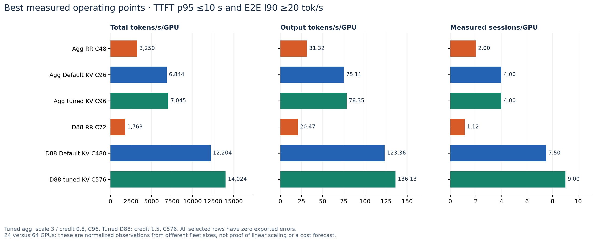
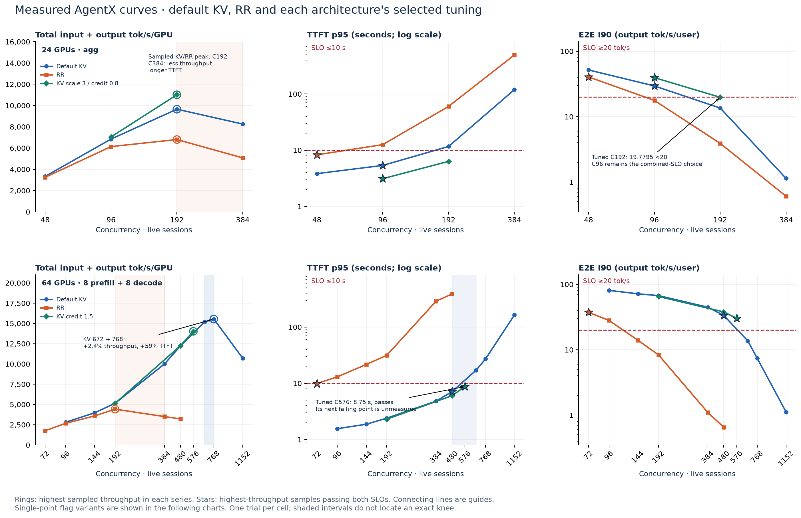
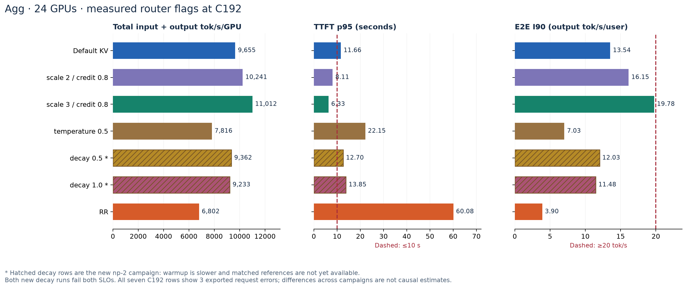
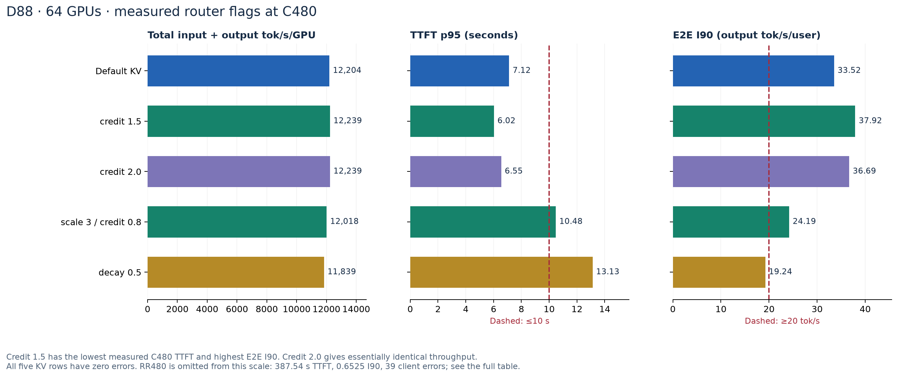

# AgentX serving performance: measured agg and disagg decisions

**Updated 2026-09-19 22:34 UTC · 34 completed hardware runs · 24-GPU agg and 64-GPU 8:8 disagg · Weka 256K**

**The new measured disagg choice is KV overlap credit 1.5 at C576:** **14,024 total tokens/s/GPU**, **8.75 s TTFT p95**, and **30.2479 E2E-normalized output tokens/s**. It passes both chosen SLOs. **Agg remains scale 3 / credit 0.8 at C96** under the combined SLO: its C192 result passes TTFT but narrowly misses E2E interactivity. The two new agg decay settings at C192 miss both limits and do not establish an improvement.

Compared at each fleet's best sampled point meeting both SLOs, tuned D88 delivers **1.99× total throughput/GPU** and **1.74× output-only throughput/GPU** versus tuned agg. The fleet sizes differ, **64 versus 24 GPUs**; this is an observed operating-point comparison, not a controlled estimate of architecture scaling.

[Standalone HTML](agentx-serving-perf-report.html) · [all hardware data CSV](agentx-serving-perf-report.csv) · [data and comparison JSON](agentx-serving-perf-report.json) · [source manifest](agentx-serving-perf-data/manifest.json) · [validation](agentx-serving-perf-report-validation.json)

## 1. Concrete operating choices

The limits are **TTFT p95 ≤10 seconds** and **E2E-normalized interactivity I90 ≥20 output tokens/s/user**. For each successful profiling request, calculate `r_i = request_latency_seconds / output_tokens_i`; then **`I90 = 1 / P90(r_i)`**, using linear percentile interpolation. This includes TTFT and generation. It is not inverse ITL/TPOT, not a percentile ratio, and not whole-session latency including think time or tools.

Select the highest measured total throughput/GPU that meets both limits and has no post-knee queue evidence. Errors are shown separately; no new availability SLO is assumed. **All six selected rows below have zero exported errors.** The lower-concurrency passing point is retained when a higher point fails either limit; there is no interpolation of passing results.


| Serving / setting | GPUs | Sessions | Total tok/s/GPU | Output tok/s/GPU | TTFT p95 (s) | E2E I90 (tok/s) | Total/RR in same topology |
| --- | --- | --- | --- | --- | --- | --- | --- |
| Agg RR | 24 | 48 | 3,250 | 31.32 | 8.27 | 40.5349 | 1.00× |
| Agg Default KV | 24 | 96 | 6,844 | 75.11 | 5.36 | 29.5030 | 2.11× |
| Agg KV scale 3 / credit 0.8 | 24 | 96 | 7,045 | 78.35 | 3.11 | 39.4930 | 2.17× |
| D88 RR | 64 | 72 | 1,763 | 20.47 | 9.91 | 37.3998 | 1.00× |
| D88 Default KV | 64 | 480 | 12,204 | 123.36 | 7.12 | 33.5225 | 6.92× |
| D88 KV credit 1.5 | 64 | 576 | 14,024 | 136.13 | 8.75 | 30.2479 | 7.95× |



[SVG](agentx-serving-perf-report-operating-points.svg) · [PDF](agentx-serving-perf-report-operating-points.pdf)


**Use the following settings as measured operating candidates, then repeat them on the intended deployment:**

| Deployment | Router arguments beyond `--router-mode kv` | Measured concurrency to use | Limit of this choice |
| --- | --- | --- | --- |
| Agg, 6 × TP4/EP4, 24 GPUs | `--router-temperature 0 --router-queue-policy fcfs --router-prefill-load-scale 3 --router-kv-overlap-score-credit 0.8` | **96** under both SLOs | 192 has I90 **19.7795**, below 20; it is not an eligible combined-SLO operating point. |
| D88, 8 prefill + 8 decode TP4, 64 GPUs | `--router-temperature 0 --router-queue-policy fcfs --router-kv-overlap-score-credit 1.5` | **576** under both SLOs | Highest tested passing point for this setting; its next failing point has not been measured. Load scale and decay retain defaults 1 and 0. |

Tuned D88 C576 has **1.25 s TTFT headroom** and **10.25 tok/s I90 headroom**, based on one trial. RR72's TTFT is **9.9115 s**, only **0.0885 s** below the limit; its capacity ratio needs a repeat before being treated as stable. These are replay-based choices, not production arrival-rate guarantees.

### Fleet totals and what can be compared


| Selected tuned fleet | GPUs | Sessions | Sessions/GPU | Total tok/s, fleet | Output tok/s, fleet | Requests/s |
| --- | --- | --- | --- | --- | --- | --- |
| Agg KV scale 3 / credit 0.8 | 24 | 96 | 4.00 | 169,089 | 1,880 | 1.97 |
| D88 KV credit 1.5 | 64 | 576 | 9.00 | 897,553 | 8,712 | 9.27 |


D88 uses **2.67× as many GPUs**, serves **5.31× total fleet tokens/s** and **4.63× fleet output tokens/s** at these selected samples. Report these separately from the per-GPU ratios. Total-token throughput counts cached input tokens, so output-only throughput and requests/s are included to expose workload-mix differences. No GPU-hour price, linear extrapolation to a different fleet size, or GPU requirement for 1,000 users is inferred.

## 2. What the new measurements add

The inventory now contains **14 agg and 20 D88 hardware runs**, up from 12 and 14 in the prior reports: **8 additional completed cells**. D88's inventory comes from the [updated source report](https://github.com/alisachen-google/gcp-dynamo-cuj/blob/75b63b8954a30b8690fd44edbb9c87f31e8b8e90/kv-cache-aware-bench/nemotron-3-ultra-550b-nvfp4/AGENTX_D88_RESULTS.md); the new agg decay jobs were discovered directly in GCS and validated from their summaries and request records.


| New measurement / artifacts | Total tok/s/GPU | TTFT p95 (s) | E2E I90 (tok/s) | Both SLOs | Client errors | What it adds |
| --- | --- | --- | --- | --- | --- | --- |
| [Agg KV decay 0.5 C192](https://console.cloud.google.com/storage/browser/alisachen-models/perf/1789831067_alisachen-n3u-agg-ns-agentx-kvd05-c192) | 9,362 | 12.70 | 12.0259 | Fail | 3 | Both fail; matched np-2 reference pending |
| [Agg KV decay 1.0 C192](https://console.cloud.google.com/storage/browser/alisachen-models/perf/1789831039_alisachen-n3u-agg-ns2-agentx-kvd10-c192) | 9,233 | 13.85 | 11.4805 | Fail | 3 | Both fail; matched np-2 reference pending |
| [D88 Default KV C96](https://console.cloud.google.com/storage/browser/alisachen-models/perf/1789808919_alisachen-n3u-mnnvl-88-agentx-kv-c96) | 2,810 | 1.56 | 80.9304 | Pass | 0 | Matched low-load KV/RR comparison |
| [D88 Default KV C144](https://console.cloud.google.com/storage/browser/alisachen-models/perf/1789803115_alisachen-n3u-mnnvl-88-agentx-kv-c144) | 3,964 | 1.87 | 71.7317 | Pass | 0 | Matched low-load KV/RR comparison |
| [D88 RR C384](https://console.cloud.google.com/storage/browser/alisachen-models/perf/1789795836_alisachen-n3u-mnnvl-88-agentx-rr-c384) | 3,504 | 289.39 | 1.0990 | Fail | 68 | Tightens RR overload bracket to 192–384 |
| [D88 KV credit 1.5 C192](https://console.cloud.google.com/storage/browser/alisachen-models/perf/1789814379_alisachen-n3u-mnnvl-88-agentx-kvc15-c192) | 5,138 | 2.30 | 65.3478 | Pass | 0 | No material throughput gain at light load |
| [D88 KV credit 1.5 C576](https://console.cloud.google.com/storage/browser/alisachen-models/perf/1789820579_alisachen-n3u-mnnvl-88-agentx-kvc15-c576) | 14,024 | 8.75 | 30.2479 | Pass | 0 | New highest tested tuned pass |
| [D88 KV credit 2.0 C480](https://console.cloud.google.com/storage/browser/alisachen-models/perf/1789787390_alisachen-n3u-mnnvl-88-agentx-kvc20-c480) | 12,239 | 6.55 | 36.6851 | Pass | 0 | No observed advantage over credit 1.5 on TTFT/I90 |


**What changed in the decision:** tuned D88 moves from the previously tested C480 to the now-tested **C576**. Relative to default KV's best sampled combined-SLO cell at C480, that is **14.9% more total throughput/GPU** and **20% more concurrent sessions**. **Default KV576 is unmeasured**, so this is not a controlled claim that the flag itself creates all of that capacity increase. The measured same-C480 flag effect remains **-15.4% TTFT p95**, **+13.1% I90**, and only **+0.29% throughput**.

## 3. Curves, knees and same-concurrency comparisons



[SVG](agentx-serving-perf-report-curves.svg) · [PDF](agentx-serving-perf-report-curves.pdf)


### Throughput peak, SLO crossing and highest tested pass are distinct

| Series | Measured throughput evidence | SLO evidence | Concrete next point |
| --- | --- | --- | --- |
| Agg default KV | Highest sampled throughput C192; C384 falls 14.5% | C96 passes both; C192 fails both | Sample 144 to narrow 96–192. |
| Agg RR | Highest sampled throughput C192; C384 falls 25.4% | C48 passes both; C96 fails both | Repeat C48, then test 72 if RR capacity matters. |
| Agg scale 3 / credit 0.8 | Two points, C96 and C192; throughput still rises | C192 passes TTFT but misses I90 by **1.10%** | Repeat C192 and test C144; no tuned throughput knee is known. |
| D88 default KV | C672→768 adds only 2.4% throughput for 59% more TTFT; C1152 then falls 31.2% | Both SLO boundaries lie in 480–672 | Default C576 is the missing direct control for the tuned result. |
| D88 RR | New C384 is 20.7% below C192; C480 falls further | TTFT crossing 72–96; I90 crossing 96–144 | Repeat C72, then C84; throughput overload bracket is now 192–384. |
| D88 credit 1.5 | C192, C480 and C576 measured; throughput still rises | All three pass both; C576 is the highest tested pass | Repeat C576, then C624 or C672 to bracket this setting's boundary. |

Each cell has one trial. The figures mark sampled points and unsampled intervals, not exact optimized knees. A one-point flag variant has no measurable concurrency knee. GPU utilization is not used to pick these knees because no aligned per-engine GPU series is supplied here.

### Default KV versus RR at the same concurrency

GPU count is fixed **within each architecture**. Ratios below compare matching session counts; overloaded RR rows describe overload behavior, not sustainable capacity.


| Topology | Sessions | KV / RR total tok/s/GPU | KV/RR throughput | KV / RR TTFT p95 (s) | RR/KV TTFT | KV / RR I90 | Interpretation |
| --- | --- | --- | --- | --- | --- | --- | --- |
| Agg24 | 48 | 3,334 / 3,250 | 1.03× | 3.83 / 8.27 | 2.16× | 51.83 / 40.53 | Below queue-check cutoff; check SLOs separately |
| Agg24 | 96 | 6,844 / 6,137 | 1.12× | 5.36 / 12.56 | 2.34× | 29.50 / 17.73 | Below queue-check cutoff; check SLOs separately |
| Agg24 | 192 | 9,655 / 6,802 | 1.42× | 11.66 / 60.08 | 5.15× | 13.54 / 3.90 | Below queue-check cutoff; check SLOs separately |
| Agg24 | 384 | 8,257 / 5,076 | 1.63× | 119.44 / 494.98 | 4.14× | 1.14 / 0.61 | RR overloaded |
| D88 | 96 | 2,810 / 2,671 | 1.05× | 1.56 / 13.03 | 8.35× | 80.93 / 28.09 | Below queue-check cutoff; check SLOs separately |
| D88 | 144 | 3,964 / 3,588 | 1.10× | 1.87 / 21.63 | 11.57× | 71.73 / 13.99 | Below queue-check cutoff; check SLOs separately |
| D88 | 192 | 5,142 / 4,419 | 1.16× | 2.40 / 31.45 | 13.12× | 67.36 / 8.38 | Below queue-check cutoff; check SLOs separately |
| D88 | 384 | 9,993 / 3,504 | 2.85× | 4.83 / 289.39 | 59.97× | 44.75 / 1.10 | RR overloaded |
| D88 | 480 | 12,204 / 3,219 | 3.79× | 7.12 / 387.54 | 54.42× | 33.52 / 0.65 | RR overloaded |


The new D88 C96 and C144 pairs show the same direction as C192: throughput gains are modest at low load, while KV substantially reduces TTFT. At C384, KV/RR throughput reaches 2.85×, but RR is already overloaded. This pattern supports prefix reuse and queue pressure as contributors; it does not independently isolate prefill computation, admission wait and KV transfer time.

## 4. Router tuning: measured effects and remaining controls

### 4.1 Agg at C192: include the new decay data, preserve the campaign distinction




[SVG](agentx-serving-perf-report-agg-flags.svg) · [PDF](agentx-serving-perf-report-agg-flags.pdf)


| C192 setting | Campaign | Total tok/s/GPU | TTFT p95 (s) | I90 (tok/s) | Cached input % | Errors | Both pass |
| --- | --- | --- | --- | --- | --- | --- | --- |
| Default KV | Sep 16 | 9,655 | 11.66 | 13.5367 | 74.4 | 3 | Fail |
| RR | Sep 16 | 6,802 | 60.08 | 3.8961 | 56.2 | 3 | Fail |
| KV scale 3 / credit 0.8 | Sep 16 | 11,012 | 6.33 | 19.7795 | 81.8 | 3 | Fail |
| KV scale 2 / credit 0.8 | Sep 16 | 10,241 | 8.11 | 16.1477 | 77.5 | 3 | Fail |
| KV temperature 0.5 | Sep 16 | 7,816 | 22.15 | 7.0315 | 61.0 | 3 | Fail |
| KV decay 0.5 | Sep 19 np-2 | 9,362 | 12.70 | 12.0259 | 72.2 | 3 | Fail |
| KV decay 1.0 | Sep 19 np-2 | 9,233 | 13.85 | 11.4805 | 71.4 | 3 | Fail |


**Observed result:** decay 0.5 gives **9,362 total tok/s/GPU, 12.70 s TTFT and 12.0259 I90**; decay 1.0 gives **9,233, 13.85 s and 11.4805 I90**. Neither passes either SLO. Both use default scale/credit and change only decay, but they run on separate np-2 fleets from the September 16 references.

**Why the default-reference comparison is provisional:** the original default-KV192 warmup is **1,634.8 s** and the original scale-3/credit-0.8 warmup is **1,634.8 s**. New decay warmups are **1,732.8 / 1,734.2 s**. The source orchestration therefore remeasures both references on np-2. Until those summaries arrive, lower throughput versus the old runs cannot be attributed solely to decay. The new settings' failure to meet the fixed SLOs is still directly observed.

**What to use now:** the previously validated scale-3/credit-0.8 C96 point remains the best sampled combined-SLO agg result. At C192 the same setting gives the best observed TTFT among the collected agg variants, but **I90 19.7795 must not be rounded up to a pass**. An improvement in TTFT alone does not settle the joint latency criterion.

### 4.2 Disagg at C480: credit 1.5 is the strongest observed latency candidate



[SVG](agentx-serving-perf-report-disagg-flags.svg) · [PDF](agentx-serving-perf-report-disagg-flags.pdf)


| C480 setting | Total tok/s/GPU | Δ total vs default | TTFT p95 (s) | Δ TTFT | E2E I90 | Cached input % | Both pass |
| --- | --- | --- | --- | --- | --- | --- | --- |
| Default KV | 12,204 | +0.00% | 7.12 | +0.0% | 33.5225 | 89.1 | Pass |
| KV scale 3 / credit 0.8 | 12,018 | -1.52% | 10.48 | +47.1% | 24.1932 | 86.3 | Fail |
| KV credit 1.5 | 12,239 | +0.29% | 6.02 | -15.4% | 37.9246 | 91.2 | Pass |
| KV credit 2.0 | 12,239 | +0.29% | 6.55 | -8.0% | 36.6851 | 91.7 | Pass |
| KV decay 0.5 | 11,839 | -2.99% | 13.13 | +84.3% | 19.2392 | 84.2 | Fail |


Credit **2.0** has effectively the same throughput as credit 1.5 (**+0.0012%**), but TTFT p95 is **6.55 versus 6.02 s** and I90 is **36.6851 versus 37.9246**. More reported cached input does not translate into a better latency result at this point. One trial cannot establish the precision of this ordering, but there is no observed reason to prefer 2.0 over 1.5.

At **C192**, credit 1.5 and default KV deliver **5,138 versus 5,142 total tok/s/GPU**: there is no material throughput gain at light load. The useful change appears in the heavier-load latency measurements. **C576 is a new operating point, not a same-concurrency A/B test.**

Scale 3 / credit 0.8 misses the D88 TTFT limit at C480; decay 0.5 misses both limits. The scale-3 setting changes two variables together, so it cannot identify which variable caused the regression. The measured agg and D88 tuning choices differ; keep separate profiles for the two deployments.

### Exact measured flag coverage


| Topology | Setting | Completed session counts | Router command |
| --- | --- | --- | --- |
| Agg24 | Default KV | 48, 96, 192, 384 | `--router-mode kv --router-temperature 0.0 --router-queue-policy fcfs` |
| Agg24 | RR | 48, 96, 192, 384 | `--router-mode round-robin` |
| Agg24 | KV scale 3 / credit 0.8 | 96, 192 | `--router-mode kv --router-temperature 0.0 --router-queue-policy fcfs --router-prefill-load-scale 3.0 --router-kv-overlap-score-credit 0.8` |
| Agg24 | KV scale 2 / credit 0.8 | 192 | `--router-mode kv --router-temperature 0.0 --router-queue-policy fcfs --router-prefill-load-scale 2.0 --router-kv-overlap-score-credit 0.8` |
| Agg24 | KV temperature 0.5 | 192 | `--router-mode kv --router-temperature 0.5 --router-queue-policy fcfs` |
| Agg24 | KV decay 0.5 | 192 | `--router-mode kv --router-temperature 0.0 --router-queue-policy fcfs --router-kv-overlap-score-credit-decay 0.5` |
| Agg24 | KV decay 1.0 | 192 | `--router-mode kv --router-temperature 0.0 --router-queue-policy fcfs --router-kv-overlap-score-credit-decay 1.0` |
| D88 | Default KV | 96, 144, 192, 384, 480, 672, 768, 1152 | `--router-mode kv --router-temperature 0.0 --router-queue-policy fcfs` |
| D88 | RR | 72, 96, 144, 192, 384, 480 | `--router-mode round-robin` |
| D88 | KV scale 3 / credit 0.8 | 480 | `--router-mode kv --router-temperature 0.0 --router-queue-policy fcfs --router-prefill-load-scale 3.0 --router-kv-overlap-score-credit 0.8` |
| D88 | KV credit 1.5 | 192, 480, 576 | `--router-mode kv --router-temperature 0.0 --router-queue-policy fcfs --router-kv-overlap-score-credit 1.5` |
| D88 | KV credit 2.0 | 480 | `--router-mode kv --router-temperature 0.0 --router-queue-policy fcfs --router-kv-overlap-score-credit 2.0` |
| D88 | KV decay 0.5 | 480 | `--router-mode kv --router-temperature 0.0 --router-queue-policy fcfs --router-kv-overlap-score-credit-decay 0.5` |


## 5. Evidence quality and simulation status

All included hardware summaries pass `inferencex-agentx-mvp` validation. The shared replay uses the pinned-name Weka 256K corpus with 393 sessions, seed 42, 3,600-second profiling, 60-second grace, trajectory start ratios 0.25–0.75, streaming, server token counts, `ignore_eos` and per-play first-turn prefix cache busting. Time-bounded closed-loop progression produces different completed request cohorts; a fixed seed does not imply identical completed turns.

The fleet recipes declare SGLang 0.5.16 and Dynamo 1.4.2. These summaries do not attest an immutable tokenizer revision or server image digest. Cached-input percentages in this report consistently use AIPerf's `overall_usage_prompt_cache_read_pct` export; the source D88 report instead quotes a frontend histogram ratio, which can differ slightly. Neither is presented as a direct per-engine KV occupancy measurement.

**Errors and cache state:** D88 RR384 has **68 client errors** and RR480 has **39**; both are overloaded. The source's separate 353 server-side timeout count for RR480 is not a client request-error count. The source notes that KV144's guard saw drain-tail timeouts from the preceding RR run before KV144 sent traffic; KV144 itself has zero exported request errors. The runner now drains after overload. Caches are not explicitly flushed between hardware cells, and cache busting does not prove identical physical cache occupancy. Warmup is a useful comparison check, not a complete health certificate.

### Native simulations: retain the evidence boundary

The existing [agg Native DynoSim V10 report](agentx-agg-kv-rr-report.md#31-native-dynosim-v10-current-completed-calibration-samples) contains **12 matching native results for the original 12 agg hardware cells**. Their stored inputs and E2E calculations are revalidated here; the new agg decay settings have no matching completed V10 result in this inventory. Calibration points and held-out samples must be read separately.


| Native agg V10 subset | Points | Mean absolute total-throughput error | Mean absolute TTFT p95 error | Mean absolute I90 error |
| --- | --- | --- | --- | --- |
| calibration | 4 | 6.2% | 23.7% | 11.4% |
| holdout | 8 | 1.7% | 9.4% | 9.9% |


**The C480 disagg native flag sweep did not produce usable performance results:** **12/12 runs failed**, with no completed measurement exports. All **12** failed runs contain **`mocker handoff session limit reached`** in prefill logs. The queue's `completed_with_failures` status means scheduling finished, not that simulations succeeded. This is a native mocker admission/handoff failure, not a measured hardware capacity limit. [Failure evidence and log hashes](agentx-serving-perf-data/source/native-c480-status.json) are preserved. The build was a V11 disaggregation extension with frozen V10 timing coefficients, not the unchanged V10 binary.

Resolve and verify the native admission/backpressure behavior before spending another full sweep on these configurations; keep the hardware batch limit intact rather than enlarging it merely to avoid errors. Then validate the corrected build at one matched hardware point and record the new build identity. No simulated flag ranking or simulated D88 knee is claimed from these failed runs.


## 6. Next measurements that would change the decision

| Priority | Exact measurement | Decision it resolves |
| --- | --- | --- |
| 1 | Finish the in-flight np-2 agg **default KV192** and **scale 3 / credit 0.8 C192** references | Separates the new decay results from the approximately 6% warmup drift between fleets/campaigns. |
| 2 | Repeat **D88 credit 1.5 C576**, and collect the already queued **default KV C576** control | Verifies the selected operating point and isolates the tuning benefit at equal concurrency. |
| 3 | Repeat **agg scale 3 / credit 0.8 C192**, then measure **C144** under the same campaign | Determines whether the 1.10% I90 miss is repeatable and finds a larger passing point than C96. |
| 4 | Measure **D88 credit 1.5 C624**; move to **C672** if both limits pass | Brackets the tuned latency boundary without calling C576 an exact knee. |
| 5 | Repeat **D88 RR72**, then **RR84** if needed | Stabilizes the RR denominator, currently only 0.089 s below the TTFT limit. |
| 6 | After the native handoff fix, rerun one C480 baseline before the remaining grid | Establishes that a full warmup and profiling window can complete and that predictions can be compared to hardware. |

The [queued D88 follow-up](agentx-serving-perf-data/source/run_agentx_88_followup.sh.txt) runs **temperature 0.5 and 0.2 at C480**, then **default KV at C576**, after the agg program releases np-2. These are planned cells, not measurements in the current inventory. There is no need to submit duplicates of those queued controls. Capture request-level E2E, actual output length, errors, trace identity and warmup timestamps on every point. To explain the architecture difference, add per-engine prefill/queue/running counts, KV occupancy, cache read counters and transfer wait/timing aligned to profiling.

## 7. Complete hardware inventory and reproduction

The table below contains every completed hardware sample used in the report. **Neither failed native runs nor an artifact directory without a completed AIPerf summary contributes a plotted point.** The pending np-2 reference and historical failed smoke directories are listed in the source manifest. New reference results can change the campaign comparison when they finish; this report is an explicit collection-time snapshot.


| Run / artifacts | Campaign | Total tok/s/GPU | Output tok/s/GPU | TTFT p95 (s) | E2E I90 | Errors | Both pass |
| --- | --- | --- | --- | --- | --- | --- | --- |
| [Agg Default KV C48](https://console.cloud.google.com/storage/browser/alisachen-models/perf/1789545801_alisachen-n3u-agg-ns-agentx-kv-c48) | agg-20260916 | 3,334 | 32.27 | 3.83 | 51.8257 | 0 | Pass |
| [Agg Default KV C96](https://console.cloud.google.com/storage/browser/alisachen-models/perf/1789550601_alisachen-n3u-agg-ns-agentx-kv-c96) | agg-20260916 | 6,844 | 75.11 | 5.36 | 29.5030 | 0 | Pass |
| [Agg Default KV C192](https://console.cloud.google.com/storage/browser/alisachen-models/perf/1789555981_alisachen-n3u-agg-ns-agentx-kv-c192) | agg-20260916 | 9,655 | 96.81 | 11.66 | 13.5367 | 3 | Fail |
| [Agg Default KV C384](https://console.cloud.google.com/storage/browser/alisachen-models/perf/1789562076_alisachen-n3u-agg-ns-agentx-kv-c384) | agg-20260916 | 8,257 | 77.74 | 119.44 | 1.1372 | 7 | Fail |
| [Agg RR C48](https://console.cloud.google.com/storage/browser/alisachen-models/perf/1789550745_alisachen-n3u-agg-ns2-agentx-rr-c48) | agg-20260916 | 3,250 | 31.32 | 8.27 | 40.5349 | 0 | Pass |
| [Agg RR C96](https://console.cloud.google.com/storage/browser/alisachen-models/perf/1789555623_alisachen-n3u-agg-ns2-agentx-rr-c96) | agg-20260916 | 6,137 | 67.11 | 12.56 | 17.7260 | 0 | Fail |
| [Agg RR C192](https://console.cloud.google.com/storage/browser/alisachen-models/perf/1789560983_alisachen-n3u-agg-ns2-agentx-rr-c192) | agg-20260916 | 6,802 | 71.38 | 60.08 | 3.8961 | 3 | Fail |
| [Agg RR C384](https://console.cloud.google.com/storage/browser/alisachen-models/perf/1789567077_alisachen-n3u-agg-ns2-agentx-rr-c384) | agg-20260916 | 5,076 | 49.65 | 494.98 | 0.6059 | 14 | Fail |
| [Agg KV scale 3 / credit 0.8 C96](https://console.cloud.google.com/storage/browser/alisachen-models/perf/1789582550_alisachen-n3u-agg-ns2-agentx-kvs3c08-c96) | agg-20260916 | 7,045 | 78.35 | 3.11 | 39.4930 | 0 | Pass |
| [Agg KV scale 3 / credit 0.8 C192](https://console.cloud.google.com/storage/browser/alisachen-models/perf/1789569414_alisachen-n3u-agg-ns-agentx-kvs3c08-c192) | agg-20260916 | 11,012 | 108.87 | 6.33 | 19.7795 | 3 | Fail |
| [Agg KV scale 2 / credit 0.8 C192](https://console.cloud.google.com/storage/browser/alisachen-models/perf/1789575514_alisachen-n3u-agg-ns-agentx-kvs2c08-c192) | agg-20260916 | 10,241 | 102.43 | 8.11 | 16.1477 | 3 | Fail |
| [Agg KV temperature 0.5 C192](https://console.cloud.google.com/storage/browser/alisachen-models/perf/1789574468_alisachen-n3u-agg-ns2-agentx-kvt05-c192) | agg-20260916 | 7,816 | 79.49 | 22.15 | 7.0315 | 3 | Fail |
| [Agg KV decay 0.5 C192](https://console.cloud.google.com/storage/browser/alisachen-models/perf/1789831067_alisachen-n3u-agg-ns-agentx-kvd05-c192) | agg-np2-20260919 | 9,362 | 94.58 | 12.70 | 12.0259 | 3 | Fail |
| [Agg KV decay 1.0 C192](https://console.cloud.google.com/storage/browser/alisachen-models/perf/1789831039_alisachen-n3u-agg-ns2-agentx-kvd10-c192) | agg-np2-20260919 | 9,233 | 93.40 | 13.85 | 11.4805 | 3 | Fail |
| [D88 Default KV C96](https://console.cloud.google.com/storage/browser/alisachen-models/perf/1789808919_alisachen-n3u-mnnvl-88-agentx-kv-c96) | d88-20260917-19 | 2,810 | 31.52 | 1.56 | 80.9304 | 0 | Pass |
| [D88 Default KV C144](https://console.cloud.google.com/storage/browser/alisachen-models/perf/1789803115_alisachen-n3u-mnnvl-88-agentx-kv-c144) | d88-20260917-19 | 3,964 | 44.14 | 1.87 | 71.7317 | 0 | Pass |
| [D88 Default KV C192](https://console.cloud.google.com/storage/browser/alisachen-models/perf/1789672351_alisachen-n3u-mnnvl-88-agentx-kv-c192) | d88-20260917-19 | 5,142 | 50.75 | 2.40 | 67.3601 | 0 | Pass |
| [D88 Default KV C384](https://console.cloud.google.com/storage/browser/alisachen-models/perf/1789678827_alisachen-n3u-mnnvl-88-agentx-kv-c384) | d88-20260917-19 | 9,993 | 100.04 | 4.83 | 44.7508 | 0 | Pass |
| [D88 Default KV C480](https://console.cloud.google.com/storage/browser/alisachen-models/perf/1789740024_alisachen-n3u-mnnvl-88-agentx-kv-c480) | d88-20260917-19 | 12,204 | 123.36 | 7.12 | 33.5225 | 0 | Pass |
| [D88 Default KV C672](https://console.cloud.google.com/storage/browser/alisachen-models/perf/1789686412_alisachen-n3u-mnnvl-88-agentx-kv-c672) | d88-20260917-19 | 15,184 | 149.17 | 17.04 | 13.7406 | 0 | Fail |
| [D88 Default KV C768](https://console.cloud.google.com/storage/browser/alisachen-models/perf/1789695978_alisachen-n3u-mnnvl-88-agentx-kv-c768) | d88-20260917-19 | 15,543 | 152.20 | 27.14 | 7.4108 | 0 | Fail |
| [D88 Default KV C1152](https://console.cloud.google.com/storage/browser/alisachen-models/perf/1789706033_alisachen-n3u-mnnvl-88-agentx-kv-c1152) | d88-20260917-19 | 10,697 | 107.71 | 164.32 | 1.1161 | 0 | Fail |
| [D88 RR C72](https://console.cloud.google.com/storage/browser/alisachen-models/perf/1789773750_alisachen-n3u-mnnvl-88-agentx-rr-c72) | d88-20260917-19 | 1,763 | 20.47 | 9.91 | 37.3998 | 0 | Pass |
| [D88 RR C96](https://console.cloud.google.com/storage/browser/alisachen-models/perf/1789734386_alisachen-n3u-mnnvl-88-agentx-rr-c96) | d88-20260917-19 | 2,671 | 29.62 | 13.03 | 28.0935 | 0 | Fail |
| [D88 RR C144](https://console.cloud.google.com/storage/browser/alisachen-models/perf/1789728380_alisachen-n3u-mnnvl-88-agentx-rr-c144) | d88-20260917-19 | 3,588 | 40.78 | 21.63 | 13.9890 | 0 | Fail |
| [D88 RR C192](https://console.cloud.google.com/storage/browser/alisachen-models/perf/1789721971_alisachen-n3u-mnnvl-88-agentx-rr-c192) | d88-20260917-19 | 4,419 | 44.48 | 31.45 | 8.3783 | 0 | Fail |
| [D88 RR C384](https://console.cloud.google.com/storage/browser/alisachen-models/perf/1789795836_alisachen-n3u-mnnvl-88-agentx-rr-c384) | d88-20260917-19 | 3,504 | 36.04 | 289.39 | 1.0990 | 68 | Fail |
| [D88 RR C480](https://console.cloud.google.com/storage/browser/alisachen-models/perf/1789757358_alisachen-n3u-mnnvl-88-agentx-rr-c480) | d88-20260917-19 | 3,219 | 34.32 | 387.54 | 0.6525 | 39 | Fail |
| [D88 KV scale 3 / credit 0.8 C480](https://console.cloud.google.com/storage/browser/alisachen-models/perf/1789748912_alisachen-n3u-mnnvl-88-agentx-kvs3c08-c480) | d88-20260917-19 | 12,018 | 121.56 | 10.48 | 24.1932 | 0 | Fail |
| [D88 KV credit 1.5 C192](https://console.cloud.google.com/storage/browser/alisachen-models/perf/1789814379_alisachen-n3u-mnnvl-88-agentx-kvc15-c192) | d88-20260917-19 | 5,138 | 50.72 | 2.30 | 65.3478 | 0 | Pass |
| [D88 KV credit 1.5 C480](https://console.cloud.google.com/storage/browser/alisachen-models/perf/1789778938_alisachen-n3u-mnnvl-88-agentx-kvc15-c480) | d88-20260917-19 | 12,239 | 123.83 | 6.02 | 37.9246 | 0 | Pass |
| [D88 KV credit 1.5 C576](https://console.cloud.google.com/storage/browser/alisachen-models/perf/1789820579_alisachen-n3u-mnnvl-88-agentx-kvc15-c576) | d88-20260917-19 | 14,024 | 136.13 | 8.75 | 30.2479 | 0 | Pass |
| [D88 KV credit 2.0 C480](https://console.cloud.google.com/storage/browser/alisachen-models/perf/1789787390_alisachen-n3u-mnnvl-88-agentx-kvc20-c480) | d88-20260917-19 | 12,239 | 123.55 | 6.55 | 36.6851 | 0 | Pass |
| [D88 KV decay 0.5 C480](https://console.cloud.google.com/storage/browser/alisachen-models/perf/1789765406_alisachen-n3u-mnnvl-88-agentx-kvd05-c480) | d88-20260917-19 | 11,839 | 119.49 | 13.13 | 19.2392 | 0 | Fail |


The [manifest](agentx-serving-perf-data/manifest.json) records the source commit, GCS inventory, every new summary and request projection, and links to the already preserved agg/D88 inputs. Per-request projection manifests include hashes of the original full JSONL exports. The generator validates those hashes, request/error counts, TTFT p95, E2E p95 and AIPerf's P10 output/E2E against the raw summaries, then computes canonical I90 independently. Source D88 warmup, in-flight counts and queue verdicts are reconciled where supplied. The HTML embeds all plots and the plotted CSV/JSON; supporting input files remain linked in GitHub to keep the standalone report compact.

Regenerate offline from the repository root, using Python with NumPy, Matplotlib and markdown-it-py:

```bash
python kv-cache-aware-bench/nemotron-3-ultra-550b-nvfp4/scripts/gen_agentx_serving_report.py
```

The read-only collector is `scripts/collect_agentx_serving_results.py`; it imports completed GCS artifacts and preserves a new inventory snapshot. Neither script submits benchmark traffic. Previous [agg](agentx-agg-kv-rr-report.md) and [D88](agentx-disagg-kv-rr-report.md) reports remain dated snapshots of their original inventories; this report carries the latest combined decisions as of **2026-09-19 22:34 UTC**.
